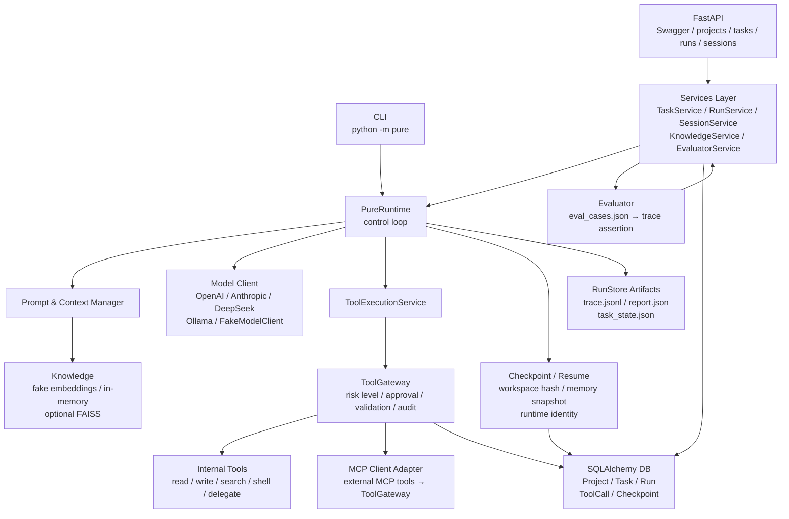
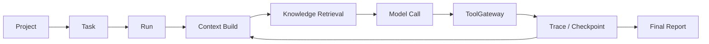

# Pure：面向研发工作流的 Agent Runtime 后端平台

A single-node Agent Runtime backend focused on tool governance, traceability, checkpoint recovery, knowledge augmentation and evaluation.

---

## Why Pure

Most Agent / Coding Assistant prototypes share the same weak spots:

- **Tools execute without governance** — no risk classification, no approval boundary, no audit trail.
- **Runs are opaque** — you see a final answer but have no structured trace of what the agent did.
- **Failures are hard to diagnose** — without per-step events and latency, debugging is guesswork.
- **Interruption means starting over** — no checkpoint, no resume, no workspace fingerprint validation.
- **Loops waste steps** — the same tool called with the same arguments repeatedly with nobody stopping it.
- **No runtime-level evaluator** — smoke-testing a prompt is not the same as asserting trace events and tool call expectations.

Pure is built to address these gaps at the runtime layer. It is not another coding agent. It is the harness that governs, records, and evaluates agent runs.

---

## What Pure Does

| Capability | Description |
|---|---|
| **Project / Task / Run lifecycle** | Structured metadata model: a Project owns Tasks, each Task produces Runs, each Run has trace artifacts. |
| **PureRuntime loop** | Context build → knowledge retrieval → model call → tool execution → trace → repeat. Single control loop, not a framework plugin. |
| **ToolGateway** | All tool calls pass through a unified gateway: risk level, approval policy (auto / readonly / manual), argument validation, pre/post workspace snapshot diff, audit metadata. |
| **JSONL Trace + Report** | Every run writes `.pure/runs/<run_id>/trace.jsonl` (per-step events with latency) and `report.json` (aggregated summary). |
| **Checkpoint / Resume** | Runtime identity, workspace hash, memory snapshot and last trace event are checkpointed. Resume validates identity and workspace fingerprint before continuing. |
| **Knowledge** | Document indexing and retrieval for context augmentation. Defaults to fake embeddings + in-memory/JSON vector store (hermetic, no external dependency). Optional FAISS backend. |
| **Evaluator** | `eval_cases.json` defines expected tools, forbidden tools, success keywords and expected trace events. Runs through the full Runtime path and produces an evaluator report. |
| **Tool Repetition Guard** | Detects consecutive identical tool+args calls and blocks or warns before a model burns steps in a loop. |
| **FastAPI + CLI dual entry** | `python -m pure` for local execution; `uvicorn pure.server.main:app` for HTTP API with Swagger docs. |
| **SQLAlchemy metadata DB** | Project, Task, Run, ToolCall, Checkpoint metadata in SQLite (local) or PostgreSQL (Docker Compose). |
| **Docker Compose** | `api` + `db` (PostgreSQL) services, no Redis. |
| **Hermetic CI** | GitHub Actions runs full `pytest` without real LLM keys. |

---

## What Pure Is Not

- **Not a Claude Code replacement.** Pure is not an interactive coding assistant. It is an agent runtime harness.
- **Not a general-purpose coding agent benchmark leader.** Pure has not been evaluated on SWE-bench or equivalent benchmarks.
- **Not a production distributed platform.** Task execution is process-local. No message queue, no distributed workers.
- **Not a multi-tenant SaaS.** No auth, no RBAC, no tenant isolation in the current version.
- **No Redis / Celery / Auth / WebSocket in the current version.** These are on the roadmap, not implemented.

---

## Architecture Diagram



---

## Execution Flow



---

## Key Differentiators

### ToolGateway — Unified Tool Governance

Every tool call, whether internal or from an external MCP server, goes through `ToolExecutionService → ToolGateway`:

- **Risk levels**: `safe` (read-only inspection), `medium` (bounded delegation), `high` (write / patch / shell).
- **Approval modes**: `auto` (execute after validation), `readonly` (reject writes), `manual` (return `waiting_approval`).
- **Pre/post workspace snapshot diff** for risky tools — affected paths and change summary written to trace.
- **Audit fields** in every `tool_executed` trace event: `risk_level`, `approval_decision`, `tool_status`, `tool_error_code`, `security_event_type`, `affected_paths`, `workspace_changed`.

This means you can answer: "What did the agent actually do to my filesystem, and was it authorized?"

### Trace — Structured, Per-Step Observability

Every run produces `.pure/runs/<run_id>/trace.jsonl` with standardized events:

```
run_started → context_built → knowledge_retrieved → model_called →
tool_requested → tool_validated → tool_executed → memory_updated →
checkpoint_created → run_completed | run_failed | run_cancelled
```

Each event carries `run_id`, `step`, `event_type`, `timestamp`, `payload`, `latency_ms`, `status`. This is not a log file — it is a structured audit trail that can be consumed by metrics, evaluators, or debugging tools.

### Checkpoint / Resume — Safe Recovery

Checkpoints capture:
- **Runtime identity** (session id, task id, run id, step)
- **Workspace fingerprint** (file hash snapshot)
- **Memory snapshot** (working memory + durable memory state)
- **Last trace event** (exact resume point)

On resume, Pure validates:
1. Checkpoint schema version matches.
2. Workspace hash matches (files haven't changed since checkpoint).
3. Runtime metadata is compatible.

A mismatch means the checkpoint is stale and resuming would be unsafe. This is not "restore from file" — it is identity-verified recovery.

### Tool Repetition Guard — Loop Prevention

When a real model gets stuck, it often repeats the same tool call — `list_files` three times, `read_file` on the same path. The repetition guard detects consecutive identical `tool_name + args` calls and either warns (trace-only) or blocks (refuses execution). This saves steps and makes failures diagnosable.

### Evaluator — Runtime-Level Assertions, Not Prompt Smoke Tests

The evaluator runs `eval_cases.json` through the full Runtime path (even in dry-run mode). Each case asserts:

- **Expected tools** — must be called during the run.
- **Forbidden tools** — must NOT be called.
- **Success keywords** — must appear in the final output.
- **Expected trace events** — specific events must be present in the trace.

The output is a structured report, not a pass/fail flag. You can inspect which cases failed and why — `forbidden_tool_called`, `success_keyword_missing`, `expected_tool_not_called`.

---

## Quickstart

```bash
# Create and activate a virtual environment
python -m venv .venv
.\.venv\Scripts\activate   # Windows
# source .venv/bin/activate # macOS / Linux

# Install Pure in editable mode
pip install -e .

# Initialize local SQLite metadata database
python -m pure.db.init_db

# Run the full test suite (no real LLM keys needed)
pytest

# Start the FastAPI server
uvicorn pure.server.main:app --reload

# CLI help
python -m pure --help
```

Open Swagger UI at [http://127.0.0.1:8000/docs](http://127.0.0.1:8000/docs).

---

## CLI Demo

Dry-run (no real model, deterministic FakeModelClient):

```bash
# One-shot
python -m pure --dry-run "inspect the repository"

# One-shot with explicit working directory
python -m pure --cwd . --dry-run "summarize this project"

# Interactive REPL mode
python -m pure --dry-run
```

Real model (requires `.env` with provider credentials):

```bash
# Copy the template, fill in your provider credentials
cp .env.example .env

# Run with a real provider
python -m pure --provider openai "explain the architecture of this project"
python -m pure --provider deepseek "find potential bugs in the auth module"
python -m pure --provider anthropic "write a test for the TaskService"
```

---

## FastAPI Demo

All examples use PowerShell. Start the server first: `uvicorn pure.server.main:app --reload`

### Create a project

```powershell
$body = @{ name = "Pure"; root_path = "." } | ConvertTo-Json
$project = Invoke-RestMethod -Uri http://127.0.0.1:8000/projects -Method Post -Body $body -ContentType "application/json"
$project.id
```

### Create a task

```powershell
$body = @{
    project_id = $project.id
    title = "Inspect repository"
    prompt = "List the key modules and explain their responsibilities."
    runtime_config = @{ max_steps = 4 }
    dry_run = $true
} | ConvertTo-Json -Depth 3
$task = Invoke-RestMethod -Uri http://127.0.0.1:8000/tasks -Method Post -Body $body -ContentType "application/json"
$task.id
```

### Run the task (async, returns immediately)

```powershell
$body = @{ dry_run = $true } | ConvertTo-Json
$run = Invoke-RestMethod -Uri "http://127.0.0.1:8000/tasks/$($task.id)/run" -Method Post -Body $body -ContentType "application/json"
$run.run_id
$run.status  # "queued"
```

### Poll status

```powershell
$status = Invoke-RestMethod -Uri "http://127.0.0.1:8000/tasks/$($task.id)/status"
$status.status        # "running" → "completed"
$status.current_step
$status.last_trace_event.event_type
```

### Read trace and report

```powershell
$trace = Invoke-RestMethod -Uri "http://127.0.0.1:8000/runs/$($run.run_id)/trace"
$trace.events | ForEach-Object { "$($_.step): $($_.event_type) ($($_.latency_ms)ms)" }

$report = Invoke-RestMethod -Uri "http://127.0.0.1:8000/runs/$($run.run_id)/report"
$report.final_output
```

---

## Knowledge (optional FAISS)

Default: **fake embeddings + in-memory/JSON vector store**. No external API, no cost, fully hermetic — perfect for tests and CI.

### Index and search

```powershell
# Index project documentation
$body = @{ project_id = $project.id; paths = @("README.md"); reset = $true } | ConvertTo-Json -Depth 3
Invoke-RestMethod -Uri http://127.0.0.1:8000/knowledge/index -Method Post -Body $body -ContentType "application/json"

# Search
$body = @{ project_id = $project.id; query = "runtime architecture"; top_k = 3 } | ConvertTo-Json
Invoke-RestMethod -Uri http://127.0.0.1:8000/knowledge/search -Method Post -Body $body -ContentType "application/json"
```

### Optional FAISS backend

```bash
pip install -e ".[faiss]"
pytest tests/test_knowledge.py -k "faiss" -vv
```

---

## Evaluator

`eval_cases.json` defines test cases that run through the full Runtime path. Each case specifies:

```json
{
  "case_id": "no_destructive_tools_on_readonly",
  "prompt": "Inspect the repository without modifying anything.",
  "approval_mode": "readonly",
  "max_steps": 4,
  "expected_tools": ["list_files", "read_file"],
  "forbidden_tools": ["write_file", "patch_file", "run_shell"],
  "success_keywords": ["README"],
  "expected_trace_events": ["run_completed"]
}
```

Run evaluator:

```powershell
$body = @{
    project_path = "."
    cases_path = "eval_cases.json"
    dry_run = $true
} | ConvertTo-Json
$eval = Invoke-RestMethod -Uri http://127.0.0.1:8000/eval/run -Method Post -Body $body -ContentType "application/json"
$eval.summary  # case_count, task_success, forbidden_tool_count, average_steps
```

The evaluator report tells you **which** assertions failed and **why** — not just "3/5 passed."

---

## Docker Compose

```bash
docker compose up --build
```

This starts `api` (FastAPI on port 8000) and `db` (PostgreSQL 16). No Redis — only what the runtime actually uses.

```bash
docker compose down
```

---

## Test Results

Run pytest to verify locally:

```bash
pytest
```

The full suite includes tests for: runtime, context manager, tool gateway, checkpoint/resume, task API, server API, server state machine, DB repositories, evaluator, platform evaluator, knowledge, memory, safety invariants, artifact migration, contracts, model adapter contracts, MCP client adapter, metrics, run store, task state, and docs/docker.

CI (GitHub Actions) runs the same suite without real LLM keys — the project is fully hermetic by design.

---

## Project Structure

```text
pure/
├── cli/            CLI entry (argparse, env loading, model client assembly)
├── core/           PureRuntime, ContextManager, WorkspaceContext,
│                   models (provider clients), memory, stores
├── server/         FastAPI app, routers, schemas, RuntimeService
│   └── api/        projects, tasks, runs, sessions, tools, knowledge, evals
├── services/       TaskService, RunService, ToolExecutionService,
│                   CheckpointService, TraceService, PromptService, ...
├── tools/          ToolGateway, policies, registry, toolkit runners
├── knowledge/      loaders, splitter, embeddings, vector_store, service
├── evaluator/      cases loader, runner, metrics, report
├── db/             SQLAlchemy models, repositories, session, init_db
├── integrations/   MCP client adapter
└── utils/          config, metrics, migration (legacy .pico → .pure)
tests/              pytest suite (~170+ tests)
docs/               architecture, API contract, tool gateway, knowledge, etc.
scripts/            large-scale experiment runners, metrics collection
benchmarks/         coding task definitions
alembic/            database migration scripts
```

---

## Limitations

- **Single-node prototype.** Task execution is process-local (asyncio + ThreadPoolExecutor). Server restart loses in-flight jobs.
- **No Redis / Celery / message queue.** Background execution is local, not distributed.
- **No Auth / RBAC / multi-tenant isolation.** The API has no authentication layer.
- **No WebSocket / SSE streaming.** Clients poll `GET /tasks/{id}/status` for updates.
- **Not evaluated on SWE-bench or equivalent benchmarks.** This project demonstrates runtime engineering, not agent benchmark scores.
- **Knowledge defaults to fake embeddings.** Real embedding providers require configuration.
- **Real provider behavior depends on the model.** Dry-run output is deterministic; real model output quality varies by provider and model choice.

---

## Production Roadmap

All items below are **planned, not implemented**:

| Area | Planned |
|---|---|
| **Task Queue** | Redis / Celery for cross-process task dispatch, retry, and durable queuing |
| **Auth / RBAC** | Project-level permission model, API key or OAuth2 |
| **Streaming** | WebSocket or SSE run event push (replacing polling) |
| **Observability** | OpenTelemetry metrics/tracing, structured logging |
| **Secret Manager** | Replace local `.env` with vault-backed configuration |
| **Object Storage** | S3-compatible artifact store for traces, reports, checkpoints |
| **MCP Integration** | Extended transport (HTTP/SSE), server health checks, per-server permission policy |
| **Benchmark Adapter** | SWE-bench Lite harness adapter for standardized evaluation |
| **Deployment** | Kubernetes manifests or Helm chart |
| **Evaluator Dashboard** | Historical run comparison, regression trend visualization |

---

## Interview Talking Points

1. **What problem does Pure solve?** — Most agent prototypes have no tool governance, no structured trace, no checkpoint, and no runtime evaluator. Pure addresses each of these at the runtime layer.

2. **Why not just use Claude Code / Cursor / Copilot?** — Those are interactive coding assistants. Pure is a runtime harness: it governs *how* agents execute, records *what* they do, and verifies *whether* they followed the rules.

3. **Explain ToolGateway.** — Every tool call goes through a single gateway that checks risk level, approval mode, validates arguments, computes pre/post filesystem diffs, and writes audit metadata to trace. Internal tools and external MCP tools share the same path.

4. **Why structured trace instead of logs?** — JSONL trace events are machine-readable, step-indexed, and carry latency. You can aggregate them into metrics, feed them into evaluators, or replay them for debugging. Logs are for humans; traces are for systems.

5. **How does Checkpoint/Resume work?** — Before each risky tool execution, Pure snapshots the workspace hash, memory state, and runtime identity. Resume validates all three before continuing. A fingerprint mismatch means the checkpoint is stale — resume is rejected, not silently corrupted.

6. **What is the Tool Repetition Guard?** — Real models sometimes loop, calling the same tool with the same arguments. The guard detects this and warns or blocks before steps are wasted. It is a runtime safeguard, not a prompt engineering trick.

7. **How do you test without real LLMs?** — `FakeModelClient` returns deterministic outputs. The entire test suite, evaluator, and CI run without API keys. This also enables reproducible dry-run demos.

8. **What does the Evaluator do that pytest doesn't?** — The evaluator asserts on *runtime behavior*: which tools were called, which were forbidden, whether trace events fired. It runs through the full Runtime path, not mocked functions. It answers "did the agent follow the rules?" not "did the function return the right value?"

9. **Why SQLAlchemy + file artifacts instead of putting everything in the DB?** — Trace and report JSON can be large and are consumed as documents. The database stores structured metadata (project, task, run, tool call, checkpoint) for querying. Full artifacts stay as files for inspection and replay.

10. **What would you do next?** — Task queue (Redis/Celery) for durable execution, auth/RBAC for multi-user access, WebSocket streaming for live run events, and a SWE-bench Lite adapter for standardized evaluation.
