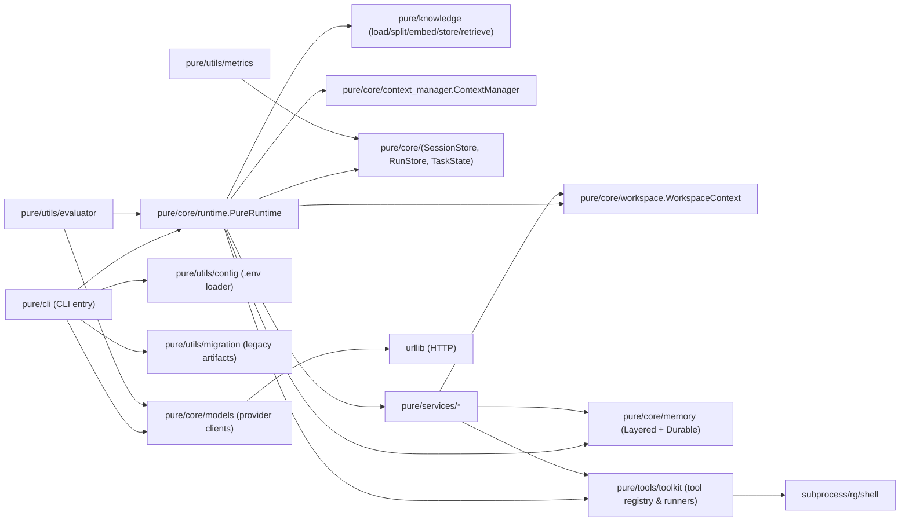
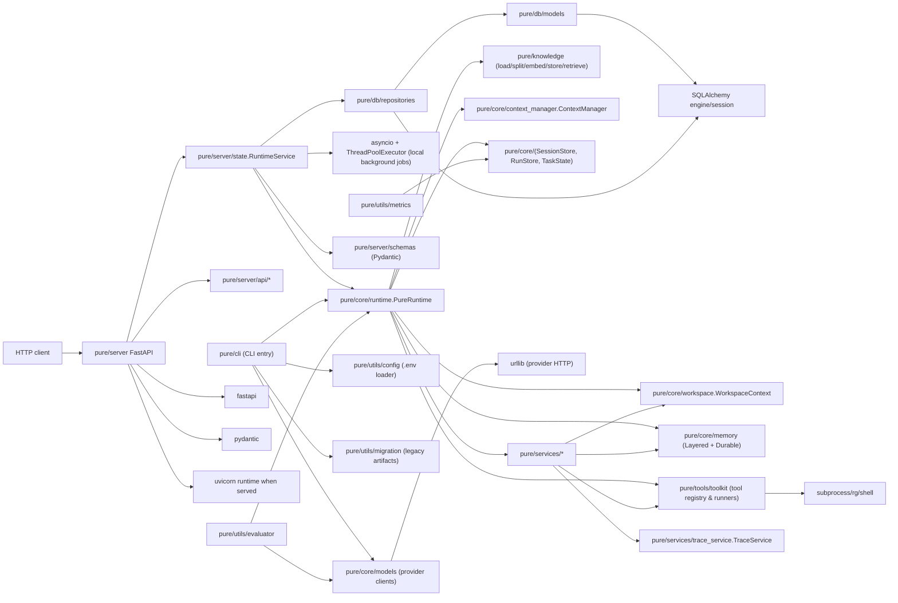
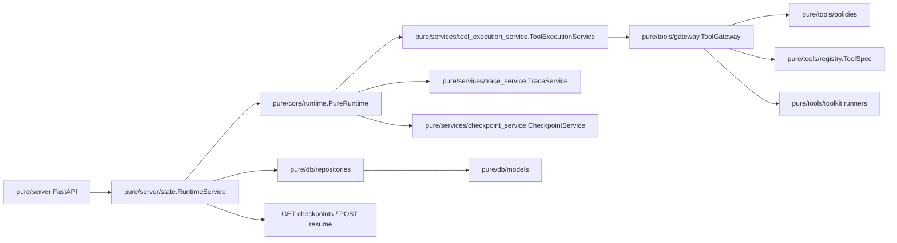
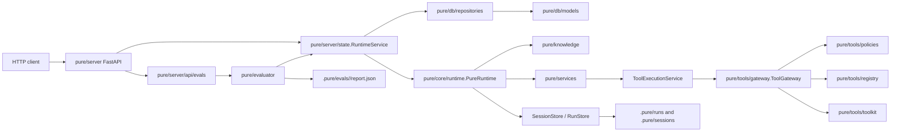

# Current Architecture (Pure)

> 目标：给下一阶段（人或 AI）一个“足够准确且可执行”的架构地图，内容完全来自当前代码。

## 1. 组件分层

### CLI 层：`pure/cli/`

- 参数解析：`build_arg_parser()`（provider、cwd、resume、approval、budget 等）。
- 环境加载：`load_project_env()`（向上查找 `.env` 并导入环境变量）。
- 模型 client 构建：`_build_model_client()`（按 provider 选择 `ModelClient`）。
- Agent 构建：`build_agent()` -> `PureRuntime(...)` 或 `PureRuntime.from_session(...)`。

### Core 层：`pure/core/`

- `PureRuntime`：主控制循环（`ask()`），负责：
  - prompt 组装（`PromptService` / `ContextManager`）
  - 模型调用（`model_client.complete()`）
  - 输出解析（`parse()`）
  - 工具执行（`ToolExecutionService` / `tools.toolkit`）
  - 状态与工件持久化（`SessionStore` / `RunStore` / durable memory）
- `WorkspaceContext`：采集 repo 快照 + `fingerprint()`，用于 prefix 重建与变更检测。
- `ContextManager`：按 section 预算渲染 prompt 并记录 metadata（写入 trace/report）。
- `memory`：工作记忆（LayeredMemory）+ durable memory（Markdown store）。

### Knowledge 层：`pure/knowledge/`

- `loaders.py`：支持 markdown/txt/README、`docs/*`、`report.json` summary 文档加载。
- `splitter.py`：按 chunk_size/chunk_overlap 切分 document -> chunk。
- `embeddings.py`：`FakeEmbeddingProvider`（测试/dry_run 默认），`ConfigurableEmbeddingProvider`（以 `PURE_EMBEDDING_PROVIDER` 选择 provider，默认 fake/mock）。
- `vector_store.py`：`VectorStore` 接口抽象；默认 `InMemoryVectorStore` 以 `.pure/knowledge/index.json` 持久化。
- `service.py`：`KnowledgeService.retrieve()` 返回 `content/source/score/metadata`，并提供 prompt 友好的 budget-clipped context 渲染。

### Services 层：`pure/services/`

将 runtime 关键职责拆为服务对象（agent 持有）：

- `PromptService`：`build_prompt_and_metadata()`（含 resume 状态与缓存 key）。
- `ToolExecutionService`：统一 tool 执行门面（校验、审批、快照 diff、metadata）。
- `CheckpointService`：checkpoint 创建与 resume 状态评估（freshness、identity mismatch）。
- `WorkspaceService`：刷新 workspace / prefix。
- `MemoryService`：工具后更新工作记忆、失效 file summary。

### Tools 层：`pure/tools/`

- `toolkit.py`：工具 registry（白名单）、参数校验、执行器（rg/read/write/patch/run_shell）。

### Utils/Bench 层：`pure/utils/`、`scripts/`、`benchmarks/`

- `evaluator.py`：固定 benchmark harness（使用 `FakeModelClient` 的脚本化输出）。
- `metrics.py`：聚合 `.pure/runs/*` 工件并生成指标（消费 trace/report）。
- `migration.py`：迁移 legacy `.pico/` -> `.pure/`。

## 2. 控制流：一次 `ask()` 的生命周期

1. 记录 user message 到 `session["history"]`。
2. 创建 `TaskState`（生成 `run_id/task_id`），写 `task_state.json`。
3. `RunStore.start_run()` 建目录并写初始 task_state。
4. Knowledge 检索与上下文增强：`KnowledgeService.retrieve()` 基于 user_message 检索项目知识，生成 `knowledge_context` section；写 trace：`knowledge_retrieved`；sources 写入 report：`knowledge_sources`。
5. 进入主循环（受 `max_steps` / `max_attempts` 限制）：
   - 组 prompt：`ContextManager.build()` -> `(prompt, prompt_metadata)`
   - 写 trace：`prompt_built`
   - 调模型：`model_requested` -> `model_client.complete()`
   - 解析：`parse()` -> `tool/final/retry`，写 trace：`model_parsed`
   - 若 tool：`ToolExecutionService.run_tool()` 执行并写 trace：`tool_executed`，必要时创建 checkpoint
   - 若 final：写 trace：`checkpoint_created`（run_finished）+ `run_finished`，写 `report.json`，返回 final 文本
6. 若超过限制：生成 stop 文本，写 `run_finished` + `report.json` 返回 stop 文本。

## 3. 工件与持久化边界

- 会话可恢复：`.pure/sessions/<session_id>.json`
- 单次运行审计：`.pure/runs/<run_id>/task_state.json|trace.jsonl|report.json`
- Durable memory：`.pure/memory/MEMORY.md` 与 `.pure/memory/topics/*.md`
- Knowledge index：`.pure/knowledge/index.json`

设计意图（来自代码注释与行为）：

- session：保存“可继续对话”的状态。
- run：保存“可复盘/可审计”的证据链。
- durable memory：保存跨会话的稳定事实/决策/约定（可被 relevant_memory 检索）。

## 4. 模块依赖关系（Mermaid）



## 5. 当前架构的关键“约束点”

- 路径安全：所有文件路径通过 `PureRuntime.path()` 解析，禁止逃逸 workspace root。
- 风险工具审批：`toolkit.BASE_TOOL_SPECS` 中标记 `risky=True` 的工具需审批（或只读模式强制拒绝）。
- 重复调用防护：对连续两次相同 tool+args 的调用直接拒绝（避免死循环）。
- 工具执行前后快照 diff：对 risky 工具执行前后计算 workspace 文件 hash 变化，写入 trace metadata。
## 6. Phase Update: Database-Backed Service Layer Architecture (2026-05-25)

### Server layer: `pure/server/`

The current architecture has a FastAPI adapter layer backed by a SQLAlchemy metadata database. It remains thin and does not replace CLI or runtime behavior.

- `main.py`: creates the FastAPI `app`, exposes `/health`, and mounts routers.
- `api/projects.py`: owns project creation and lookup.
- `api/tasks.py`: owns task creation, asynchronous run start, status polling, and cancellation.
- `api/sessions.py`: keeps legacy session creation, session inspection, and direct `ask` endpoints.
- `api/runs.py`: exposes run metadata, trace, and report endpoints.
- `api/tools.py`: exposes tool metadata.
- `api/knowledge.py`: owns knowledge document ingestion, indexing, and search.
- `schemas.py`: Pydantic request/response models.
- `state.py`: `RuntimeService`, the HTTP orchestration adapter. It owns live session handles, in-process task jobs, metadata writes through repositories, and delegates execution to `PureRuntime.ask()` from a local background executor.

### Database layer: `pure/db/`

- `models.py`: SQLAlchemy 2.x declarative models for `Project`, `Task`, `Run`, `ToolCall`, and `Checkpoint`.
- `session.py`: engine/session factory helpers.
- `repositories.py`: repository classes used by service code. API routers do not write SQLAlchemy sessions directly.
- `init_db.py`: database initialization command. SQLite at `.pure/pure.db` is the default local database; PostgreSQL/MySQL-compatible SQLAlchemy URLs are supported by design.

### HTTP call flow

```text
HTTP request
  -> FastAPI router
  -> RuntimeService
  -> pure/db repositories for Project/Task/Run metadata
  -> immediate HTTP response for /tasks/{task_id}/run
  -> asyncio/thread-executor background job
  -> PureRuntime.ask() for task execution
  -> SessionStore / RunStore artifacts
  -> repository indexing of run/tool/checkpoint metadata
```

`RuntimeService.create_task()` creates only the database task. `RuntimeService.start_task()` creates a run, marks the task queued, and returns `{run_id, status}` before execution completes. The FastAPI `/tasks/{task_id}/run` route dispatches the job with the current event loop and a local thread executor. `RuntimeService.run_task()` remains available for the legacy session ask API.

### Updated module dependencies



### Architecture constraints that remain unchanged

- `PureRuntime.path()` remains the workspace path boundary.
- Tool execution still goes through `ToolExecutionService`.
- `RunStore` remains the source of trace/report data.
- `TraceService` standardizes trace event shape before `RunStore` appends JSONL.
- `SessionStore` remains the source of persisted session data.
- The database stores metadata and summaries only; it does not store full trace/report JSON payloads.
- The HTTP layer does not introduce Redis, Celery, WebSocket streaming, a broker, or a durable distributed worker queue.

## 7. Phase Update: Async Task Runtime and Standard Trace (2026-05-26)

### Task execution architecture

The platform task API is now background-oriented:

1. `POST /tasks` creates task metadata with status `created`.
2. `POST /tasks/{task_id}/run` creates a run, marks the task/run queued, stores artifact paths, and returns immediately.
3. The route schedules `RuntimeService._run_task_job()` through `asyncio` and a local `ThreadPoolExecutor`.
4. The background job marks the task/run running, calls the existing `PureRuntime.ask()` loop, then indexes trace/report/tool/checkpoint summaries.
5. Clients poll `GET /tasks/{task_id}/status` or inspect `GET /runs/{run_id}` and `GET /runs/{run_id}/trace`.

This keeps the runtime loop intact and avoids Celery, Redis Queue, Kafka, or a complex queueing subsystem. The tradeoff is that queued/running jobs are process-local; server restart does not resume in-flight work.

### Cancellation

`POST /tasks/{task_id}/cancel` marks the task and latest run as `cancelled`, requests cancellation on the local future when possible, and appends `run_cancelled` to trace when an active task state or trace path is available. Cancellation is cooperative: a blocking model/tool call may finish before the cancellation marker is observed.

### Standard trace flow

`pure/services/trace_service.py` owns trace formatting and validation. The runtime still emits from its existing control points, but each event now includes:

- `run_id`
- `step`
- `event_type`
- `timestamp`
- `payload`
- `latency_ms`
- `status`

Legacy trace fields remain present at the top level for compatibility with existing tests, metrics, and artifact readers.

## 8. Phase Update: Tool Gateway and Checkpoint/Resume Platform (2026-05-26)

### Tool execution architecture

The runtime loop remains `PureRuntime.ask()`. Tool execution now flows through an explicit governance layer:

```text
PureRuntime.ask()
  -> ToolExecutionService.run_tool()
  -> ToolGateway.execute()
  -> policy validation
  -> toolkit runner
  -> metadata returned to runtime
  -> trace event + DB indexing
```

`ToolGateway` owns the execution decision and audit metadata. `toolkit.py` still owns the actual restricted tool runners and argument validation helpers.

### Tool policy model

Tool metadata is normalized through `pure/tools/registry.py`:

- `ToolSpec.name`
- `ToolSpec.description`
- `ToolSpec.input_schema`
- `ToolSpec.risk_level`
- `ToolSpec.requires_approval`

Policy checks live in `pure/tools/policies.py`:

- `approval_mode=auto`: execute after validation and legacy approval policy checks.
- `approval_mode=readonly`: reject `write_file`, `patch_file`, `run_shell`, and `delete_file`.
- `approval_mode=manual`: return `waiting_approval` for high-risk tools instead of executing them.
- Shell command arguments are checked for workspace path escapes.

### Checkpoint and resume architecture

Checkpoint creation remains inside `CheckpointService` and session artifacts. The checkpoint object now also includes task/run/step context, a memory snapshot, workspace hash, last trace event, and runtime metadata. During task artifact indexing, a checkpoint summary is written to the metadata database.

Resume is exposed through the task API:

```text
HTTP client
  -> POST /tasks/{task_id}/resume
  -> RuntimeService.resume_task()
  -> CheckpointRepository lookup
  -> workspace hash / schema / runtime metadata validation
  -> RuntimeService.start_task()
  -> asynchronous PureRuntime.ask() run
```

### Updated module dependencies



### Architecture constraints that remain unchanged

- The model-facing tool protocol is unchanged.
- The `PureRuntime.ask()` runtime loop remains the only task execution loop.
- Workspace file paths still resolve through `PureRuntime.path()`.
- Trace/report artifacts remain in `RunStore`.
- Session artifacts remain in `SessionStore`.
- The database stores metadata and summaries only.
- Background execution remains process-local and does not use Redis, Celery, Kafka, or a durable broker.

## 9. Phase Update: Evaluator, Docker, and Docs Architecture (2026-05-26)

### Evaluator architecture

The Evaluator is a platform adapter around the existing Runtime. It does not introduce a second execution loop.

```text
eval_cases.json
  -> pure/evaluator/cases.py
  -> EvaluatorRunner
  -> RuntimeService.create_project/create_task/start_task
  -> RuntimeService._run_task_job()
  -> PureRuntime.ask()
  -> trace.jsonl + report.json
  -> pure/evaluator/metrics.py
  -> .pure/evals/<eval_id>/report.json
```

The evaluator consumes trace/report artifacts and computes summary metrics:

- `task_success`
- `expected_tool_hit_rate`
- `forbidden_tool_count`
- `average_steps`
- `average_latency`
- `checkpoint_created`
- `knowledge_retrieved`

`dry_run=true` remains a complete path: it creates project/task/run metadata, normal run artifacts, checkpoints, and evaluator reports without calling a real model.

### FastAPI additions

The server now mounts `pure/server/api/evals.py`:

- `POST /eval/run`
- `GET /eval/{eval_id}/report`

The current report id lookup is process-local in `RuntimeService.eval_reports`; the report file itself is stored under `.pure/evals/<eval_id>/report.json`.

### Docker architecture

Docker packaging is intentionally small:

```text
docker compose
  -> api: builds this repo and serves pure.server.main:app through uvicorn
  -> db: postgres:16-alpine metadata database
```

Redis is not part of the architecture because no current Runtime, API, task queue, or cache path uses it.

### Updated module dependencies



### Current architecture constraints

- `PureRuntime.ask()` remains the only task execution loop.
- Evaluator, API, and Docker layers delegate into existing runtime behavior.
- The metadata database stores project/task/run/tool/checkpoint summaries only.
- Full run trace/report artifacts remain file-backed.
- Evaluator reports are file-backed and not duplicated into the database.
- Background task execution remains process-local.
