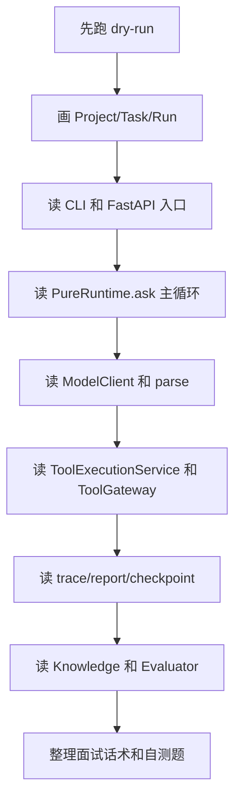

# 00 怎么学习 Pure

## 本章解决什么问题

这章不是介绍功能，而是给你一条复习路线：怎样从“项目能跑”走到“能解释设计、能回答追问、能承认边界”。Pure 现在是一个单机 Agent Runtime / Harness 原型，学习目标不是把它包装成很大的平台，而是把它的主链路、边界和证据讲清楚。

Vibe Coding 做出项目不等于掌握项目。原因很简单：你可能知道“我让模型改了什么”，但不知道“请求为什么走这条链路、状态为什么落在这些地方、工具为什么不能被模型直接调用、失败时应该看哪个证据”。面试时真正被追问的通常不是“你写了多少文件”，而是“你为什么这么分层、这层解决什么风险、这层的替代方案是什么”。

## 这块在 Pure 中怎么实现

Pure 的学习应该围绕一条主链路展开：

用户入口 -> Project / Task / Run -> RuntimeConfig -> `PureRuntime.ask()` -> `model_client.complete()` -> `PureRuntime.parse()` -> `ToolExecutionService` -> `ToolGateway` -> tool runner -> trace/report/checkpoint -> API status/evaluator。

推荐顺序：

1. 先跑通：`python -m pure --dry-run "inspect the repository"`、`pytest`、FastAPI dry-run。
2. 再画图：画 Project / Task / Run，画 Runtime loop，画 ToolExecutionService / ToolGateway。
3. 再读调用链：从 `pure/cli/cli.py`、`pure/server/api/tasks.py` 读到 `pure/core/runtime.py`。
4. 再读测试：优先读 runtime、tool gateway、task api、knowledge、evaluator 测试。
5. 最后手改小功能：例如只改一个 eval case、只调 repetition guard config、只加一个只读工具。当前任务不要求改业务代码，这一步留给学习阶段。

每学完一章，强制回答四个问题：

- 这个模块解决什么问题？
- 它怎么实现？
- 为什么不采用另一种做法？
- 如果面试官追问，我怎么答？

## 核心代码入口

| 入口 | 为什么先看 |
|---|---|
| `README.md` | 当前项目定位、能力边界、运行命令。 |
| `pyproject.toml` | 真实依赖范围，能看出没有 Redis/Celery/WebSocket 依赖。 |
| `pure/cli/cli.py` | CLI 如何装配 workspace、model client、session、runtime。 |
| `pure/server/main.py` | FastAPI app 和 router 挂载。 |
| `pure/server/state.py` | `RuntimeService`、本地后台线程、model client factory。 |
| `pure/core/runtime.py` | `PureRuntime.ask()` 主循环、parse、checkpoint、report。 |
| `pure/services/tool_execution_service.py` | 工具执行编排和 repetition guard 接入。 |
| `pure/tools/gateway.py` | 工具治理、安全策略、audit metadata。 |
| `pure/knowledge/service.py` | Knowledge index/retrieve/context 注入。 |
| `pure/evaluator/runner.py` | eval cases 如何走完整 RuntimeService 路径。 |
| `tests/` | 最可靠的行为证据。 |
| `eval_cases.json` | 当前 runtime evaluator 的默认用例。 |

## 主流程图或伪代码



```text
for each chapter:
  read README/docs summary
  locate code entry
  follow one test
  draw one flow
  write 30-second answer
  write "cannot claim" list
```

## 两周学习计划

第 1 到 2 天：跑通项目。执行 dry-run CLI、启动 FastAPI、创建 Project/Task/Run、读取 trace/report。目标是知道 `.pure/runs/<run_id>/trace.jsonl` 和 `report.json` 怎么产生。

第 3 到 5 天：读 Runtime 主链路。重点读 `PureRuntime.ask()`、`ContextManager.build()`、`PromptService.build_prompt_and_metadata()`、`PureRuntime.parse()`。

第 6 到 8 天：读 Tool 系统。重点区分 `ToolExecutionService`、`ToolRepetitionGuard`、`ToolGateway`、`toolkit`。

第 9 到 10 天：读状态和恢复。重点读 `SessionStore`、`RunStore`、`TaskState`、`CheckpointService`、`CheckpointAppService`。

第 11 到 12 天：读 Knowledge 和 Evaluator。重点确认 fake embedding、optional FAISS、eval case schema、failure reasons。

第 13 到 14 天：准备面试话术。把每章压缩成 30 秒、2 分钟、一个亮点、一个边界。

## 四周吃透计划

第 1 周：跑通和总览。产出一张全局架构图、一张 request lifecycle 图。

第 2 周：主循环和工具治理。产出一份 `ToolExecutionService vs ToolGateway` 对比笔记。

第 3 周：状态、恢复、评测。手动构造一次 repeated tool、readonly block、checkpoint mismatch 的 dry-run。

第 4 周：面试输出。用自己的话讲 5 分钟，不看文档；再从 `18-interview-questions.md` 随机抽题回答。

## study-notes 目录建议

```text
study-notes/
  00-run-log.md
  01-main-chain.md
  02-runtime-loop.md
  03-tool-governance.md
  04-state-and-artifacts.md
  05-checkpoint-resume.md
  06-knowledge-evaluator.md
  07-interview-answers.md
  diagrams/
    request-lifecycle.mmd
    tool-system.mmd
    storage-model.mmd
```

## 面试官会怎么追问

- 你说自己掌握了 Pure，能不能从 HTTP 请求讲到 trace 落盘？
- Vibe Coding 生成的代码，你怎么证明自己真的理解？
- 你为什么说它是 Runtime / Harness，而不是业务 Agent？
- 如果我删掉 ToolGateway，系统会失去什么？

## 我应该怎么回答

“我会先从一条真实请求链路讲：入口创建 Task 和 Run，服务层装配 session 和 model client，最后进入 `PureRuntime.ask()`。主循环每轮 build prompt、调用模型、parse 输出、经 `ToolExecutionService` 和 `ToolGateway` 执行工具，再把结果写回 history、trace、checkpoint、report。我的学习方法不是背 README，而是每个模块都能说出代码入口、测试证据和不能夸大的边界。”

## 不能夸大的说法

- 不能说 Pure 已经是生产级分布式平台。
- 不能说 Pure 替代 Claude Code、Cursor 或 OpenHands。
- 不能说默认 Knowledge 就是真实语义 RAG，默认是 fake embedding。
- 不能说 evaluator 有 SWE-bench 成绩。
- 不能把 Roadmap 写成已实现能力。

## 自测问题

1. `PureRuntime.ask()` 和 FastAPI `/tasks/{id}/run` 谁是真正执行任务的地方？
2. dry-run 为什么仍然能产生 trace、report、checkpoint？
3. `ToolExecutionService` 和 `ToolGateway` 的职责差别是什么？
4. `trace.jsonl` 和普通日志有什么不同？
5. resume 为什么要校验 workspace hash？

