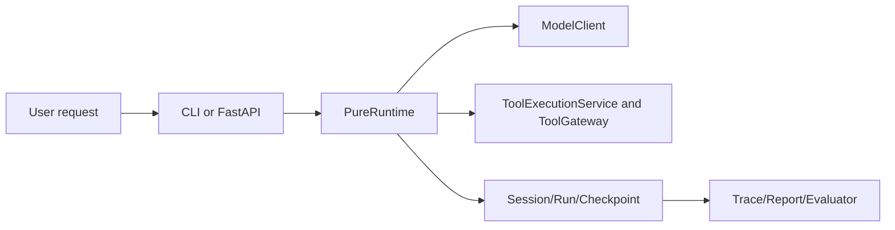

# 01 Pure 项目定位

## 本章解决什么问题

这一章解决“Pure 到底是什么”以及“面试时怎么不吹过头”。Pure 当前不是原始 Pico，也不是 Claude Code 替代品，更不是完整生产级分布式 Agent 平台。基于当前代码，它更准确的定位是：单机 Agent Runtime / Agent Harness 原型，带 CLI、FastAPI、SQLAlchemy 元数据层、工具治理、trace/report/checkpoint、Knowledge context augmentation 和 evaluator。

## 这块在 Pure 中怎么实现

Pure 的核心不是某个具体业务 Agent，而是把 Agent 执行过程放进一个可治理、可观察、可恢复、可评测的 Runtime：

- 用户可以从 CLI 或 FastAPI 进入。
- 服务层创建 Project / Task / Run 元数据。
- `PureRuntime.ask()` 负责主循环。
- `ModelClient` 提供统一 `complete()` 接口。
- `parse()` 把模型文本变成控制流动作。
- `ToolExecutionService` 组织工具执行流程。
- `ToolGateway` 做工具治理和审计 metadata。
- `RunStore` 写 trace/report/task_state。
- `CheckpointService` 创建和校验恢复状态。
- `EvaluatorRunner` 用 `eval_cases.json` 断言 runtime 行为。

Pure 解决的核心问题：

- 工具调用不可控：通过 ToolGateway、approval mode、路径边界、audit metadata。
- 执行过程不可观测：通过标准化 JSONL trace 和 report。
- 中断后难恢复：通过 checkpoint、workspace hash、runtime identity、memory snapshot。
- 模型重复探索：通过 Tool Repetition Guard。
- 缺少运行时评测：通过 evaluator 对 tool、trace、关键词、guardrail 做断言。

## Pure 是什么

Pure 是一个面向研发工作流的单机 Agent Runtime / Harness 原型。它提供一条完整执行链路：任务进入、上下文构建、模型调用、工具执行治理、状态落盘、运行证据生成、评测断言。

## Pure 不是什么

- 不是具体业务 Agent。它没有固定业务领域目标，比如客服、代码审查 SaaS 或知识库问答产品。
- 不是 Claude Code 替代品。它没有成熟终端交互体验、IDE UX、真实沙箱、产品化权限系统。
- 不是完整生产级分布式平台。当前没有 Redis、Celery、Auth、RBAC、WebSocket/SSE、多租户隔离。
- 不是 SWE-bench 成绩项目。当前没有 SWE-bench 运行结果。
- 不是完整 RAG 产品。Knowledge 默认 fake embedding，只做 Runtime prompt context augmentation。

## 核心代码入口

| 路径 | 证据 |
|---|---|
| `README.md` | 明确写出 single-node、not production distributed、not Claude Code replacement。 |
| `pyproject.toml` | 依赖只有 FastAPI、SQLAlchemy、Alembic、uvicorn、psycopg 等，没有 Redis/Celery。 |
| `pure/core/runtime.py` | `PureRuntime`、`MiniAgent = PureRuntime`、`Pico = PureRuntime`。 |
| `pure/server/state.py` | `RuntimeService` 使用 `ThreadPoolExecutor(max_workers=4)`，进程内状态。 |
| `pure/tools/gateway.py` | 工具治理边界。 |
| `pure/evaluator/runner.py` | evaluator 走 RuntimeService 完整路径。 |
| `tests/test_task_api.py` | Project/Task/Run/status/trace/report 行为证据。 |

## 主流程图或伪代码



```text
Pure value =
  runtime control loop
  + tool governance
  + state/artifacts
  + evaluator
  - productized coding assistant claims
  - distributed platform claims
```

## Pure 和 Pico 的关系

Pure 从 Pico 演进而来，保留了 `Pico = PureRuntime` 兼容 alias，也保留了 `.pico` 到 `.pure` 的迁移工具。当前 Pure 已经围绕 FastAPI service layer、DB metadata、ToolGateway、Evaluator、Knowledge、Repetition Guard、标准 trace 做了系统改造。不能说 Pure 完全超越 Pico，只能说定位和改造方向不同。

## Pure 和 Claude Code / Cursor / OpenHands 的关系

它们不是同类产品。Claude Code、Cursor、OpenHands 更偏向面向用户的 coding agent / coding assistant / developer agent product。Pure 更像后端 runtime harness：它关心“Agent 执行时如何治理和留证”，而不是“用户在 IDE/终端里如何顺滑写代码”。

## 30 秒定位话术

“Pure 是我从 Pico 演进出来的单机 Agent Runtime / Harness 原型。它不是 Claude Code 替代品，也不是生产级分布式平台。它重点做 Runtime 层工程化：Project/Task/Run 生命周期、工具治理、结构化 trace、checkpoint/resume、Knowledge 上下文增强和 evaluator，用来解决 Agent 执行不可控、不可观测、难恢复、难评测的问题。”

## 2 分钟项目介绍

“Pure 的入口有 CLI 和 FastAPI。FastAPI 层用 SQLAlchemy 保存 Project、Task、Run、ToolCall、Checkpoint 元数据；真正执行任务的是 `PureRuntime.ask()`。Runtime 每次运行先检索 Knowledge，之后进入循环：构建 prompt、调用统一 ModelClient、parse 模型输出，如果是 tool call 就交给 ToolExecutionService，内部先过 Repetition Guard，再过 ToolGateway。ToolGateway 做参数校验、approval mode、路径边界和 risky tool 的 workspace diff，并把 audit 字段写进 trace。每个 run 都有 `.pure/runs/<run_id>/trace.jsonl` 和 `report.json`。Checkpoint 会保存 runtime identity、workspace hash、memory snapshot 和 last trace event。Evaluator 使用 `eval_cases.json` 跑完整 runtime 路径，检查 expected tools、forbidden tools、success keywords 和 expected trace events。当前边界也很明确：单机原型，没有 Redis/Celery/Auth/WebSocket，没有 SWE-bench 成绩，真实 provider 效果依赖模型。”

## 面试官会怎么追问

- 你为什么叫它 Runtime / Harness？
- 你这个和一个普通 Agent demo 有什么区别？
- 你这个和 Claude Code 有什么区别？
- 你说从 Pico 魔改，具体改了什么？
- 没有 Redis/Celery 还能算后端项目吗？

## 我应该怎么回答

“Agent 更强调智能决策，Runtime / Harness 更强调执行环境。Pure 的价值不在模型更聪明，而在模型输出之后的治理链路：parse、ToolExecutionService、ToolGateway、trace、checkpoint、evaluator。它是单机后端原型，有 FastAPI、service、repository、DB 和 artifact 层，但还不是生产分布式平台。”

## 不能夸大的说法

- 不能说“生产级 Agent 平台”。
- 不能说“替代 Claude Code / Cursor / OpenHands”。
- 不能说“完整企业级安全”，因为没有 Auth/RBAC/多租户隔离。
- 不能说“完整 RAG”，默认 fake embedding。
- 不能说“SWE-bench 表现很好”，当前没有成绩。

## 自测问题

1. 为什么 Pure 更像 Harness 而不是业务 Agent？
2. 当前 Pure 的真实边界有哪些？
3. ToolGateway 解决的是智能问题还是治理问题？
4. Evaluator 和 pytest 的价值差异是什么？
5. 如果面试官说“这不就是 Pico 改名吗”，你用哪些代码入口回答？

