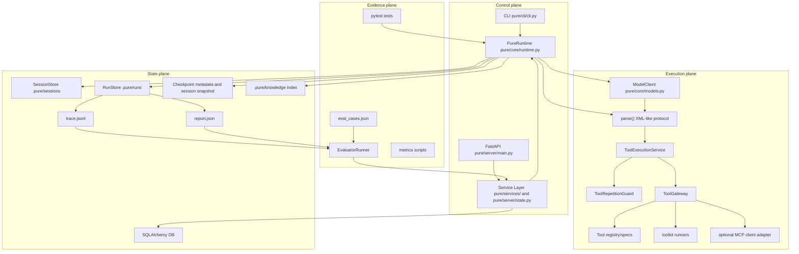

# 02 Pure 全局架构

## 本章解决什么问题

这一章给 Pure 建一张总地图。你需要能从“入口层、执行层、状态层、证据层”解释 Pure，而不是陷在某个函数细节里。全局架构的关键是：FastAPI/CLI 只是入口，真正的执行核心是 `PureRuntime.ask()`；DB 和文件工件分工保存状态；Evaluator 消费 trace/report 证明运行时行为。

## 这块在 Pure 中怎么实现

可以把 Pure 拆成四层：

1. 控制面：CLI、FastAPI、Service Layer、`PureRuntime`。
2. 执行面：ModelClient、Parser、ToolExecutionService、Tool Repetition Guard、ToolGateway、Tools、可选 MCP client adapter。
3. 状态面：SQLAlchemy DB、Session/Task/Run、Trace、Report、Checkpoint、Knowledge index。
4. 证据面：Evaluator、eval cases、metrics scripts、pytest tests。

## Mermaid 架构图



## 核心代码入口

| 文件路径 | 模块角色 | 为什么要看它 | 适合面试讲什么 |
|---|---|---|---|
| `pure/cli/cli.py` | CLI 装配层 | 从命令行参数到 `PureRuntime` | CLI 是薄入口，不是执行核心。 |
| `pure/server/main.py` | FastAPI app | `/health` 和 router 挂载 | HTTP 入口很薄。 |
| `pure/server/state.py` | RuntimeService 门面 | model client factory、本地 executor、service 组合 | 单机后台执行，不是分布式队列。 |
| `pure/server/api/tasks.py` | Task HTTP API | create/run/status/cancel/resume | Task 和 Run 分离。 |
| `pure/services/task_service.py` | Task 编排 | 创建任务、启动 run、resume 校验后重新 start | API 层不直接跑主循环。 |
| `pure/services/scheduler.py` | 本地后台任务 | `ThreadPoolExecutor` 调用 `_run_task_job` | 进程内 async，不是 Celery。 |
| `pure/services/run_service.py` | Run 查询和索引 | 读 trace/report，索引 tool calls/checkpoints | DB 存摘要，文件存完整工件。 |
| `pure/core/runtime.py` | Runtime 主循环 | `ask()` 是核心 | Agent 执行和证据生产在同一主循环。 |
| `pure/core/models.py` | Provider 适配 | 统一 `complete()` | Runtime 不绑定具体 provider。 |
| `pure/core/context_manager.py` | Prompt 预算 | section budgets、context reduction | prompt 每轮可解释。 |
| `pure/services/prompt_service.py` | Prompt 元数据门面 | resume 状态、cache key、secret redaction metadata | Prompt 不是裸字符串。 |
| `pure/services/tool_execution_service.py` | 工具执行总调度 | guard + gateway + history metadata | 它管流程，不是安全边界本身。 |
| `pure/services/tool_repetition_guard.py` | 重复调用检测 | normalized args、warn/block | 解决短窗口重复探索。 |
| `pure/tools/gateway.py` | 工具治理边界 | policy、validation、diff、metadata | ToolGateway 是安全/audit 边界。 |
| `pure/tools/toolkit.py` | 真实工具实现 | list/read/search/run/write/patch/delegate | 工具白名单和参数校验。 |
| `pure/services/checkpoint_service.py` | Checkpoint 内核 | create/evaluate/validate checkpoint | create 是存档，resume 是读档校验。 |
| `pure/knowledge/service.py` | Knowledge 服务 | index/retrieve/context | context augmentation，不是业务 RAG 产品。 |
| `pure/evaluator/runner.py` | Runtime evaluator | eval case 走完整 RuntimeService | 评测 runtime 行为。 |
| `pure/db/models.py` | DB 模型 | Project/Task/Run/ToolCall/Checkpoint | 数据模型边界。 |
| `tests/` | 行为证据 | 当前实现的最好证据 | 面试时用测试证明不是口头设计。 |

## 主流程图或伪代码

```text
HTTP/CLI
  -> assemble RuntimeConfig and model client
  -> create or load session
  -> PureRuntime.ask()
    -> retrieve knowledge
    -> loop
      -> build prompt
      -> model complete
      -> parse
      -> maybe execute tool through ToolExecutionService
      -> write trace/task_state/checkpoint
    -> write report
  -> API exposes status/trace/report
  -> evaluator consumes trace/report
```

## 面试官会怎么追问

- 为什么要分控制面、执行面、状态面、证据面？
- DB 和文件工件为什么同时存在？
- ToolGateway 和 toolkit 为什么分开？
- Evaluator 为什么不直接调用 `PureRuntime.ask()`？

## 我应该怎么回答

“我会先画四层。控制面负责入口和生命周期，执行面负责模型输出到工具动作，状态面负责会话、run、checkpoint、trace/report 的落盘，证据面负责测试和 evaluator。分层的目的不是复杂化，而是把用户入口、模型适配、工具治理、状态持久化和评测证据分开，方便定位问题和面试解释。”

## 不能夸大的说法

- 不能说有分布式 worker，当前是本地 `ThreadPoolExecutor`。
- 不能说 DB 保存了完整 trace/report，完整内容在文件工件里。
- 不能说 MCP 是完整生态平台，当前是可选 client adapter。
- 不能说 evaluator 证明模型能力，它主要证明 runtime 行为。

## 自测问题

1. Runtime 和 Service Layer 的边界是什么？
2. `RunStore` 和 DB 的职责差别是什么？
3. Tool 系统为什么拆成 registry、gateway、toolkit？
4. Knowledge 在架构图里为什么属于状态面和执行辅助？
5. 如果 trace 事件不标准化，Evaluator 会失去什么？

