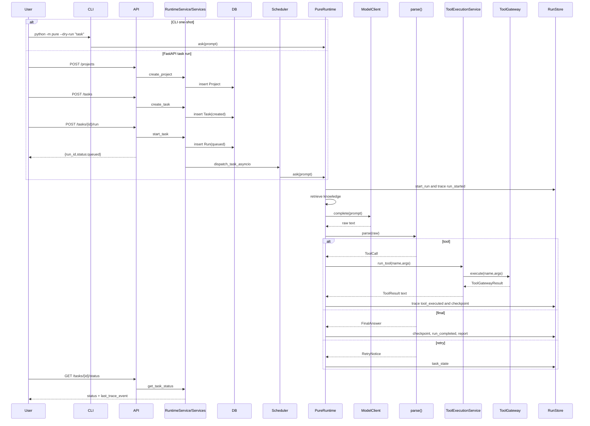

# 03 一次请求的生命周期

## 本章解决什么问题

这一章追踪一次请求从用户入口到最终结果的完整生命周期。重点是同时讲清 CLI、FastAPI、dry-run 和真实 provider 路径。你要能解释：哪些步骤同步执行，哪些是本地后台执行，为什么现在没有消息队列，以及未来 Celery/Redis 应该插在哪里。

## 这块在 Pure 中怎么实现

Pure 有两类主要入口：

- CLI：`python -m pure` 或 console script `pure`，由 `pure/cli/cli.py` 装配并同步调用 `agent.ask()`。
- FastAPI：`pure/server/main.py` 挂载 routers。`POST /tasks` 只创建 Task；`POST /tasks/{task_id}/run` 创建 Run 后返回 queued，并把执行提交到进程内 `ThreadPoolExecutor`。

dry-run 和真实 provider 的差别只在 model client：

- dry-run：`FakeModelClient(["<final>Dry run: no LLM API called.</final>"])`，不调用外部 API。
- mock_outputs：同样使用 `FakeModelClient`，但输出来自 runtime_config。
- real provider：OpenAI-compatible、Anthropic-compatible、DeepSeek、Ollama，走 `pure/core/models.py` 的 HTTP client。

## CLI 路径

1. `pure/__main__.py` 调用 `pure.cli.main.main()`。
2. `pure/cli/cli.py` 解析参数。
3. `WorkspaceContext.build(args.cwd)` 创建工作区快照。
4. `load_project_env()` 加载 `.env`。
5. `migrate_legacy_pico_artifacts()` 迁移 `.pico` 运行产物到 `.pure`。
6. `_build_model_client()` 或 dry-run 的 `FakeModelClient`。
7. `SessionStore(.pure/sessions)` 和 `PureRuntime(...)`。
8. one-shot 模式直接调用 `agent.ask(prompt)`。

CLI 是同步执行：命令行会等 `ask()` 返回 final/stop/error。

## FastAPI 路径

1. `pure/server/main.py` 创建 app 并挂载 routers。
2. `POST /projects` 进入 `ProjectService.create_project()`，写 DB。
3. `POST /tasks` 进入 `TaskService.create_task()`，只写 Task metadata，状态 `created`。
4. `POST /tasks/{id}/run` 进入 `TaskService.start_task()`，创建 session、run、artifact paths，状态 `queued`。
5. route 调用 `runtime_service.dispatch_task_asyncio()`。
6. `TaskScheduler._run_task_job()` 在本地线程池里设置 running，调用 `RunService.run_task()`。
7. `RunService.run_task()` 调用 `agent.ask()`。
8. 完成后 `RunService.index_run_artifacts()` 把 tool calls 和 checkpoint metadata 索引进 DB。
9. 客户端通过 `GET /tasks/{id}/status`、`GET /runs/{run_id}/trace`、`GET /runs/{run_id}/report` 轮询和读取。

FastAPI 的 run 是本地后台执行，不是分布式队列。服务重启会丢进程内 `task_jobs`、`sessions`、`run_to_session` 这类 live state。

## Dry-run 路径

dry-run 仍然创建 Project/Task/Run、trace、report、checkpoint。区别是模型输出固定，不调用外部 LLM。默认输出是：

```text
<final>Dry run: no LLM API called.</final>
```

如果 eval case 或 runtime_config 提供 `mock_outputs`，则 FakeModelClient 按列表返回工具调用或 final。

## Real provider 路径

真实 provider 走同一条 Runtime 主链路，只是 `model_client.complete()` 会发 HTTP：

- `OpenAICompatibleModelClient`：`/v1/responses`。
- `AnthropicCompatibleModelClient`：`/v1/messages`。
- `DeepSeek`：当前复用 Anthropic-compatible client。
- `OllamaModelClient`：`/api/generate`。

真实 provider 的输出质量和格式稳定性依赖模型。Runtime 通过 `parse()` 对坏格式返回 retry notice，但不能保证模型最终一定完成任务。

## 核心代码入口

| 路径 | 角色 |
|---|---|
| `pure/cli/cli.py` | CLI 参数、env、model、session、runtime 装配。 |
| `pure/server/api/projects.py` | Project HTTP API。 |
| `pure/server/api/tasks.py` | Task create/run/status/cancel/resume API。 |
| `pure/server/api/runs.py` | Run metadata、trace、report API。 |
| `pure/server/state.py` | RuntimeService、ThreadPoolExecutor、model client factory。 |
| `pure/services/task_service.py` | Task/Run 创建和 resume 后重新 start。 |
| `pure/services/scheduler.py` | 本地后台线程执行 `_run_task_job()`。 |
| `pure/services/run_service.py` | 调用 `agent.ask()`，读取和索引工件。 |
| `pure/core/runtime.py` | `PureRuntime.ask()` 主执行链路。 |

## 主流程图或伪代码



## 同步、异步和未来队列

同步：

- CLI one-shot 和 REPL 每次 `agent.ask()` 是同步的。
- `RunService.run_task()` 内部调用 `agent.ask()` 是同步的。
- `/sessions/{session_id}/ask` 是同步 HTTP 执行。

异步/后台：

- `/tasks/{task_id}/run` 是 async route，但真正后台执行是本地 `ThreadPoolExecutor`。
- `TaskScheduler.dispatch_task_asyncio()` 使用 `loop.run_in_executor()`。

当前为什么没有消息队列：

- 项目定位是单机 Runtime / Harness 原型。
- `pyproject.toml` 没有 Redis/Celery 依赖。
- `docker-compose.yml` 只有 api 和 db。
- 当前重点是 Runtime 治理和可观察性，而不是分布式任务调度。

未来如果引入 Celery/Redis，应插在 `TaskScheduler` 一层：`TaskService.start_task()` 创建 Run 后把 job 投递到 broker，worker 进程调用等价的 `_run_task_job()`。DB 继续保存 Task/Run 状态，trace/report 需要转向共享对象存储或可被 worker/API 共同访问的路径。

## 面试官会怎么追问

- `POST /tasks` 为什么不直接执行？
- `/tasks/{id}/run` 返回 queued 后任务在哪里跑？
- dry-run 会不会绕过 Runtime？
- 真实 provider 失败时怎么记录？
- 未来加 Celery 要改哪里？

## 我应该怎么回答

“Task 和 Run 分开，是为了让任务定义和一次执行实例分离。FastAPI 路径里 `/tasks/{id}/run` 只把 Run 创建出来并提交到本地 executor，真正执行仍然是 `PureRuntime.ask()`。dry-run 不绕过 Runtime，只替换 ModelClient。未来上 Celery/Redis 应该替换 `TaskScheduler` 的 dispatch 机制，而不是改 Runtime 主循环。”

## 不能夸大的说法

- 不能说当前有 durable queue。
- 不能说当前支持跨进程恢复 in-flight job。
- 不能说 dry-run 等价真实模型效果。
- 不能说真实 provider 行为稳定可控。

## 自测问题

1. CLI 和 FastAPI 哪个路径会创建 DB Project/Task/Run？
2. `/sessions/{id}/ask` 和 `/tasks/{id}/run` 的执行方式有什么差别？
3. dry-run 为什么还能测试 ToolGateway？
4. 如果服务重启，queued/running job 会发生什么？
5. Celery 应该插在 Runtime 前、Runtime 内还是 Scheduler 层？
