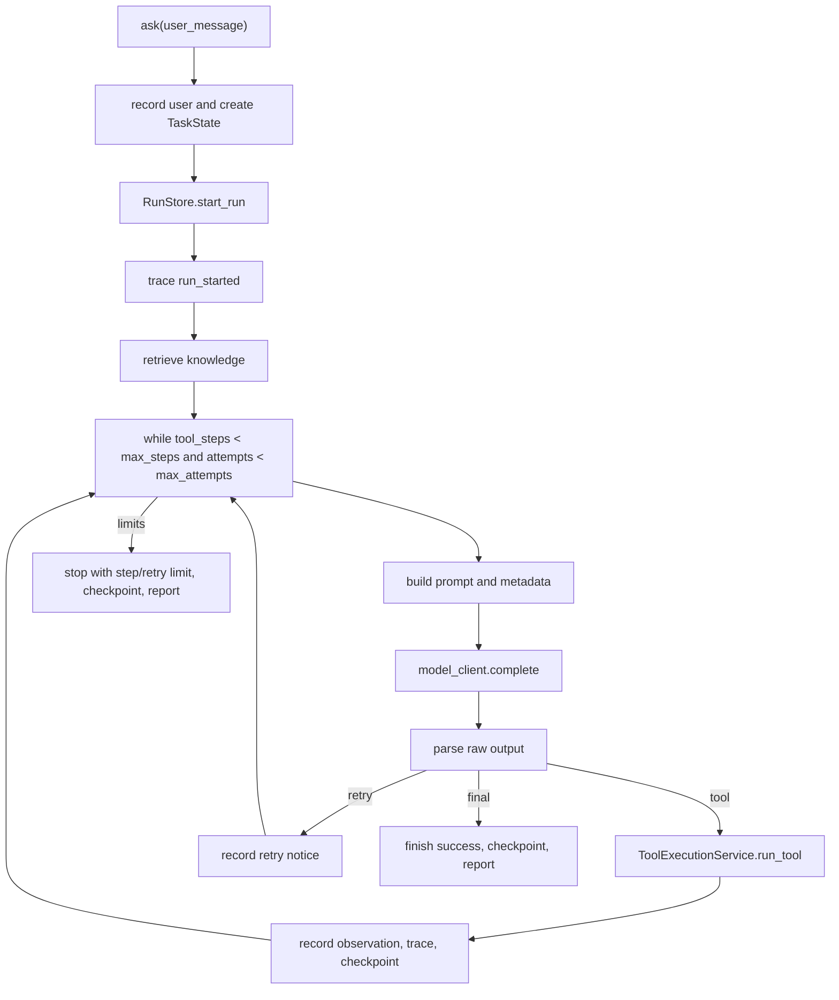

# 04 PureRuntime 主循环

## 本章解决什么问题

这一章深挖 `PureRuntime.ask()`。你要能解释一次 ask/run 的生命周期、每一轮循环做什么、为什么模型输出不能直接执行、工具结果如何回到下一轮上下文、step/retry limit 怎么处理，以及 trace/report/checkpoint 为什么是 runtime 的一部分，而不是跑完后的装饰。

## 这块在 Pure 中怎么实现

主循环入口在 `pure/core/runtime.py` 的 `PureRuntime.ask()`。它做的事情不是简单地 “prompt -> model -> print”，而是：

1. 重置本轮 repetition guard 状态。
2. 把用户请求写入 session history 和 working memory。
3. 创建 `TaskState`，启动 `RunStore` 运行目录。
4. 写 `run_started` trace。
5. 检索 Knowledge，并写 `knowledge_retrieved` trace。
6. 进入循环，直到 final、step limit、retry limit 或异常。
7. 每轮构建 prompt，写 context trace。
8. 调模型，parse 输出。
9. 如果是 tool，则执行工具、写 trace、更新 history/memory、创建 checkpoint。
10. 如果是 final，则写 memory/checkpoint/run_completed/report。
11. 如果是 retry，则把 retry notice 写回 history，下轮继续。

注意：代码中 Runtime 实际 emit 的事件名包含 `prompt_built`、`model_requested`、`model_parsed`、`run_finished`；`TraceService` 会规范化为 `context_built`、`model_called`、`run_completed` 等标准 `event_type`。看 trace 时应以 `event_type` 为准。

## 核心代码入口

| 路径 | 重点 |
|---|---|
| `pure/core/runtime.py` | `PureRuntime.ask()`、`parse()`、`build_report()`、checkpoint 调用点。 |
| `pure/services/prompt_service.py` | prompt metadata、resume status、prefix/cache metadata。 |
| `pure/core/context_manager.py` | prompt section 预算、context reduction。 |
| `pure/services/trace_service.py` | trace event 标准化和 aliases。 |
| `pure/services/tool_execution_service.py` | 工具执行总调度。 |
| `pure/services/checkpoint_service.py` | checkpoint 创建和 resume state 评估。 |
| `pure/core/task_state.py` | status、stop_reason、attempts、tool_steps。 |
| `tests/test_runtime.py` | runtime 行为、parse、guard、resume、checkpoint 证据。 |

## 主流程图或伪代码



```python
def ask(user_message):
    record_user_message()
    task_state = TaskState.create(...)
    run_store.start_run(task_state)
    emit_trace("run_started")
    retrieve_knowledge_context()
    emit_trace("knowledge_retrieved")

    tool_steps = 0
    attempts = 0
    max_attempts = max(max_steps * 3, max_steps + 4)

    while tool_steps < max_steps and attempts < max_attempts:
        attempts += 1
        task_state.record_attempt()
        prompt, metadata = build_prompt_and_metadata(user_message)
        emit_trace("prompt_built")

        if metadata.resume_status == "partial-stale":
            create_checkpoint(trigger="freshness_mismatch")
        if metadata.resume_status == "workspace-mismatch":
            emit_trace("runtime_identity_mismatch")
            create_checkpoint(trigger="workspace_mismatch")
        if metadata.budget_reductions:
            create_checkpoint(trigger="context_reduction")

        raw = model_client.complete(prompt, max_new_tokens, prompt_cache_key=...)
        kind, payload = parse(raw)
        emit_trace("model_parsed")

        if kind == "tool":
            tool_steps += 1
            task_state.record_tool(payload.name)
            emit_trace("tool_requested")
            result = run_tool(payload.name, payload.args)
            record_tool_observation(result)
            emit_trace("tool_executed")
            emit_trace("memory_updated")
            create_checkpoint(trigger="tool_executed")
            continue

        if kind == "retry":
            record_retry_notice(payload)
            continue

        final = payload
        task_state.finish_success(final)
        promote_durable_memory()
        create_checkpoint(trigger="run_finished")
        emit_trace("run_finished")
        write_report()
        return final

    stop_with_step_or_retry_limit()
    create_checkpoint(trigger=stop_reason)
    emit_trace("run_finished")
    write_report()
    return final_stop_text
```

## 每一轮循环做什么

每轮循环不是复用上一轮完整 prompt，而是重新构建 prompt。原因是上一轮可能新增了 tool observation、memory note、checkpoint text、context reduction metadata、workspace fingerprint 变化。`ContextManager` 会按 section 组装 prefix、memory、knowledge_context、relevant_memory、history、current_request。

模型输出后不能直接执行。模型输出只是文本，可能是坏 JSON、空 final、缺少 tool name、同时包含无关说明。`parse()` 是模型文本和 runtime 控制流之间的桥：它把 raw text 转成 `tool`、`final`、`retry` 三种动作。

工具结果通过两条路回到下一轮：

- 完整观察写入 `session["history"]`，下一轮 history section 可见。
- 高价值摘要写入 `LayeredMemory`，下一轮 memory/relevant_memory section 可见。

## step limit / retry limit

`tool_steps` 只统计进入工具执行阶段的次数，`attempts` 统计模型被调用的轮数。`max_attempts = max(max_steps * 3, max_steps + 4)`，所以坏格式 retry 不会立刻耗尽 tool step，但也不会无限重试。

final answer 判断由 `parse()` 决定：

- `<final>...</final>` 且非空：final。
- 没有标签但 raw 非空：当前实现会当 final。
- `<tool>...</tool>`：tool。
- malformed tool JSON、空 final、空响应：retry。

## run_failed / run_completed 怎么落盘

Runtime 成功或停止时 emit `run_finished`，由 `TraceService` 标准化为 `run_completed`，只要 payload status 是 `completed` 或 `stopped`。如果 API 后台执行抛异常，`TaskScheduler` 捕获后通过 `RunService.append_failure_trace()` 写 `run_failed`，并更新 DB 中 Task/Run 为 failed。

## 面试官会怎么追问

- 为什么 prompt 每轮重新构建？
- 为什么 parse 层不能省？
- step limit 和 retry limit 为什么分开？
- checkpoint 为什么在主循环里，而不是结束后统一生成？
- trace/report 是日志吗？

## 我应该怎么回答

“`ask()` 一边推进任务，一边生产证据。每轮模型决策之前要重新构建 prompt，因为上一轮工具观察、memory 和 checkpoint 状态会改变上下文。模型输出不能直接执行，所以先经过 `parse()` 变成 tool/final/retry。工具执行后结果写回 history 和 memory，然后写 trace 和 checkpoint。trace/report/checkpoint 不是装饰，它们是 runtime 控制流的一部分。”

## 不能夸大的说法

- 不能说 Runtime 有强 planner 或 multi-agent planner。
- 不能说 checkpoint 发生在每个 risky tool 前后；当前代码是在工具执行后、context reduction、freshness/workspace mismatch、run finish/stop 时创建 checkpoint。
- 不能说模型坏格式一定能恢复，只是给 retry notice。
- 不能说 run_failed 完全由 Runtime 内部处理，API 后台异常由 Scheduler/RunService 记录。

## 自测问题

1. `attempts` 和 `tool_steps` 各自统计什么？
2. `parse()` 返回哪三类结果？
3. 工具结果通过哪些结构进入下一轮 prompt？
4. `run_finished` 和 `run_completed` 的关系是什么？
5. 为什么说 trace/checkpoint 是 runtime 的组成部分？

