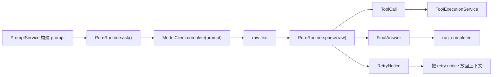

# 05 ModelClient 与 Parser

## 本章解决什么问题

这一章解决两个容易混在一起的问题：

1. Pure 怎么把不同模型供应商统一成一个 Runtime 可调用的接口。
2. Pure 怎么把模型返回的普通文本转换成 Runtime 能执行的控制流。

在 Pure 中，`ModelClient` 只负责“拿到模型原始输出”，`parse()` 负责“把原始输出解释成下一步动作”。二者之间的边界非常重要：模型输出不是命令，只有经过 parser 识别、校验并转成 `ToolCall` / `FinalAnswer` / `RetryNotice` 后，Runtime 才会继续推进。

## 这块在 Pure 中怎么实现

Pure 的模型层集中在 [pure/core/models.py](../../pure/core/models.py)。核心接口是：

```python
class ModelClient:
    def complete(self, prompt: str, max_new_tokens: int = 400, **kwargs: Any) -> str:
        raise NotImplementedError
```

不同实现包括：

| Client | 代码位置 | 作用 | 真实边界 |
| --- | --- | --- | --- |
| `FakeModelClient` | [pure/core/models.py](../../pure/core/models.py) | 测试、dry-run、evaluator mock 输出 | 不代表真实模型能力 |
| `OpenAICompatibleModelClient` | [pure/core/models.py](../../pure/core/models.py) | 调用 OpenAI-compatible `/responses` 接口 | 真实效果依赖 provider |
| `AnthropicCompatibleModelClient` | [pure/core/models.py](../../pure/core/models.py) | 调用 Anthropic-style `/messages` 接口 | DeepSeek 在 CLI/API 中也复用这一类 |
| `OllamaModelClient` | [pure/core/models.py](../../pure/core/models.py) | 调用本地 Ollama `/api/generate` | 依赖本地 Ollama 服务 |

Runtime 不直接依赖 OpenAI、Anthropic 或 Ollama。它只调用 `model_client.complete(...)`。这样测试时可以把模型替换成 `FakeModelClient`，服务层也可以根据 provider/env 创建不同 client。

模型返回后，Runtime 会调用 [pure/core/runtime.py](../../pure/core/runtime.py) 中的 `PureRuntime.parse(raw)`。它识别三类输出：

1. `<tool>{...}</tool>`：解析成 `ToolCall`。
2. `<final>...</final>`：解析成 `FinalAnswer`。
3. 坏格式或空输出：解析成 `RetryNotice`，让 Runtime 要求模型修正。

如果返回文本不是 tool/final 标签，但非空，当前实现会把它当成 final answer。这是为了让 dry-run 和简单 provider 输出能收敛，但面试时不能把它说成强约束协议。

## 核心代码入口

| 入口 | 文件 | 重点看什么 |
| --- | --- | --- |
| `ModelClient.complete()` | [pure/core/models.py](../../pure/core/models.py) | Runtime 依赖的统一模型接口 |
| `FakeModelClient` | [pure/core/models.py](../../pure/core/models.py) | mock 输出、dry-run、evaluator 的基础 |
| `OpenAICompatibleModelClient.complete()` | [pure/core/models.py](../../pure/core/models.py) | OpenAI-compatible 调用、重试、usage/cache 提取 |
| `AnthropicCompatibleModelClient.complete()` | [pure/core/models.py](../../pure/core/models.py) | Anthropic-style 调用 |
| `OllamaModelClient.complete()` | [pure/core/models.py](../../pure/core/models.py) | 本地模型调用 |
| `PureRuntime.parse()` | [pure/core/runtime.py](../../pure/core/runtime.py) | 从 raw text 到控制对象 |
| `ToolCall` / `FinalAnswer` / `RetryNotice` | [pure/core/runtime.py](../../pure/core/runtime.py) | parser 的输出类型 |
| `RuntimeService._model_client_from_request()` | [pure/server/state.py](../../pure/server/state.py) | API 层如何选择 provider 或 mock client |
| `build_model_client()` | [pure/cli/cli.py](../../pure/cli/cli.py) | CLI 层如何选择 dry-run/provider |

## 主流程图或伪代码



伪代码：

```python
raw = model_client.complete(prompt, max_new_tokens=config.max_new_tokens)
parsed = parse(raw)

if parsed.kind == "tool":
    execute_tool(parsed.tool_call)
elif parsed.kind == "final":
    finish_success(parsed.answer)
else:
    history.add("assistant", parsed.notice)
    continue
```

## 面试官会怎么追问

**为什么不用原生 function calling？**

追问点通常不是“XML 标签好不好”，而是你有没有意识到这个设计的取舍。

可以回答：

> Pure 当前定位是 runtime/harness 原型，希望模型层尽量 provider-neutral。不同 provider 的 function calling 协议差异比较大，测试时也不方便完全复现，所以当前用 XML-like `<tool>` / `<final>` 协议作为文本层控制协议。好处是 FakeModelClient、OpenAI-compatible、Anthropic-style、Ollama 都能走同一个 parser；代价是格式约束不如原生 tool calling 强，需要 Runtime 对 malformed output 做 retry。

**模型输出坏格式怎么办？**

可以回答：

> Runtime 不会直接执行 raw text。`parse()` 会把坏格式转成 `RetryNotice`，主循环把这个 notice 写回对话历史，让模型下一轮修正。如果一直输出坏格式，会受 `max_attempts` / retry limit 限制，最后以 stop reason 收敛。

**Dry-run 和真实 provider 有什么差异？**

可以回答：

> Dry-run 使用 `FakeModelClient`，输出是固定或预设的，主要用于链路验证、API smoke test 和 evaluator。真实 provider 会调用外部模型，质量、格式稳定性、延迟都依赖模型本身和网络环境。Pure 当前没有宣称真实模型 benchmark。

## 我应该怎么回答

30 秒版本：

> Pure 把模型调用和 Runtime 控制流拆开了。Runtime 只依赖一个 `ModelClient.complete()` 接口，不绑定具体 provider；模型返回的 raw text 还要经过 `parse()`，转换成 `ToolCall`、`FinalAnswer` 或 `RetryNotice`。这样 dry-run、mock evaluator 和真实 provider 可以共用同一套 Runtime 主循环。

深挖版本：

> 这个设计的关键是把“语言模型输出”和“系统动作”隔离开。模型层只返回文本，parser 是文本协议和控制流之间的桥。Runtime 后续是否执行工具，还要经过 ToolExecutionService、Repetition Guard 和 ToolGateway，而不是模型说什么就做什么。这样做牺牲了一部分原生 function calling 的结构化能力，但换来了 provider-neutral 和测试可控。

## 不能夸大的说法

不能说：

- “Pure 已经支持所有模型 provider。”
- “Pure 的 parser 能保证模型永远按格式输出。”
- “FakeModelClient 可以代表真实模型效果。”
- “Pure 已经实现了生产级 function calling 编排。”
- “DeepSeek 是独立完整适配层。”当前服务层/CLI 中 DeepSeek 走的是 Anthropic-style compatible client。

更准确的说法：

- “Pure 当前实现了一个简化的 provider-neutral 模型接口，并提供 Fake、OpenAI-compatible、Anthropic-style、Ollama 这些接入路径。”
- “Parser 能把约定格式转换成 Runtime 控制对象，并对坏格式做 retry 收敛。”

## 自测问题

1. `ModelClient` 为什么只暴露 `complete()`，而不是把 tool schema 也塞进去？
2. `FakeModelClient` 在 evaluator 中具体怎么驱动 mock 输出？
3. `parse()` 什么时候返回 `ToolCall`？
4. malformed tool JSON 会发生什么？
5. 为什么 raw text 不能直接进入 ToolGateway？
6. 如果未来改成原生 function calling，Runtime 哪些地方需要改，哪些地方可以保持不变？
