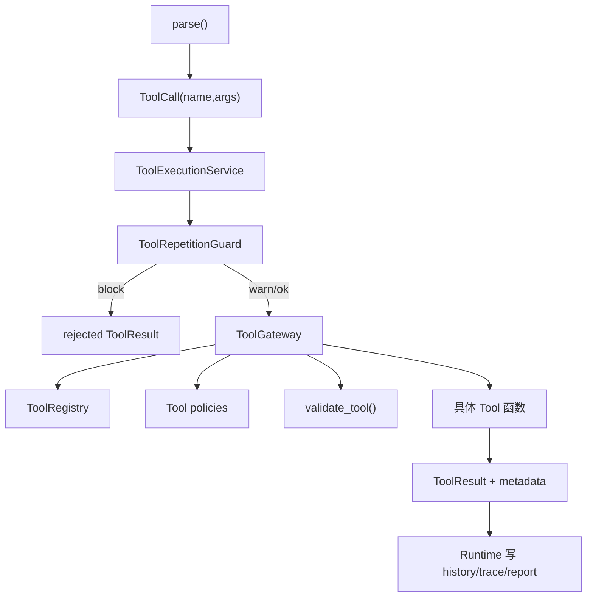

# 06 ToolExecutionService 与工具执行系统

## 本章解决什么问题

这一章要把“模型想调用工具”到“工具真正执行”之间的链路拆清楚。

Pure 里有几个名字很容易混：

- `ToolCall` 是 parser 解析出来的工具调用意图。
- `ToolExecutionService` 是工具执行总调度。
- `ToolRepetitionGuard` 是重复调用治理。
- `ToolGateway` 是安全、审批、参数校验和执行边界。
- Tool 本身才是真正读文件、写文件、搜索、运行 shell 的实现。

一句话：`ToolExecutionService` 管流程，`ToolGateway` 管边界，Tool 管执行。

## 这块在 Pure 中怎么实现

主入口在 [pure/services/tool_execution_service.py](../../pure/services/tool_execution_service.py)。Runtime 在 parser 得到 `ToolCall` 后，并不直接调用工具函数，而是调用：

```python
result, metadata = self.tool_execution_service.execute(tool_call, runtime_config=runtime_config)
```

`ToolExecutionService.execute()` 大致做这些事：

1. 从 `ToolCall` 里取出 `name` 和 `args`。
2. 读取 `runtime_config` 中的 repetition guard 配置。
3. 调用 `ToolRepetitionGuard.check(...)` 判断是否短窗口重复调用。
4. 如果 mode 是 `block`，直接返回 rejected，不进入 ToolGateway。
5. 如果 mode 是 `warn`，继续执行，但给 observation 增加 warning，并记录 trace。
6. 调用 `ToolGateway.execute(...)` 做校验、审批、安全策略和真正执行。
7. 对可改变 workspace 的工具执行后清空 repetition guard 的短期记录。
8. 返回 `ToolResult` 文本和 metadata，交给 Runtime 写入 history/trace/report。

Tool 真正实现位于 [pure/tools/toolkit.py](../../pure/tools/toolkit.py)，包括：

- `list_files`
- `read_file`
- `search`
- `run_shell`
- `write_file`
- `patch_file`
- `delegate`

工具注册和风险等级位于 [pure/tools/registry.py](../../pure/tools/registry.py)。安全和审批策略位于 [pure/tools/policies.py](../../pure/tools/policies.py)。Gateway 位于 [pure/tools/gateway.py](../../pure/tools/gateway.py)。

## 核心代码入口

| 入口 | 文件 | 重点看什么 |
| --- | --- | --- |
| `ToolCall` | [pure/core/runtime.py](../../pure/core/runtime.py) | parser 输出的工具调用意图 |
| `ToolExecutionService.execute()` | [pure/services/tool_execution_service.py](../../pure/services/tool_execution_service.py) | 工具执行总调度 |
| `ToolRepetitionGuard.check()` | [pure/services/tool_repetition_guard.py](../../pure/services/tool_repetition_guard.py) | 重复调用检测 |
| `ToolGateway.execute()` | [pure/tools/gateway.py](../../pure/tools/gateway.py) | 参数校验、审批、安全策略、执行 |
| `ToolRegistry` | [pure/tools/registry.py](../../pure/tools/registry.py) | 工具注册、schema、risk level |
| `validate_tool()` | [pure/tools/toolkit.py](../../pure/tools/toolkit.py) | 工具参数校验 |
| `validate_tool_policy()` | [pure/tools/policies.py](../../pure/tools/policies.py) | approval/read-only 策略 |
| `TOOL_SPECS` | [pure/tools/toolkit.py](../../pure/tools/toolkit.py) | 当前内置工具定义 |

## 主流程图或伪代码



结构图：

```text
ToolExecutionService
├── ToolRepetitionGuard
└── ToolGateway
    ├── ToolRegistry
    ├── policies
    └── tools
```

伪代码：

```python
def execute(tool_call, runtime_config):
    decision = repetition_guard.check(tool_call, runtime_config)

    if decision.action == "block":
        trace("tool_rejected_repeated_call")
        return rejected_result()

    if decision.action == "warn":
        trace("repeated_tool_call_detected")

    result, metadata = tool_gateway.execute(tool_call.name, tool_call.args, runtime_config)

    if tool_call.name in MUTATING_TOOLS and metadata["tool_status"] != "rejected":
        repetition_guard.clear()

    return result, metadata
```

## 面试官会怎么追问

**ToolExecutionService 和 ToolGateway 有什么区别？**

可以回答：

> ToolExecutionService 是 Runtime 侧的执行编排层，它负责接收 ToolCall、调用 repetition guard、调用 ToolGateway，并把结果整理给 Runtime。ToolGateway 是更靠近工具边界的层，负责工具是否存在、参数是否合法、approval/read-only 策略、安全校验、执行工具、记录 affected_paths 和 workspace_changed。

**为什么 Repetition Guard 不放在 ToolGateway 里？**

可以回答：

> Repetition Guard 不是传统安全策略，它治理的是 Agent loop 行为，也就是“短窗口内同工具同参数反复调用”。ToolGateway 更像能力边界和安全边界。如果把 repetition guard 放进 Gateway，会把运行时行为治理和工具访问控制混在一起。现在放在 ToolExecutionService 中，能在进入 Gateway 前决定 warn/block，也更贴近 Runtime 调度。

**为什么不能 Model 直接调用 Tool？**

可以回答：

> 因为模型输出只是文本意图，不是可信命令。直接执行会绕过 parser、重复调用治理、参数校验、approval policy、workspace escape 检查、trace 证据记录。Pure 的价值之一就是把模型意图变成受控的 Runtime 动作。

## 我应该怎么回答

30 秒版本：

> Pure 的工具执行链路是 `parse -> ToolCall -> ToolExecutionService -> ToolRepetitionGuard -> ToolGateway -> Tool`。ToolExecutionService 管流程，Gateway 管安全和审批，Tool 才负责真正执行。这样模型不能直接碰文件系统或 shell。

深挖版本：

> 我把工具调用分成调度、治理、边界、执行四层。Runtime 只把 parser 得到的 ToolCall 交给 ToolExecutionService。Service 先做 repetition guard，避免模型在短窗口内无意义重复探索；然后进入 ToolGateway 做工具存在性、schema、approval/read-only、workspace escape 等检查。只有通过这些检查后，才调用 toolkit 里的工具函数。结果会带 metadata 回到 Runtime，进入 trace、history 和 report。

## 不能夸大的说法

不能说：

- “ToolExecutionService 是安全沙箱。”
- “ToolGateway 能保证所有系统级安全。”
- “Pure 已经有生产级 command sandbox。”
- “Repetition Guard 能解决所有 Agent loop。”
- “工具调用是模型原生 function calling。”

更准确的说法：

- “ToolExecutionService 是 Runtime 内部的工具执行编排层。”
- “ToolGateway 做的是项目级工具边界和审批策略，不是 OS sandbox。”
- “Repetition Guard 只治理短窗口同工具同参数重复调用。”

## 自测问题

1. `ToolCall` 和 `ToolResult` 分别在哪里产生？
2. `ToolExecutionService` 为什么需要读取 `runtime_config`？
3. `ToolGateway` 拒绝工具后，Runtime 是否还会把 observation 写回 history？
4. `warn` 和 `block` 两种 repetition mode 有什么区别？
5. 为什么 mutating tool 执行后要清空 repetition guard？
6. 如果要新增一个工具，应该改哪些文件？
