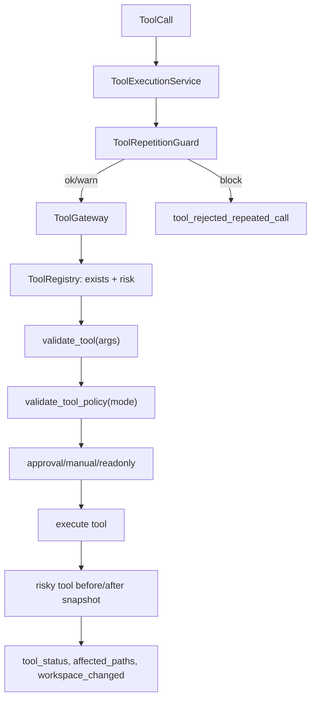
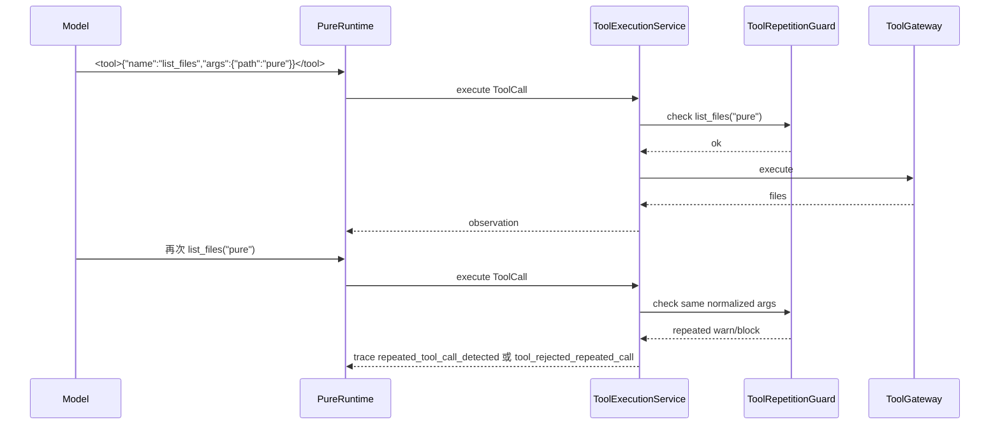

# 07 ToolGateway 与 Guardrails

## 本章解决什么问题

这一章解释 Pure 怎么给工具调用加边界。

Agent Runtime 最大的风险不是“模型会说错话”，而是模型可以通过工具改变文件、运行命令、读越界路径。Pure 当前没有生产级 sandbox，但它实现了一套单机 Runtime 内的 guardrails：

- 工具注册和 schema。
- 参数校验。
- workspace path escape 防护。
- shell 工作区策略。
- approval/read-only/manual 模式。
- risky tool 的 workspace before/after snapshot。
- affected paths / workspace changed / tool status 元数据。
- Tool Repetition Guard 的短窗口重复调用检测。

这些能力不是完整生产安全平台，但它们让 Pure 的工具调用比“模型直接执行命令”可控得多。

## 这块在 Pure 中怎么实现

工具注册在 [pure/tools/registry.py](../../pure/tools/registry.py) 和 [pure/tools/toolkit.py](../../pure/tools/toolkit.py)。

`TOOL_SPECS` 定义了工具名、描述、参数 schema、是否 risky。`ToolRegistry` 会把它们转换成带 risk level 的 `ToolSpec`。默认规则是：

- `list_files` / `read_file` / `search`：偏安全的读工具。
- `write_file` / `patch_file` / `run_shell`：高风险工具。
- `delegate`：中风险工具。

参数校验主要在 [pure/tools/toolkit.py](../../pure/tools/toolkit.py) 的 `validate_tool()`：

- `read_file` 校验路径、行号范围。
- `search` 校验 pattern。
- `run_shell` 校验 command、timeout。
- `write_file` 校验 path/content。
- `patch_file` 校验 old_text/new_text，且 old_text 在目标文件中只能出现一次。

路径边界由 Runtime 的 `path()` 和工具函数共同执行。`PureRuntime.path()` 会把路径解析到 workspace root 内，如果 `commonpath` 检测到越界，会抛错。

审批策略在 [pure/tools/policies.py](../../pure/tools/policies.py)：

| 模式 | 行为 |
| --- | --- |
| `auto` | 默认允许执行，仍做参数和路径校验 |
| `readonly` | 阻止写文件、patch、shell 等高风险动作 |
| `manual` | 高风险工具进入 `waiting_approval`，不自动执行 |

ToolGateway 主流程在 [pure/tools/gateway.py](../../pure/tools/gateway.py)。它会：

1. 查工具是否存在。
2. 规范化 approval mode。
3. 运行 `validate_tool()`。
4. 运行 `validate_tool_policy()`。
5. 对高风险工具处理 approval。
6. 执行工具函数。
7. 对 risky tool 记录 before/after workspace snapshot、`affected_paths`、`workspace_changed`、`diff_summary`。
8. 返回 tool output 和 metadata。

Tool Repetition Guard 在 [pure/services/tool_repetition_guard.py](../../pure/services/tool_repetition_guard.py)。它保存最近工具调用的：

- `tool_name`
- `normalized_args`
- `step`
- `timestamp`
- `workspace_fingerprint`

它会忽略 `timeout`、`limit`、`display_limit`、`max_lines` 这类非语义参数，并把 path 规范化成 workspace 相对路径。默认模式是 `warn`，也可以配置成 `block`。

## 核心代码入口

| 入口 | 文件 | 重点看什么 |
| --- | --- | --- |
| `TOOL_SPECS` | [pure/tools/toolkit.py](../../pure/tools/toolkit.py) | 当前内置工具及 schema |
| `ToolRegistry` | [pure/tools/registry.py](../../pure/tools/registry.py) | 工具注册和 risk level |
| `validate_tool()` | [pure/tools/toolkit.py](../../pure/tools/toolkit.py) | 参数级校验 |
| `PureRuntime.path()` | [pure/core/runtime.py](../../pure/core/runtime.py) | workspace escape 防护 |
| `validate_tool_policy()` | [pure/tools/policies.py](../../pure/tools/policies.py) | approval/read-only 策略 |
| `check_shell_workspace_policy()` | [pure/tools/policies.py](../../pure/tools/policies.py) | shell 参数中的路径逃逸检查 |
| `ToolGateway.execute()` | [pure/tools/gateway.py](../../pure/tools/gateway.py) | 工具边界总入口 |
| `ToolRepetitionGuard` | [pure/services/tool_repetition_guard.py](../../pure/services/tool_repetition_guard.py) | 短窗口重复调用治理 |
| `tests/test_tool_gateway_checkpoint_resume.py` | [../../tests/test_tool_gateway_checkpoint_resume.py](../../tests/test_tool_gateway_checkpoint_resume.py) | Gateway、approval、resume 相关测试 |
| `tests/test_runtime.py` | [../../tests/test_runtime.py](../../tests/test_runtime.py) | 重复调用检测和 Runtime 行为测试 |

## 主流程图或伪代码



重复调用例子：



伪代码：

```python
decision = repetition_guard.check(tool_name, args, step, workspace_fingerprint)

if decision.mode == "block":
    trace("tool_rejected_repeated_call")
    return rejected_result

if decision.mode == "warn":
    trace("repeated_tool_call_detected")

result, metadata = tool_gateway.execute(tool_name, args, runtime_config)
```

## 面试官会怎么追问

**ToolGateway 是不是 sandbox？**

可以回答：

> 不是。Pure 当前没有生产级 sandbox。ToolGateway 是 Runtime 内的工具边界层，做工具注册、参数校验、approval/read-only 策略、workspace path 检查和 risky tool 元数据记录。它降低误执行风险，但不能替代容器隔离、seccomp、权限隔离或多租户 sandbox。

**readonly/manual/auto 有什么区别？**

可以回答：

> `auto` 是在校验通过后自动执行；`readonly` 会拒绝写文件、patch、shell 等高风险动作；`manual` 对高风险工具返回 `waiting_approval`，不直接执行。当前没有完整的人类审批 UI，所以 manual 更像服务层和未来 UI 的接口预留。

**Tool Repetition Guard 和安全策略有什么区别？**

可以回答：

> 安全策略关心这个工具能不能被允许执行，比如路径越界、readonly 禁写、高风险审批。Repetition Guard 关心 Agent 是否在短窗口内做无意义重复探索，比如连续多次 `list_files("pure")`。它不是安全策略，而是 loop 治理。

## 我应该怎么回答

30 秒版本：

> Pure 的 ToolGateway 是工具边界层，负责工具注册、参数校验、approval/read-only 策略、路径逃逸防护和 risky tool 的执行元数据。Repetition Guard 在 Gateway 之前检测同工具同参数短窗口重复调用，默认 warn，也可以 block。二者职责不同：Gateway 管安全边界，Guard 管 Agent loop 行为。

深挖版本：

> 例如模型连续调用 `list_files("pure")`，第一次会通过 Gateway 正常执行；第二次 ToolExecutionService 会先问 Repetition Guard，Guard 把 path 规范化后发现和最近调用一致。如果配置是 warn，会写 `repeated_tool_call_detected` trace 并继续执行；如果是 block，会直接返回 rejected 并写 `tool_rejected_repeated_call`。这只能解决短窗口重复探索，不能解决所有死循环。

## 不能夸大的说法

不能说：

- “Pure 有生产级 sandbox。”
- “ToolGateway 能防住所有恶意命令。”
- “manual approval 已经有完整人审 UI。”
- “Repetition Guard 可以彻底解决 Agent loop。”
- “run_shell 是完全安全的。”

更准确的说法：

- “Pure 当前在单机 Runtime 内实现了工具边界和审批策略。”
- “高风险工具有额外校验和执行元数据记录，但生产化还需要真正隔离和人审 UI。”

## 自测问题

1. 工具 schema 在哪里定义？
2. `write_file` 和 `patch_file` 为什么被视为高风险？
3. `readonly` 模式会如何处理 `run_shell`？
4. `manual` 模式下高风险工具的 `tool_status` 是什么？
5. `affected_paths` 和 `workspace_changed` 从哪里来？
6. 为什么 `timeout` 不应该影响 repetition guard 的语义判断？
7. `list_files("pure")` 连续重复调用时，trace 会出现哪些事件？
