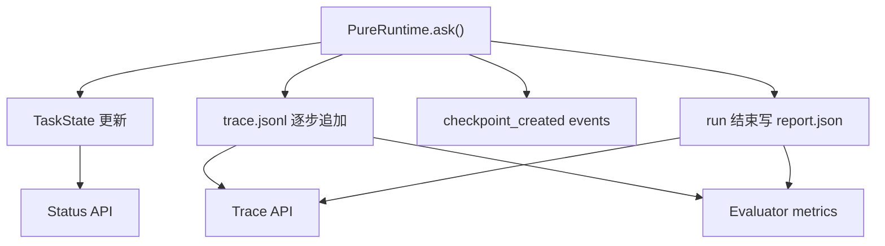

# 08 Trace、Report 与 Run Artifacts

## 本章解决什么问题

这一章解释 Pure 如何把一次 Agent 运行变成可复盘的证据。

普通日志通常回答“程序有没有报错”。Pure 的 trace/report 要回答的是：

- Runtime 每一步做了什么？
- 模型什么时候被调用？
- prompt/context 是否构建成功？
- 工具是否被请求、校验、执行或拒绝？
- 是否发生重复调用、安全拒绝、knowledge 检索、checkpoint 创建？
- 最终为什么完成、停止或失败？
- evaluator 能不能消费这些证据来判断行为是否符合预期？

所以 Trace 不是跑完后的装饰，而是 Runtime 主链路的一部分。

## 这块在 Pure 中怎么实现

Run artifacts 由 [pure/core/run_store.py](../../pure/core/run_store.py) 中的 `RunStore` 管理，默认写到：

```text
.pure/runs/<run_id>/
├── task_state.json
├── trace.jsonl
└── report.json
```

`trace.jsonl` 是逐行追加的 JSONL。每一行是一个事件。使用 JSONL 的原因：

1. 可以边跑边追加，不需要等整个 run 结束。
2. 单个事件结构化，方便 evaluator 和 API 读取。
3. 文件损坏时影响范围通常小于一个大 JSON。
4. 更适合长任务的增量观察。

trace 标准化在 [pure/services/trace_service.py](../../pure/services/trace_service.py)。Runtime 内部会发出一些 legacy 名称，例如 `prompt_built`、`model_requested`、`model_parsed`、`run_finished`，TraceService 会映射到标准事件类型：

| Runtime 发出的事件 | 标准 `event_type` |
| --- | --- |
| `prompt_built` | `context_built` |
| `model_requested` | `model_called` |
| `model_parsed` | `model_called` |
| `run_finished` | `run_completed` 或 `run_failed` |

主要事件包括：

- `run_started`
- `context_built`
- `model_called`
- `tool_requested`
- `tool_validated`
- `tool_executed`
- `repeated_tool_call_detected`
- `tool_rejected_repeated_call`
- `memory_updated`
- `checkpoint_created`
- `knowledge_retrieved`
- `run_completed`
- `run_failed`
- `run_cancelled`

`report.json` 由 [pure/core/runtime.py](../../pure/core/runtime.py) 的 `build_report()` 生成。它是本次 run 的摘要，包括：

- `run_id`
- `task_id`
- `status`
- `stop_reason`
- `final_answer`
- `tool_steps`
- `attempts`
- `checkpoint_id`
- `resume_status`
- `task_state`
- `prompt_metadata`
- `knowledge_sources`
- `repeated_tool_call_count`
- `runtime_config_warnings`
- durable memory 相关统计

Trace 是逐步证据，Report 是最终摘要。

## 核心代码入口

| 入口 | 文件 | 重点看什么 |
| --- | --- | --- |
| `RunStore.append_trace()` | [pure/core/run_store.py](../../pure/core/run_store.py) | trace.jsonl 如何追加 |
| `RunStore.write_report()` | [pure/core/run_store.py](../../pure/core/run_store.py) | report.json 如何落盘 |
| `TraceService.emit()` | [pure/services/trace_service.py](../../pure/services/trace_service.py) | 标准事件如何生成 |
| `PureRuntime.trace()` | [pure/core/runtime.py](../../pure/core/runtime.py) | Runtime 如何记录 trace |
| `PureRuntime.build_report()` | [pure/core/runtime.py](../../pure/core/runtime.py) | report 摘要结构 |
| `RunService.get_trace()` | [pure/server/state.py](../../pure/server/state.py) | API 如何读取 trace |
| `RunService.get_report()` | [pure/server/state.py](../../pure/server/state.py) | API 如何读取 report |
| `pure/server/api/runs.py` | [pure/server/api/runs.py](../../pure/server/api/runs.py) | status/trace/report API |
| `pure/evaluator/runner.py` | [pure/evaluator/runner.py](../../pure/evaluator/runner.py) | evaluator 如何消费 trace/report |

## 主流程图或伪代码



trace event 示例：

```json
{
  "run_id": "run-123",
  "step": 1,
  "event_type": "tool_executed",
  "timestamp": "2026-06-07T10:00:00Z",
  "status": "ok",
  "payload": {
    "tool": "list_files",
    "tool_status": "success",
    "latency_ms": 3
  }
}
```

report 示例结构：

```json
{
  "run_id": "run-123",
  "task_id": "task-123",
  "status": "completed",
  "stop_reason": "final_answer_returned",
  "final_answer": "done",
  "tool_steps": 1,
  "attempts": 2,
  "knowledge_sources": [],
  "repeated_tool_call_count": 0
}
```

Status API 读取的是 DB 中的 run/task 状态和 artifacts 摘要，不是只读 terminal log。

## 面试官会怎么追问

**Trace 和普通日志有什么区别？**

可以回答：

> 普通日志主要服务开发排错，通常是非结构化文本。Pure 的 trace 是 Runtime 事件流，每个事件有 `event_type`、`run_id`、`step`、`payload`、`status`、`latency_ms` 等结构化字段。它不仅给人看，也给 evaluator 和 API 消费，用来判断工具调用、安全拒绝、checkpoint、knowledge 等行为是否发生。

**为什么 Agent 项目需要可观测性？**

可以回答：

> Agent 的行为不是固定流程，模型可能重试、调用工具、重复探索、被策略拒绝。只看最终答案无法知道它为什么成功或失败。Trace 让运行过程可复盘，也能支撑 evaluator 检查 runtime behavior。

**Evaluator 怎么消费 trace？**

可以回答：

> Evaluator 运行 case 后读取 trace/report，统计 expected tools、forbidden tools、expected trace events、tool rejection、security events、repeated tool calls 等指标，再生成 eval report。

## 我应该怎么回答

30 秒版本：

> Pure 每次 run 都会生成 `trace.jsonl`、`task_state.json` 和 `report.json`。trace 是逐步事件证据，report 是最终摘要，status API 则读当前任务状态。Evaluator 不是只看 final answer，而是消费 trace/report 来判断 Runtime 行为。

深挖版本：

> TraceService 会把 Runtime 里的 legacy 事件名标准化成 `context_built`、`model_called`、`tool_executed`、`checkpoint_created` 等事件。这样 CLI、API 和 evaluator 都能基于同一套运行证据工作。它不是日志装饰，因为 Runtime 在每一轮构建上下文、调用模型、执行工具、更新 memory、创建 checkpoint 时都会同步生产 trace。

## 不能夸大的说法

不能说：

- “Pure 已经接入 OpenTelemetry。”
- “Trace 等同于分布式链路追踪。”
- “Status API 是实时 WebSocket 流。”
- “Report 可以证明模型真实效果好。”
- “所有运行状态都在 DB 里。”

更准确的说法：

- “Pure 当前用本地 artifacts + DB 元数据记录单机 run 的结构化证据。”
- “Trace/report 能支撑本项目 evaluator 和人工复盘，但还不是生产级 observability stack。”

## 自测问题

1. `trace.jsonl` 为什么比一个大 JSON 更适合长任务？
2. `report.json` 和 `trace.jsonl` 分别回答什么问题？
3. `prompt_built` 最终会变成哪个标准 `event_type`？
4. `run_finished` 什么时候会被映射成 `run_failed`？
5. evaluator 为什么需要 `expected_trace_events`？
6. Status API 读取的是哪些状态来源？
