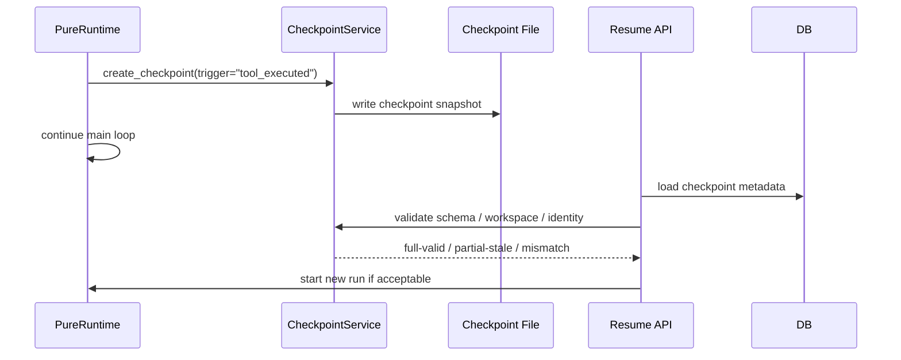

# 09 Checkpoint 与 Resume

## 本章解决什么问题

这一章专门澄清 Pure 里最容易误解的一句话：

> 主循环里看到 checkpoint，不代表它在恢复；它是在为未来恢复和当前审计创建存档点。

`create_checkpoint` 是存档，`resume` 是读档和重新启动。二者不是同一件事。

Pure 当前的 checkpoint/resume 是单机 Runtime 原型中的恢复机制：它保存任务状态、memory snapshot、workspace hash、runtime identity 等信息，并在 resume 时判断旧状态还能不能信。它不是生产级事务恢复，也不是分布式 job checkpoint。

## 这块在 Pure 中怎么实现

Checkpoint 核心在 [pure/services/checkpoint_service.py](../../pure/services/checkpoint_service.py)。

Checkpoint 保存的内容包括：

- `schema_version`
- `task_id`
- `run_id`
- `step`
- `status`
- `current_goal`
- `completed`
- `current_blocker`
- `next_step`
- `key_files`
- `summary`
- `memory_snapshot`
- `workspace_hash`
- `last_trace_event`
- `runtime_metadata`
- `runtime_identity`

`runtime_identity` 用来判断恢复时环境是否一致，包含：

- `cwd`
- `model`
- `model_client`
- `approval_policy`
- `read_only`
- `max_steps`
- `max_new_tokens`
- `feature_flags`
- `shell_env_allowlist`
- `workspace_fingerprint`
- `tool_signature`

`workspace_hash` / fingerprint 用来判断当前工作区和 checkpoint 时是否一致。API 层也会用 DB 中 checkpoint 的 workspace hash 做 resume 校验。

Runtime 在 [pure/core/runtime.py](../../pure/core/runtime.py) 中创建 checkpoint。当前真实触发点包括：

- 工具执行后：trigger `tool_executed`
- run 正常结束：trigger `run_finished`
- step/retry stop：trigger 对应 stop reason
- context reduction / prompt budget reduction 发生时：`prompt_metadata["budget_reductions"]` 非空，trigger `context_reduction`
- key file freshness mismatch：trigger `freshness_mismatch`
- workspace mismatch：trigger `workspace_mismatch`

需要注意：当前代码不是“每个 risky tool 执行前都 create checkpoint”。ToolGateway 会对 risky tool 做 before/after workspace snapshot，用于 diff 和 metadata；checkpoint 则由 Runtime 在工具执行后和其他状态变化点创建。这是一个重要边界。

Resume 入口在服务层：

- [pure/server/api/tasks.py](../../pure/server/api/tasks.py) 的 resume route。
- [pure/services/checkpoint_app_service.py](../../pure/services/checkpoint_app_service.py) 的 `CheckpointAppService.get_resume_checkpoint()` 和 `validate_for_resume()`。
- [pure/services/task_service.py](../../pure/services/task_service.py) 的 `resume_task()`。

Resume 会先验证 checkpoint schema、workspace hash、model identity 等，再创建一个新的 run 去继续任务语境。它不是把旧 Python 调用栈恢复回来。

## 核心代码入口

| 入口 | 文件 | 重点看什么 |
| --- | --- | --- |
| `CheckpointService.create_checkpoint()` | [pure/services/checkpoint_service.py](../../pure/services/checkpoint_service.py) | checkpoint 内容怎么构建 |
| `CheckpointService.evaluate_resume_state()` | [pure/services/checkpoint_service.py](../../pure/services/checkpoint_service.py) | full-valid/partial-stale/workspace-mismatch 判断 |
| `PureRuntime.create_checkpoint()` 调用点 | [pure/core/runtime.py](../../pure/core/runtime.py) | Runtime 中何时存档 |
| `WorkspaceContext.fingerprint` | [pure/core/workspace.py](../../pure/core/workspace.py) | workspace identity 来源 |
| `CheckpointAppService.validate_for_resume()` | [pure/services/checkpoint_app_service.py](../../pure/services/checkpoint_app_service.py) | API 层 resume 校验 |
| `TaskService.resume_task()` | [pure/services/task_service.py](../../pure/services/task_service.py) | resume 后如何启动新 run |
| `Checkpoint` DB model | [pure/db/models.py](../../pure/db/models.py) | checkpoint 元数据怎么入库 |
| `tests/test_tool_gateway_checkpoint_resume.py` | [../../tests/test_tool_gateway_checkpoint_resume.py](../../tests/test_tool_gateway_checkpoint_resume.py) | checkpoint/resume API 测试 |
| `tests/test_runtime.py` | [../../tests/test_runtime.py](../../tests/test_runtime.py) | runtime checkpoint 行为测试 |

## 主流程图或伪代码



Runtime 内存档伪代码：

```python
if tool_executed:
    checkpoint = create_checkpoint(trigger="tool_executed")
    trace("checkpoint_created", checkpoint_id=checkpoint.id)

if context_reduction or workspace_mismatch or freshness_mismatch:
    checkpoint = create_checkpoint(trigger=reason)
```

Resume 校验伪代码：

```python
checkpoint = load_checkpoint(checkpoint_id)

if checkpoint.schema_version != supported:
    reject("schema-mismatch")

if checkpoint.workspace_hash != current_workspace_hash:
    reject("workspace-mismatch")

if runtime_identity_conflicts(checkpoint, current_runtime):
    reject_or_partial("identity-mismatch")

start_new_run(task_id, resume_from=checkpoint_id)
```

## 面试官会怎么追问

**为什么上下文裁剪也要 checkpoint？**

可以回答：

> 因为 context reduction 会改变模型下一轮能看到的信息。创建 checkpoint 可以记录裁剪发生前后的任务状态和 memory snapshot，方便恢复和审计。否则后续失败时很难判断是模型能力问题、工具问题，还是上下文瘦身导致的信息丢失。

**Checkpoint 和普通保存 JSON 有什么区别？**

可以回答：

> 普通 JSON 只是数据 dump。Pure 的 checkpoint 有 schema version、runtime identity、workspace hash、memory snapshot、last trace event 等恢复语义。Resume 时会用这些字段判断旧状态是否可信，而不是无条件读出来继续。

**这个恢复机制离生产级还差什么？**

可以回答：

> 当前是单机原型，没有分布式任务队列、对象存储、事务性 workspace snapshot、强隔离 sandbox、跨机器恢复，也没有 UI 级冲突处理。生产化需要 Redis/Celery 或类似 job 系统、对象存储、版本化 artifacts、权限和审计，以及更严格的 workspace snapshot/rollback 机制。

## 我应该怎么回答

30 秒版本：

> Pure 的 checkpoint 是运行时存档，保存任务状态、memory snapshot、workspace hash 和 runtime identity；resume 是读取并校验这个存档后启动新的 run。主循环里创建 checkpoint 不是正在恢复，而是在为未来恢复和当前审计留下可信状态点。

深挖版本：

> Resume 不会恢复 Python 调用栈，而是用 checkpoint 判断旧状态是否仍可信。比如 workspace hash 变了，就会拒绝或标记 mismatch；key file freshness 变化可能是 partial-stale。这样比简单保存 JSON 更安全，但当前仍是单机原型，不是分布式事务恢复。

## 不能夸大的说法

不能说：

- “Pure 可以任意中断后无损恢复。”
- “Checkpoint 是生产级事务快照。”
- “Resume 会恢复旧进程栈。”
- “每个 risky tool 前都会 create checkpoint。”当前代码不是这样。
- “workspace hash 能证明代码语义完全一致。”

更准确的说法：

- “Pure 用 checkpoint 保存恢复所需的运行时状态和身份信息，并在 resume 前做一致性校验。”
- “当前实现适合单机 runtime/harness 原型的恢复与审计，不是生产级分布式恢复。”

## 自测问题

1. `create_checkpoint` 和 `resume` 的区别是什么？
2. checkpoint 保存哪些字段？
3. `runtime_identity` 为什么要包含 model 和 approval policy？
4. `partial-stale` 和 `workspace-mismatch` 有什么区别？
5. 当前 Runtime 在哪些真实触发点创建 checkpoint？
6. 为什么不能说“看到 checkpoint 就是在恢复”？
