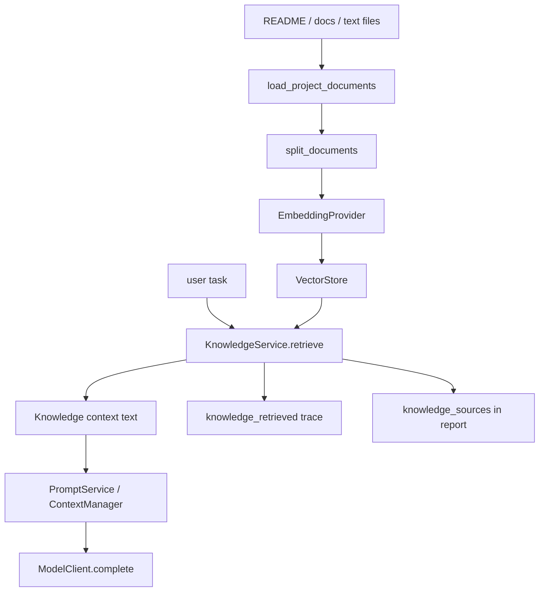

# 10 Knowledge Context Augmentation

## 本章解决什么问题

这一章解释 Pure 的 Knowledge 到底是什么，以及它不是什么。

必须先立边界：Pure 的 Knowledge 不是 Charon 那种面向业务问答的完整 RAG 系统，也不是知识库产品。它更准确地说是 Runtime context augmentation：在 Runtime 构建 prompt 前，从项目 README/docs/文本资料中检索一些相关片段，注入到模型上下文，帮助模型更了解当前项目。

当前默认 embedding 是 fake/local deterministic embedding，不代表真实语义检索能力。FAISS 是可选后端，不是默认能力。

## 这块在 Pure 中怎么实现

Knowledge 核心在 [pure/knowledge/service.py](../../pure/knowledge/service.py)。

主对象是 `KnowledgeService`：

```python
KnowledgeService(
    root,
    embedding_provider=None,
    vector_store=None,
    chunk_size=900,
    chunk_overlap=120,
)
```

它负责：

1. 从项目路径加载文档。
2. 把文档切成 chunk。
3. 调 embedding provider 生成向量。
4. 写入 vector store。
5. 根据用户 query 检索 top-k chunk。
6. 渲染成 `Knowledge context:` 文本注入 prompt。

文档加载在 [pure/knowledge/loaders.py](../../pure/knowledge/loaders.py)。默认偏向 README、docs、文本/Markdown 文档，也会忽略 `.git`、`.pure`、venv、cache、node_modules 等目录。

chunk 切分在 [pure/knowledge/splitter.py](../../pure/knowledge/splitter.py)。默认 `chunk_size=900`，`chunk_overlap=120`，按段落和窗口切分。

embedding 在 [pure/knowledge/embeddings.py](../../pure/knowledge/embeddings.py)：

| Provider | 说明 | 边界 |
| --- | --- | --- |
| `FakeEmbeddingProvider` | 本地 deterministic token/hash embedding | 不是语义模型 |
| `OpenAICompatibleEmbeddingProvider` | 调 OpenAI-compatible embeddings endpoint | 依赖 API key 和 provider |
| `GenericAPIEmbeddingProvider` | 通用 API embedding 适配 | 依赖接口形态 |
| `ConfigurableEmbeddingProvider` | 根据环境变量选择 provider | 默认 fake/mock |

vector store 在 [pure/knowledge/vector_store.py](../../pure/knowledge/vector_store.py)：

| Store | 说明 |
| --- | --- |
| `InMemoryVectorStore` | 默认路径 `.pure/knowledge/index.json`，名字叫 in-memory，但会 JSON 持久化 |
| `FaissVectorStore` | 可选，需要 `faiss-cpu` 和 numpy，可由 `PURE_VECTOR_STORE=faiss` 启用 |

Runtime 在 [pure/core/runtime.py](../../pure/core/runtime.py) 的 `retrieve_knowledge_context()` 中调用 Knowledge。当前逻辑是在 run 早期检索一次，然后把 `knowledge_context` 放入 prompt 相关 metadata/section，并写 `knowledge_retrieved` trace。report 中也会保留 `knowledge_sources`。

## 核心代码入口

| 入口 | 文件 | 重点看什么 |
| --- | --- | --- |
| `KnowledgeService.index_project()` | [pure/knowledge/service.py](../../pure/knowledge/service.py) | 如何加载并索引项目文档 |
| `KnowledgeService.retrieve_for_context()` | [pure/knowledge/service.py](../../pure/knowledge/service.py) | 检索结果如何渲染进 prompt |
| `load_project_documents()` | [pure/knowledge/loaders.py](../../pure/knowledge/loaders.py) | 默认读哪些文档，忽略哪些目录 |
| `split_documents()` | [pure/knowledge/splitter.py](../../pure/knowledge/splitter.py) | chunk 切分策略 |
| `FakeEmbeddingProvider` | [pure/knowledge/embeddings.py](../../pure/knowledge/embeddings.py) | 默认 fake embedding 的真实含义 |
| `vector_store_from_environment()` | [pure/knowledge/vector_store.py](../../pure/knowledge/vector_store.py) | inmemory/faiss 后端选择 |
| `PureRuntime.retrieve_knowledge_context()` | [pure/core/runtime.py](../../pure/core/runtime.py) | Runtime 如何拿 knowledge context |
| `KnowledgeAppService` | [pure/services/knowledge_app_service.py](../../pure/services/knowledge_app_service.py) | API 层 knowledge index/search |
| `tests/test_knowledge.py` | [../../tests/test_knowledge.py](../../tests/test_knowledge.py) | Knowledge 单元测试和 FAISS optional 测试 |

## 主流程图或伪代码



伪代码：

```python
if vector_store.empty():
    knowledge_service.index_project()

knowledge_context, sources = knowledge_service.retrieve_for_context(
    user_message,
    top_k=config.knowledge_top_k,
    budget_chars=config.knowledge_budget_chars,
)

trace("knowledge_retrieved", sources=sources)
prompt_sections["knowledge_context"] = knowledge_context
```

## 面试官会怎么追问

**Pure 的 Knowledge 和 RAG 有什么区别？**

可以回答：

> Pure 的 Knowledge 是 Runtime context augmentation。它主要给 Agent Runtime 提供项目上下文，比如 README/docs 中的约定。Charon 那类业务 RAG 更关心领域文档 ingestion、权限、召回质量、答案生成、引用、评估等完整产品链路。Pure 当前没有把 Knowledge 做成独立知识库产品。

**默认 fake embedding 是不是语义检索？**

可以回答：

> 不是。`FakeEmbeddingProvider` 是 deterministic 本地 embedding，主要用于测试和 dry-run。它能让链路稳定可跑，但不能代表真实语义检索效果。真实语义能力要接真实 embedding provider，并用真实数据验证。

**FAISS 是默认的吗？**

可以回答：

> 不是。FAISS 是 optional dependency。默认环境变量里 `PURE_VECTOR_STORE=inmemory`，如果设置成 `faiss` 且安装了可选依赖，才走 `FaissVectorStore`。

## 我应该怎么回答

30 秒版本：

> Pure 的 Knowledge 是给 Runtime prompt 补充项目上下文的轻量检索层。它会加载 README/docs，切 chunk，生成 embedding，写 vector store，检索后渲染成 `Knowledge context:` 注入 prompt，并在 trace/report 记录 sources。默认 fake embedding 只保证链路可测，不代表真实语义 RAG。

深挖版本：

> 我没有把它包装成完整知识库产品。它服务的是 Agent Runtime：减少模型对项目上下文的盲猜。当前默认 `ConfigurableEmbeddingProvider` 会落到 fake provider，vector store 默认是本地 JSON-backed store。FAISS 和真实 embedding 都是可选路径。面试时我会强调这是 context augmentation，不是 Charon 那种业务 RAG。

## 不能夸大的说法

不能说：

- “Pure 已经有完整 RAG 系统。”
- “默认 fake embedding 有真实语义召回能力。”
- “FAISS 是默认向量数据库。”
- “Knowledge 能保证模型回答正确。”
- “Pure 已经支持企业知识库权限和多租户隔离。”

更准确的说法：

- “Pure 实现了项目文档级 context augmentation。”
- “真实检索质量需要接真实 embedding provider 并运行评测验证。”

## 自测问题

1. `KnowledgeService` 的职责是什么？
2. 默认会索引哪些类型的文件？
3. chunk size 和 overlap 在哪里配置？
4. fake embedding 为什么对测试有价值？
5. `retrieve_for_context()` 返回的两个值分别是什么？
6. `knowledge_retrieved` trace 对 evaluator 有什么价值？
7. Pure Knowledge 和 Charon RAG 最核心的边界差异是什么？
