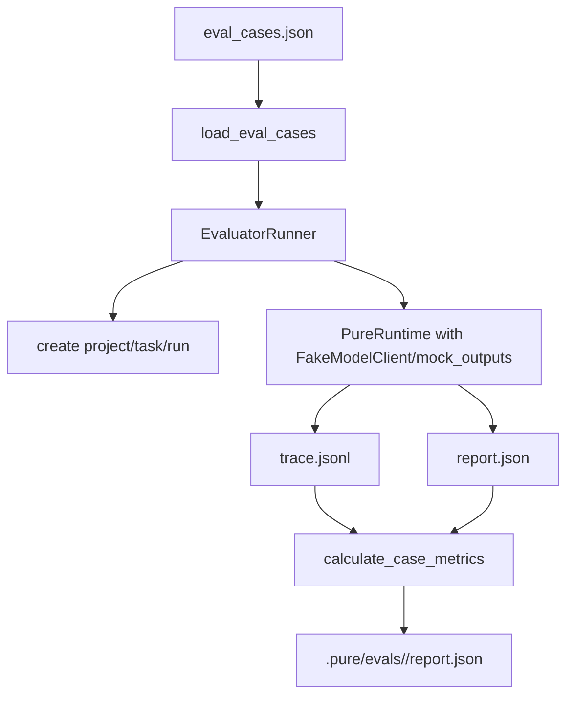

# 11 Evaluator 与 Benchmark

## 本章解决什么问题

这一章解释 Pure 为什么需要 evaluator，以及 evaluator 和 pytest 的区别。

pytest 回答的是“代码逻辑是否符合断言”。Evaluator 回答的是“一个 Agent run 的行为是否符合预期”。它不只看最终答案，还看工具是否调用、禁止工具是否被拒绝、trace 事件是否出现、checkpoint/knowledge/repetition/security 等 runtime behavior 是否发生。

Pure 当前没有 SWE-bench 成绩。任何 benchmark 数字都必须真实运行后再写，不能凭文档或 mock case 编。

## 这块在 Pure 中怎么实现

Evaluator 主代码在 [pure/evaluator](../../pure/evaluator)。

Eval case 定义在 [pure/evaluator/cases.py](../../pure/evaluator/cases.py)。必填字段包括：

| 字段 | 含义 |
| --- | --- |
| `id` | case id |
| `task` | 用户任务 |
| `expected_tools` | 期望出现的工具调用 |
| `forbidden_tools` | 不允许出现的工具调用 |
| `success_keywords` | final/report 中应包含的关键词 |
| `max_steps` | 最大工具步数 |
| `expected_trace_events` | 期望出现的 trace event |

可选字段：

| 字段 | 含义 |
| --- | --- |
| `mock_outputs` | 用来驱动 `FakeModelClient` 的模型输出序列 |
| `runtime_config` | 覆盖本 case 的 RuntimeConfig |

Runner 在 [pure/evaluator/runner.py](../../pure/evaluator/runner.py)。它会为每个 case 创建 project/task/run，使用 dry-run 或 `mock_outputs` 跑 Runtime，然后读取 trace/report，计算 metrics，最后写 `.pure/evals/<eval_id>/report.json`。

Metrics 在 [pure/evaluator/metrics.py](../../pure/evaluator/metrics.py)，包括：

- `case_passed`
- `task_success`
- `expected_tool_hit_rate`
- `forbidden_tool_count`
- `missing_expected_tools`
- `step_budget_met`
- `latency_ms`
- `checkpoint_created`
- `knowledge_retrieved`
- `expected_trace_event_hit_rate`
- `tool_rejection_count`
- `security_event_count`
- `repeated_tool_call_count`
- `failure_reasons`

当前 `eval_cases.json` 包含的 case：

| Case | 关注点 |
| --- | --- |
| `dry_run_runtime_smoke` | dry-run runtime smoke |
| `dry_run_knowledge_smoke` | knowledge trace smoke |
| `project_structure_analysis` | list/read tool 链路 |
| `tool_policy_readonly` | readonly 策略拒绝写工具 |
| `knowledge_retrieval_context` | knowledge context usage |
| `checkpoint_creation` | checkpoint trace |
| `forbidden_tool_guard` | forbidden tool / readonly rejection |

另有 [pure/utils/evaluator.py](../../pure/utils/evaluator.py) 和 [benchmarks/coding_tasks.json](../../benchmarks/coding_tasks.json) 这套 deterministic benchmark harness，主要用 FakeModelClient 和脚本化 fixtures 验证 harness 行为。它仍然不是 SWE-bench。

## 核心代码入口

| 入口 | 文件 | 重点看什么 |
| --- | --- | --- |
| `EvalCase` | [pure/evaluator/cases.py](../../pure/evaluator/cases.py) | case schema 和校验 |
| `EvaluatorRunner.run()` | [pure/evaluator/runner.py](../../pure/evaluator/runner.py) | 如何创建 task/run 并收集结果 |
| `calculate_case_metrics()` | [pure/evaluator/metrics.py](../../pure/evaluator/metrics.py) | 指标和 failure_reasons 如何产生 |
| `eval_cases.json` | [../../eval_cases.json](../../eval_cases.json) | 当前平台 eval cases |
| `pure/server/api/evals.py` | [pure/server/api/evals.py](../../pure/server/api/evals.py) | API evaluator 入口 |
| `pure/utils/evaluator.py` | [pure/utils/evaluator.py](../../pure/utils/evaluator.py) | 旧/独立 benchmark harness |
| `benchmarks/coding_tasks.json` | [../../benchmarks/coding_tasks.json](../../benchmarks/coding_tasks.json) | deterministic fixture tasks |
| `tests/test_platform_evaluator.py` | [../../tests/test_platform_evaluator.py](../../tests/test_platform_evaluator.py) | 平台 evaluator 测试 |
| `tests/test_evaluator.py` | [../../tests/test_evaluator.py](../../tests/test_evaluator.py) | utility evaluator 测试 |

## 主流程图或伪代码



伪代码：

```python
for case in cases:
    model_client = FakeModelClient(case.mock_outputs)
    run = start_task(case.task, runtime_config=case.runtime_config)
    trace = load_trace(run)
    report = load_report(run)
    metrics = calculate_case_metrics(case, trace, report)
    rows.append(metrics)

write_eval_report(rows, aggregate(rows))
```

## 面试官会怎么追问

**Evaluator 和 pytest 有什么区别？**

可以回答：

> pytest 验证代码函数和 API 行为；Evaluator 验证一次 Agent run 的行为证据。比如 pytest 可以断言 readonly 会拒绝写文件，Evaluator 可以用 case 验证某个任务过程中是否出现 expected trace event、是否调用 forbidden tool、是否产生 tool rejection。

**mock_outputs 怎么驱动 FakeModelClient？**

可以回答：

> Eval case 中的 `mock_outputs` 会作为 FakeModelClient 的输出序列。Runtime 每次调用 `complete()` 就取下一个输出。这样 evaluator 可以稳定复现工具调用、final answer、坏格式 retry 等路径，不依赖真实模型。

**哪些指标能写进简历？**

可以回答：

> 可以写“设计了 runtime evaluator，基于 trace/report 验证 expected tools、forbidden tools、trace events、security/repetition/checkpoint/knowledge 行为”。不能写 SWE-bench 成绩，不能写真实模型通过率，除非我真的跑过并能给出报告。

## 我应该怎么回答

30 秒版本：

> Pure 的 evaluator 不是替代 pytest，而是补充 Runtime 行为评测。它用 eval cases 驱动 dry-run/mock Runtime，读取 trace/report，计算工具命中、禁止工具、trace events、checkpoint、knowledge、repetition、安全拒绝等指标。当前没有 SWE-bench 成绩，所有数字都要真实运行后再说。

深挖版本：

> 我把 evaluator 设计成“证据消费层”。它不盲信 final answer，而是看 run artifacts。比如一个 case 期望出现 `tool_executed` 和 `checkpoint_created`，metrics 会检查 trace；如果 forbidden tool 出现，failure_reasons 会指出原因。这样可以回归 Runtime governance，而不是只测模型输出文本。

## 不能夸大的说法

不能说：

- “Pure 有 SWE-bench 成绩。”
- “Evaluator 证明真实模型能力强。”
- “dry-run pass rate 等于生产效果。”
- “mock_outputs 是真实推理。”
- “Evaluator 可以替代单元测试。”

更准确的说法：

- “Evaluator 覆盖的是 Runtime behavior，可以配合 pytest 做回归。”
- “真实 benchmark 需要接真实 provider 和公开数据集重新运行。”

## 自测问题

1. EvalCase 的必填字段有哪些？
2. `expected_tools` 和 `forbidden_tools` 分别怎么用？
3. `expected_trace_events` 为什么可以是字符串或对象？
4. `failure_reasons` 从哪里产生？
5. `repeated_tool_call_count` 优先从 report 读还是从 trace 算？
6. 为什么 evaluator 不能替代 pytest？
7. 面试时为什么不能写 SWE-bench？
