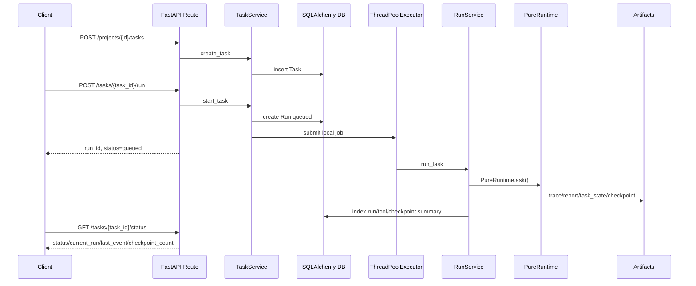

# 12 API 与 Service Layer

## 本章解决什么问题

这一章解释 Pure 的后端部分：FastAPI 入口、Project/Task/Run 生命周期、service layer、DB、artifacts，以及为什么当前没有 Redis/Celery/message queue。

Pure 是一个单机 Agent Runtime / Harness 原型，但它已经有后端服务化结构。面试时要避免两个极端：既不能说它只是脚本，也不能说它已经是生产级分布式平台。

## 这块在 Pure 中怎么实现

FastAPI 入口在 [pure/server/main.py](../../pure/server/main.py)。它注册了这些 router：

- sessions
- projects
- tasks
- runs
- tools
- knowledge
- evals

应用状态集中在 [pure/server/state.py](../../pure/server/state.py) 的 `RuntimeService`。它负责装配：

- `SessionService`
- `ProjectService`
- `TaskService`
- `RunService`
- `CheckpointAppService`
- `KnowledgeAppService`
- `EvaluatorAppService`
- `ToolAuditService`
- 本地 `ThreadPoolExecutor(max_workers=4)`

Project / Task / Run 的关系：

- Project：一个工作区项目，包含 `root_path` 和 metadata。
- Task：用户要 Runtime 完成的任务，属于一个 Project。
- Run：某一次执行尝试，属于一个 Task。

Create Task 和 Run Task 分开，是为了把“登记任务”和“执行任务”拆开：

1. `POST /projects` 创建项目。
2. `POST /projects/{project_id}/tasks` 创建任务，状态未必马上执行。
3. `POST /tasks/{task_id}/run` 创建 run 并调度执行。
4. `GET /tasks/{task_id}/status` 查询当前状态。
5. `GET /runs/{run_id}/trace` / `report` 读取 artifacts。

当前异步执行不是消息队列，而是进程内 `ThreadPoolExecutor`。API route 返回 queued/running 状态，本地后台线程执行 `_run_task_job()`，没有 Redis、Celery、RabbitMQ 或 WebSocket/SSE。

## 核心代码入口

| 入口 | 文件 | 重点看什么 |
| --- | --- | --- |
| FastAPI app | [pure/server/main.py](../../pure/server/main.py) | app/router 注册 |
| RuntimeService | [pure/server/state.py](../../pure/server/state.py) | 服务装配、本地 executor、model client factory |
| task API | [pure/server/api/tasks.py](../../pure/server/api/tasks.py) | create/run/status/cancel/resume |
| run API | [pure/server/api/runs.py](../../pure/server/api/runs.py) | trace/report/status 读取 |
| project API | [pure/server/api/projects.py](../../pure/server/api/projects.py) | Project 创建/读取 |
| schemas | [pure/server/schemas.py](../../pure/server/schemas.py) | API request/response |
| TaskService | [pure/services/task_service.py](../../pure/services/task_service.py) | Task/Run 生命周期和调度入口 |
| RunService | [pure/services/run_service.py](../../pure/services/run_service.py) | 执行 Runtime、索引 artifacts |
| scheduler | [pure/services/scheduler.py](../../pure/services/scheduler.py) | ThreadPoolExecutor 调度封装 |
| DB session | [pure/db/session.py](../../pure/db/session.py) | SQLAlchemy engine/session |
| repositories | [pure/db/repositories.py](../../pure/db/repositories.py) | Project/Task/Run/ToolCall/Checkpoint CRUD |

## 主流程图或伪代码



未来如果引入 Celery/Redis，插入位置应该在 `TaskService.start_task()` 和 `_run_task_job()` 之间：

```text
TaskService.start_task()
  -> create DB Run
  -> enqueue job to Redis/Celery
worker
  -> load task/project/runtime_config
  -> RunService.run_task()
  -> index artifacts
```

## 面试官会怎么追问

**没有 Redis/Celery 还是后端项目吗？**

可以回答：

> 是后端服务化原型，但不是生产级异步任务平台。它有 FastAPI、service layer、SQLAlchemy、repository、Project/Task/Run 生命周期和本地后台执行。Redis/Celery 是生产化长任务和横向扩展需要的下一步，不是当前已实现能力。

**什么场景需要消息队列？**

可以回答：

> 当任务耗时长、并发多、需要失败重试、跨进程/跨机器调度、worker 水平扩展、任务优先级、可靠取消和恢复时，需要消息队列。当前 ThreadPoolExecutor 适合本地原型和测试，不适合多实例生产部署。

**如果一个 Agent 任务跑 10 分钟，你会怎么改？**

可以回答：

> 我会把 run 调度从进程内 executor 抽到 job queue：API 只创建 run 和 enqueue，worker 执行 Runtime；trace 用 SSE/WebSocket 或轮询暴露；artifacts 放对象存储；DB 记录 job 状态；取消和恢复走明确状态机。

## 我应该怎么回答

30 秒版本：

> Pure 的 API 层是 FastAPI + service layer + SQLAlchemy。Project 表示工作区，Task 表示用户任务，Run 表示一次执行。创建 task 和 run 分开，run 由本地 ThreadPoolExecutor 后台执行，trace/report/checkpoint 写 artifacts，再索引摘要进 DB。当前没有 Redis/Celery，是单机原型。

深挖版本：

> Service layer 的意义是让 CLI/Runtime 和 HTTP API 解耦。API 不直接操作 `PureRuntime.ask()` 的细节，而是通过 TaskService/RunService 创建 DB 状态、装配 session/model client、调度 run、索引 artifacts。这样未来加队列时，主要替换调度层，而不是重写 Runtime 主循环。

## 不能夸大的说法

不能说：

- “Pure 已经有生产级异步任务系统。”
- “Pure 有 Redis/Celery。”
- “Status API 是实时推送。”
- “支持多租户 Auth/RBAC。”
- “ThreadPoolExecutor 等价于分布式 worker。”

更准确的说法：

- “Pure 当前是单机后端原型，已经有服务分层和本地异步执行，生产化需要引入队列、鉴权、实时推送和更强隔离。”

## 自测问题

1. FastAPI app 入口在哪里？
2. Project/Task/Run 的一对多关系是什么？
3. 为什么创建 Task 和 Run Task 要分开？
4. 当前后台执行靠什么实现？
5. Status API 返回哪些核心字段？
6. Redis/Celery 未来应该插在哪一层？
7. 为什么 API 层不应该直接塞满 Runtime 细节？
