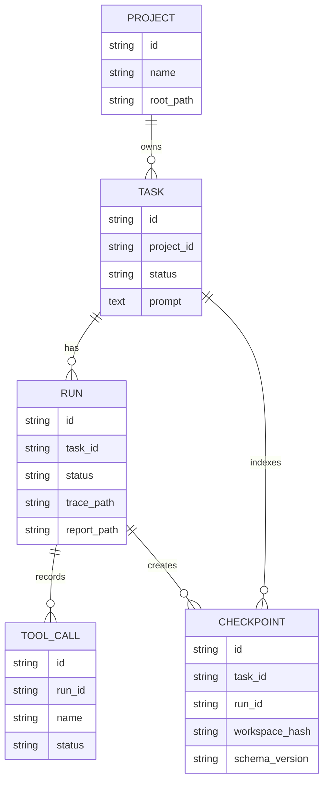

# 13 Data Model 与 Storage

## 本章解决什么问题

这一章解释 Pure 的数据模型和存储边界：哪些状态进 DB，哪些状态留在文件 artifacts，为什么不全部塞数据库，也不全部放文件。

Pure 当前的存储不是生产级数据平台，而是单机 Runtime/Harness 的后端元数据层。它用 SQLAlchemy 管 Project/Task/Run/ToolCall/Checkpoint 摘要，用 `.pure/` 文件保存完整 session、trace、report 和 checkpoint payload。

## 这块在 Pure 中怎么实现

DB model 在 [pure/db/models.py](../../pure/db/models.py)。

核心模型：

| 模型 | 含义 |
| --- | --- |
| `Project` | 一个工作区项目，保存 root path、name、description |
| `Task` | 用户任务，属于 Project，保存 prompt/status/runtime_config 等 |
| `Run` | 一次执行尝试，属于 Task，保存 status、artifact paths、started/finished 时间 |
| `ToolCall` | 工具调用摘要，属于 Run |
| `Checkpoint` | checkpoint 索引和 resume 校验摘要，属于 Task/Run |

Repository 在 [pure/db/repositories.py](../../pure/db/repositories.py)，负责 CRUD 和状态更新。

完整 artifacts 主要在本地文件：

```text
.pure/
├── pure.db
├── sessions/<session_id>.json
├── runs/<run_id>/
│   ├── task_state.json
│   ├── trace.jsonl
│   └── report.json
├── evals/<eval_id>/report.json
└── knowledge/index.json 或 index.faiss
```

DB 负责可查询的结构化 metadata：

- project/task/run 状态。
- run artifact path。
- tool call 摘要。
- checkpoint 摘要和校验字段。

文件 artifacts 负责完整证据：

- trace event stream。
- report 全量 JSON。
- session history/memory/checkpoints。
- evaluator report。
- knowledge index。

默认数据库 URL 来自 `.env.example`：

```text
PURE_DATABASE_URL=sqlite:///.pure/pure.db
```

因为使用 SQLAlchemy，配置 PostgreSQL URL 后可以走 Postgres。项目中也有 Alembic 和 docker compose 支持 DB 迁移/服务化，但当前默认仍是 SQLite 单机路径。

## 核心代码入口

| 入口 | 文件 | 重点看什么 |
| --- | --- | --- |
| DB models | [pure/db/models.py](../../pure/db/models.py) | Project/Task/Run/ToolCall/Checkpoint 字段 |
| repositories | [pure/db/repositories.py](../../pure/db/repositories.py) | CRUD 和状态更新 |
| DB session | [pure/db/session.py](../../pure/db/session.py) | engine/session/URL |
| Alembic env | [../../alembic/env.py](../../alembic/env.py) | migration 如何加载 metadata |
| migrations | [../../alembic/versions](../../alembic/versions) | 当前表结构演进 |
| RunStore | [pure/core/run_store.py](../../pure/core/run_store.py) | trace/report/task_state 文件 |
| SessionStore | [pure/core/session_store.py](../../pure/core/session_store.py) | session/checkpoint 文件 |
| RunService.index_run_artifacts() | [pure/services/run_service.py](../../pure/services/run_service.py) | artifacts 摘要如何写入 DB |
| `.env.example` | [../../.env.example](../../.env.example) | 默认 SQLite/knowledge 配置 |

## 主流程图或伪代码



索引伪代码：

```python
run = RunRepository.create(task_id, status="queued")
runtime.ask()

trace = load_trace(run.trace_path)
report = load_report(run.report_path)

for event in trace if event is tool event:
    ToolCallRepository.create(summary(event))

if report.checkpoint_id:
    CheckpointRepository.create(summary(checkpoint))
```

## 面试官会怎么追问

**为什么不全部塞数据库？**

可以回答：

> trace/report/session 这些是半结构化 artifacts，可能比较大，也需要直接人工查看和 evaluator 消费。全部塞 DB 会让 schema 演进和读写复杂度上升。当前 DB 存摘要和索引，完整证据留在文件。

**为什么不全部放文件？**

可以回答：

> 如果全部放文件，查询 project/task/run 状态、列任务、按 run 查工具调用和 checkpoint 会很不方便。API 服务层需要结构化状态和索引，所以 DB 存 metadata。

**SQLite/PostgreSQL 当前怎么支持？**

可以回答：

> 默认 `.env.example` 是 SQLite `.pure/pure.db`，适合单机原型。SQLAlchemy 和 Alembic 让它可以配置 PostgreSQL URL，但这不等于已经有生产多租户和高可用存储。

## 我应该怎么回答

30 秒版本：

> Pure 采用 DB metadata + file artifacts。DB 存 Project/Task/Run/ToolCall/Checkpoint 摘要，文件存完整 session、trace.jsonl、report.json、checkpoint payload 和 evaluator report。这样既能给 API 查询状态，又能保留可审计 artifacts。

深挖版本：

> 这个分层是按访问模式设计的。Task/Run 状态需要结构化查询，所以进 DB；trace/report 是证据文档，适合 JSONL/JSON 文件增量写和人工复盘。生产化后可以把 artifacts 放对象存储，把 DB 换成 Postgres，并补权限、保留策略和 migration 兼容。

## 不能夸大的说法

不能说：

- “Pure 已经是生产级数据平台。”
- “PostgreSQL 支持意味着已经多租户生产可用。”
- “所有状态都在 DB 里。”
- “文件 artifacts 有对象存储和生命周期管理。”
- “checkpoint 有完整 schema migration。”

更准确的说法：

- “Pure 当前实现了单机服务化所需的 metadata DB 和本地 artifacts 分层。”
- “生产化需要 Postgres、对象存储、权限、migration 和保留策略继续完善。”

## 自测问题

1. Project/Task/Run 分别代表什么？
2. ToolCall 表存的是完整工具输出还是摘要？
3. Checkpoint 表为什么不是完整 checkpoint source of truth？
4. `trace.jsonl` 存在哪里？
5. 默认数据库是什么？
6. 为什么 DB 和文件需要分工？
7. 生产化后 artifacts 应该怎么演进？
