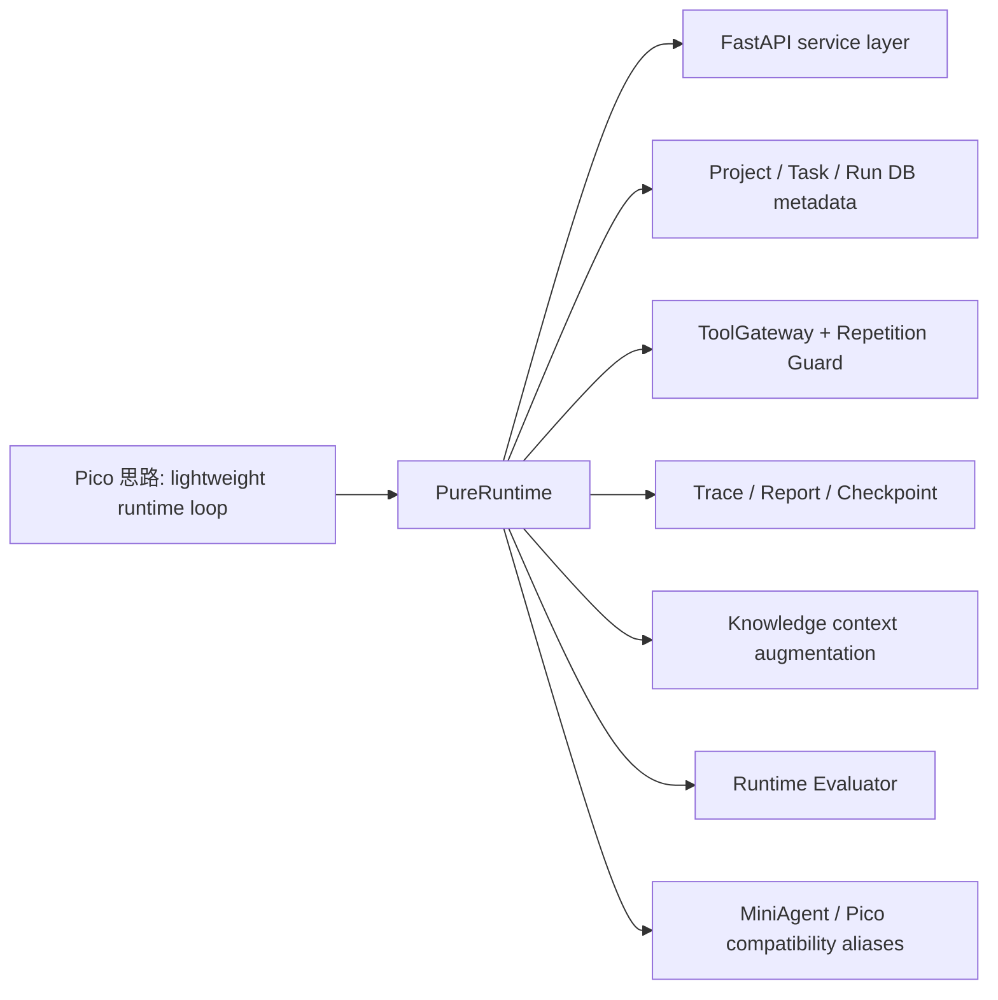

# 14 Pure vs Pico

## 本章解决什么问题

这一章帮助你诚实解释 Pure 和 Pico 的关系。

Pure 从 Pico 演进/魔改而来，但当前 Pure 已经不是原始 Pico。面试时既不能攻击原项目，也不能说 Pure 完全超越 Pico。更准确的表达是：Pure 继承了 Pico 的轻量 runtime 思路，但围绕后端工程化、运行时治理、API 服务化、评测和知识上下文做了系统改造。

## 这块在 Pure 中怎么实现

从代码看，Pure 仍保留了 Pico compatibility layer。在 [pure/core/runtime.py](../../pure/core/runtime.py) 中：

```python
MiniAgent = PureRuntime
Pico = PureRuntime
```

这说明：

- 当前真正的核心类是 `PureRuntime`。
- `MiniAgent` / `Pico` 是兼容别名。
- 保留 alias 的原因是迁移旧脚本、旧测试或旧 artifacts 时更平滑。

CLI 中也有 legacy 迁移痕迹：[pure/cli/cli.py](../../pure/cli/cli.py) 会处理 `.pico` 到 `.pure` 的迁移兼容。文档和测试中也能看到历史命名兼容。

Pure 相比原始 Pico 思想上继承了：

- 小型 runtime 主循环。
- 模型输出通过文本协议驱动工具或 final。
- 工具调用受 Runtime 管理。
- 会话状态和运行证据可落盘。
- 面向学习和面试解释的文档风格。

Pure 当前真实新增/强化的方向包括：

| 方向 | Pure 代码依据 |
| --- | --- |
| FastAPI service layer | [pure/server/main.py](../../pure/server/main.py), [pure/server/api](../../pure/server/api) |
| Project/Task/Run 生命周期 | [pure/services/task_service.py](../../pure/services/task_service.py), [pure/db/models.py](../../pure/db/models.py) |
| SQLAlchemy metadata DB | [pure/db](../../pure/db) |
| ToolGateway | [pure/tools/gateway.py](../../pure/tools/gateway.py) |
| Tool Repetition Guard | [pure/services/tool_repetition_guard.py](../../pure/services/tool_repetition_guard.py) |
| TraceService 标准事件 | [pure/services/trace_service.py](../../pure/services/trace_service.py) |
| Checkpoint/Resume API 校验 | [pure/services/checkpoint_app_service.py](../../pure/services/checkpoint_app_service.py) |
| Knowledge context augmentation | [pure/knowledge](../../pure/knowledge) |
| Evaluator | [pure/evaluator](../../pure/evaluator), [../../eval_cases.json](../../eval_cases.json) |
| 本地后台执行 | [pure/services/scheduler.py](../../pure/services/scheduler.py), [pure/server/state.py](../../pure/server/state.py) |
| MCP fake/stdin adapter | [pure/integrations/mcp_client](../../pure/integrations/mcp_client) |

需要谨慎说的点：

- “async execution” 当前是 API route + 进程内 ThreadPoolExecutor，不是分布式队列。
- “Knowledge” 是 context augmentation，不是完整 RAG。
- “Evaluator” 是 runtime behavior evaluator，不是 SWE-bench。
- “Checkpoint/Resume” 是单机状态校验恢复，不是事务级恢复。

## 核心代码入口

| 入口 | 文件 | 适合讲什么 |
| --- | --- | --- |
| `PureRuntime` alias | [pure/core/runtime.py](../../pure/core/runtime.py) | Pico/MiniAgent 兼容关系 |
| CLI legacy migration | [pure/cli/cli.py](../../pure/cli/cli.py) | `.pico` 到 `.pure` 兼容 |
| API service layer | [pure/server/main.py](../../pure/server/main.py) | Pure 服务化改造 |
| DB models | [pure/db/models.py](../../pure/db/models.py) | 后端元数据层 |
| ToolGateway | [pure/tools/gateway.py](../../pure/tools/gateway.py) | 工具治理强化 |
| Evaluator | [pure/evaluator/runner.py](../../pure/evaluator/runner.py) | 运行时评测 |
| Knowledge | [pure/knowledge/service.py](../../pure/knowledge/service.py) | context augmentation |
| README 定位 | [../../README.md](../../README.md) | 单机 runtime/harness 边界 |

## 主流程图或伪代码



面试解释伪代码：

```text
不是：我只是复制 Pico。
而是：我保留 runtime loop 的核心思想，
然后把它改造成后端 harness：
API + DB + ToolGateway + Trace + Checkpoint + Knowledge + Evaluator。
```

## 面试官会怎么追问

**你这个项目是不是抄 Pico？**

可以回答：

> 项目最初参考 Pico 的轻量 runtime 思路，我保留了兼容层，比如 `Pico = PureRuntime`，也保留了部分迁移逻辑。后续我围绕工程化后端、运行时治理、API 服务化、评测和知识上下文做了系统改造。判断不是简单复制，可以看 FastAPI/DB/Project-Task-Run、ToolGateway、Repetition Guard、Evaluator、Knowledge、Checkpoint resume API 这些当前代码模块。

**为什么保留 Pico alias？**

可以回答：

> 这是兼容层。旧脚本、旧测试或旧 artifacts 可能仍引用 `Pico` 或 `MiniAgent`。把它们 alias 到 `PureRuntime` 可以降低迁移成本，同时主命名已经转成 Pure。

**Pure 相比 Pico 强在哪里？**

可以回答：

> 我不会说完全超越。更准确是定位不同：Pico 更轻量，Pure 当前更偏后端 runtime/harness，强调 Project/Task/Run、工具治理、trace/report/checkpoint、API、DB、evaluator 和 knowledge context。

## 我应该怎么回答

必背话术：

> 这个项目最初参考 Pico，但我围绕工程化后端、运行时治理、API 服务化、评测和知识上下文做了系统改造。

扩展版：

> Pure 继承了 Pico 的轻量 Runtime 主循环思路，但当前实现已经围绕后端服务化重构：FastAPI 提供 Project/Task/Run API，SQLAlchemy 存 metadata，Run artifacts 存 trace/report，ToolGateway 和 Repetition Guard 管工具调用，Checkpoint/Resume 做状态校验恢复，Evaluator 消费 trace/report 做行为评测。它仍然是单机原型，不是生产分布式平台。

## 不能夸大的说法

不能说：

- “Pure 完全超越 Pico。”
- “Pico 没价值。”
- “Pure 与 Pico 已经没有任何关系。”
- “Pure 是完全原创从零开始。”
- “Pure 已经生产级。”

更准确的说法：

- “Pure 从 Pico 思路演进而来，保留兼容层，但当前代码在服务化、治理、评测和知识上下文上做了明显改造。”

## 自测问题

1. `PureRuntime` 和 `Pico` alias 的关系是什么？
2. 为什么保留 `MiniAgent`？
3. CLI 中 `.pico` 迁移说明了什么？
4. Pure 哪些模块能证明不是简单照搬？
5. 哪些能力只能说是规划或原型，不能说生产级？
6. 面试时如何既承认参考开源，又讲清自己的改造价值？
