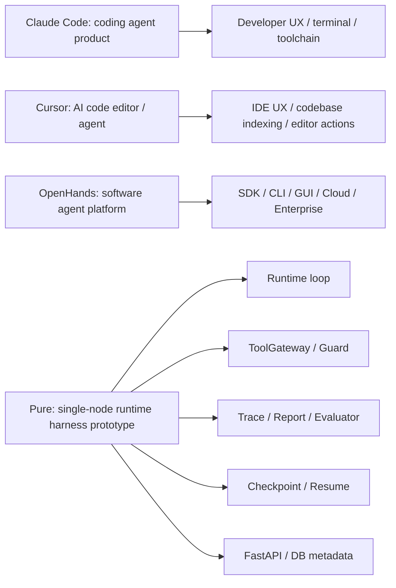

# 15 Pure vs Claude Code / OpenHands / Cursor

## 本章解决什么问题

这一章解决面试里最常见的比较问题：

> “你这个和 Claude Code、Cursor、OpenHands 有什么区别？”

核心答案是：Pure 和它们不是同类产品。Claude Code / Cursor 更接近面向开发者的 Coding Agent / Coding Assistant 产品；OpenHands 是更完整的软件开发 Agent 平台；Pure 当前是单机 Agent Runtime / Harness 原型，重点在后端 Runtime 治理链路，不在 IDE UX、终端体验或完整 Coding Agent 产品化。

外部定位参照：

- Anthropic 官方把 Claude Code 描述为可以读取 codebase、跨文件修改、运行测试并交付 committed code 的 agentic coding system。参考 [Anthropic Claude Code](https://www.anthropic.com/product/claude-code)。
- Cursor 官方定位是 AI code editor / coding agent，强调 codebase understanding、Agent、IDE 体验和多模型。参考 [Cursor](https://cursor.com/) 与 [Cursor Agent docs](https://docs.cursor.com/agent)。
- OpenHands README 定位为 AI-Driven Development，并提供 SDK、CLI、Local GUI、Cloud、Enterprise 等形态。参考 [OpenHands GitHub](https://github.com/OpenHands/OpenHands)。

这些参照只是为了回答“不是同类产品”，不能用来暗示 Pure 已经达到它们的产品完整度。

## 这块在 Pure 中怎么实现

Pure 当前可讲的价值来自代码中的 Runtime/Harness 能力：

| Pure 能力 | 代码入口 | 可讲价值 |
| --- | --- | --- |
| Runtime Loop | [pure/core/runtime.py](../../pure/core/runtime.py) | 模型调用、parse、工具执行、trace/checkpoint/report 的主编排 |
| ToolGateway | [pure/tools/gateway.py](../../pure/tools/gateway.py) | 工具边界、审批、风险元数据 |
| Repetition Guard | [pure/services/tool_repetition_guard.py](../../pure/services/tool_repetition_guard.py) | 短窗口同工具同参数重复调用治理 |
| Trace/Report | [pure/services/trace_service.py](../../pure/services/trace_service.py), [pure/core/run_store.py](../../pure/core/run_store.py) | Runtime 行为证据 |
| Checkpoint/Resume | [pure/services/checkpoint_service.py](../../pure/services/checkpoint_service.py), [pure/services/checkpoint_app_service.py](../../pure/services/checkpoint_app_service.py) | 状态存档与恢复前校验 |
| Evaluator | [pure/evaluator](../../pure/evaluator) | 基于 trace/report 的 runtime behavior 评测 |
| API/DB | [pure/server](../../pure/server), [pure/db](../../pure/db) | Project/Task/Run 服务化和 metadata |
| Knowledge | [pure/knowledge](../../pure/knowledge) | 项目文档 context augmentation |

Pure 缺少的产品能力也要说清楚：

- 没有 IDE UX。
- 没有成熟 terminal polish。
- 没有生产 sandbox。
- 没有公开 benchmark 成绩。
- 没有强 planner / multi-agent 系统。
- 没有 production security / multi-user isolation。
- 没有 Redis/Celery 分布式任务系统。
- 没有 WebSocket/SSE live trace streaming。

## 核心代码入口

| 比较点 | Pure 代码依据 | 面试表达 |
| --- | --- | --- |
| 不是 IDE | 无前端 IDE 代码，只有 FastAPI/CLI | “Pure 不做编辑器体验。” |
| 不是 Claude Code 替代品 | README 定位、Runtime 后端结构 | “Pure 是 Runtime/Harness，不是用户级 coding assistant。” |
| 工具治理 | [pure/tools/gateway.py](../../pure/tools/gateway.py) | “我重点做模型输出后的受控执行。” |
| 可观测性 | [pure/services/trace_service.py](../../pure/services/trace_service.py) | “每次 run 有结构化 trace/report。” |
| 恢复 | [pure/services/checkpoint_service.py](../../pure/services/checkpoint_service.py) | “checkpoint 是 identity-verified recovery 原型。” |
| 评测 | [pure/evaluator/metrics.py](../../pure/evaluator/metrics.py) | “Evaluator 检查 runtime behavior。” |

## 主流程图或伪代码



面试比较伪代码：

```text
if asked "is it Claude Code?":
    say no
    explain Pure is lower-level runtime/harness
    name what Pure has
    name what Pure lacks
```

## 面试官会怎么追问

**你这个和 Claude Code 有什么区别？**

可以回答：

> Claude Code 是面向开发者的 agentic coding system，强调在真实开发环境中读代码、改文件、跑测试、提交结果。Pure 不做这个产品体验。Pure 是我做的单机 Runtime/Harness 原型，重点研究模型输出之后的执行治理：parse、ToolGateway、Trace、Checkpoint、Evaluator、API/DB 生命周期。

**为什么不直接用 LangChain？**

可以回答：

> LangChain 是通用 LLM 应用框架，抽象很多链、工具和集成。Pure 的目标更窄：我想把 Agent Runtime 的主循环、工具治理、trace、checkpoint、evaluator、API 后端这条链路自己吃透。不是否定 LangChain，而是这个项目用于理解 runtime/harness 的工程边界。

**为什么不做完整 Coding Agent 产品？**

可以回答：

> 因为完整产品需要 IDE/terminal UX、sandbox、planner、benchmark、权限、多用户隔离、实时协作等大量能力。Pure 当前更适合作为后端 Runtime 原型，先把可控执行、可观测、可恢复、可评测做清楚。

## 我应该怎么回答

30 秒版本：

> Pure 不是 Claude Code、Cursor 或 OpenHands 的替代品。它不是完整 coding assistant 产品，而是单机 Agent Runtime/Harness 原型。我的重点是 Runtime 主循环、工具治理、trace/report、checkpoint/resume、evaluator、API/DB 和 knowledge context，不是 IDE UX 或生产 sandbox。

深挖版本：

> 如果把 Claude Code/Cursor 看成用户使用的 coding agent 产品，Pure 更像其中偏后端的 runtime harness 实验：模型输出怎么解析、工具调用怎么被策略约束、执行证据怎么记录、失败后怎么用 checkpoint 判断能否恢复、Runtime 行为怎么用 evaluator 回归。这些是产品背后的基础设施问题，但 Pure 当前只做到单机原型。

## 不能夸大的说法

不能说：

- “Pure 是 Claude Code 替代品。”
- “Pure 比 Cursor 更强。”
- “Pure 是完整 OpenHands 平台。”
- “Pure 有生产 sandbox 和多用户权限。”
- “Pure 有公开 benchmark 成绩。”

更准确的说法：

- “Pure 与这些产品定位不同，它更像 runtime/harness 学习和验证项目。”
- “Pure 可以讲 Runtime 治理设计，但不能夸成完整 coding agent 产品。”

## 自测问题

1. Claude Code、Cursor、OpenHands 各自大致是什么？
2. 为什么说 Pure 和它们不是同类产品？
3. Pure 缺少哪些产品化能力？
4. Pure 在面试中可讲的价值有哪些？
5. 为什么不能说 Pure 是 Claude Code 替代品？
6. 如果面试官问 LangChain，你怎么回答？
