# 16 Limitations 与 Roadmap

## 本章解决什么问题

这一章专门防止面试时吹过头。

Pure 当前是单机 Agent Runtime / Harness 原型。它有不少后端工程化结构，但不能说成完整生产级分布式 Agent 平台。Roadmap 也不能写成已实现。

## 这块在 Pure 中怎么实现

当前已实现的能力可以基于代码确认：

| 状态 | 能力 | 代码依据 |
| --- | --- | --- |
| Implemented | `PureRuntime.ask()` 主循环 | [pure/core/runtime.py](../../pure/core/runtime.py) |
| Implemented | CLI dry-run / provider path | [pure/cli/cli.py](../../pure/cli/cli.py) |
| Implemented | FastAPI service layer | [pure/server/main.py](../../pure/server/main.py) |
| Implemented | SQLAlchemy metadata DB | [pure/db](../../pure/db) |
| Implemented | Project/Task/Run | [pure/db/models.py](../../pure/db/models.py), [pure/services/task_service.py](../../pure/services/task_service.py) |
| Implemented | ToolGateway | [pure/tools/gateway.py](../../pure/tools/gateway.py) |
| Implemented | Repetition Guard | [pure/services/tool_repetition_guard.py](../../pure/services/tool_repetition_guard.py) |
| Implemented | Trace/report artifacts | [pure/services/trace_service.py](../../pure/services/trace_service.py), [pure/core/run_store.py](../../pure/core/run_store.py) |
| Implemented | Checkpoint/resume 校验原型 | [pure/services/checkpoint_service.py](../../pure/services/checkpoint_service.py), [pure/services/checkpoint_app_service.py](../../pure/services/checkpoint_app_service.py) |
| Implemented | Knowledge context augmentation | [pure/knowledge](../../pure/knowledge) |
| Implemented | Evaluator | [pure/evaluator](../../pure/evaluator) |
| Implemented | 本地后台执行 | [pure/services/scheduler.py](../../pure/services/scheduler.py) |

当前限制：

- single-node prototype。
- no Redis/Celery/message queue。
- no Auth/RBAC。
- no WebSocket/SSE。
- no production multi-user isolation。
- no SWE-bench evaluation。
- fake embedding default。
- real provider behavior unstable，效果依赖模型和网络。
- no strong planner/multi-agent。
- no production sandbox。
- manual approval 没有完整人审 UI。
- artifacts 默认本地文件，没有对象存储。
- checkpoint schema migration 还不完整。
- MCP 当前以 adapter/fake/stdin 路径为主，不能夸成成熟 MCP 平台。

## 核心代码入口

| 判断 | 看哪里 |
| --- | --- |
| 没有 Redis/Celery 依赖 | [pyproject.toml](../../pyproject.toml) |
| 默认 SQLite/fake embedding | [../../.env.example](../../.env.example) |
| 本地 executor | [pure/server/state.py](../../pure/server/state.py), [pure/services/scheduler.py](../../pure/services/scheduler.py) |
| 没有 Auth/RBAC route/middleware | [pure/server/main.py](../../pure/server/main.py), [pure/server/api](../../pure/server/api) |
| Evaluator case | [../../eval_cases.json](../../eval_cases.json), [pure/evaluator](../../pure/evaluator) |
| FAISS optional | [pyproject.toml](../../pyproject.toml), [pure/knowledge/vector_store.py](../../pure/knowledge/vector_store.py) |
| Checkpoint schema | [pure/services/checkpoint_service.py](../../pure/services/checkpoint_service.py) |

## 主流程图或伪代码

```mermaid
flowchart TD
    Implemented["Implemented now"] --> Runtime["Runtime / ToolGateway / Trace / Checkpoint / Evaluator / API"]
    Planned["Planned"] --> Queue["Redis/Celery async jobs"]
    Planned --> Auth["Auth/RBAC"]
    Planned --> Stream["WebSocket/SSE trace streaming"]
    Planned --> OTEL["OpenTelemetry"]
    Planned --> Storage["Object storage"]
    Planned --> Vector["real embeddings + pgvector/Milvus"]
    Planned --> SWE["SWE-bench Lite adapter"]
    Planned --> MCP["MCP integration hardening"]
    Planned --> Planner["better planner"]
    Planned --> Human["human approval UI"]
    NotScope["Not in current scope"] --> Replacement["Claude Code replacement"]
    NotScope --> Distributed["full distributed agent platform"]
```

Roadmap 分层：

| 类别 | 事项 | 状态表达 |
| --- | --- | --- |
| Async jobs | Redis/Celery | Planned |
| Security | Auth/RBAC | Planned |
| Realtime | WebSocket/SSE live trace | Planned |
| Observability | OpenTelemetry | Planned |
| Artifacts | Object storage | Planned |
| Knowledge | real embedding provider | Planned |
| Vector DB | pgvector/Milvus | Planned |
| Benchmark | SWE-bench Lite adapter | Planned |
| Tool ecosystem | MCP tool integration hardening | Planned |
| Agent quality | better planner | Planned |
| Human control | human approval UI | Planned |
| Product scope | Claude Code/Cursor replacement | Not in scope |
| Platform scope | full production distributed platform | Not in current scope |

## 面试官会怎么追问

**为什么没有 Redis/Celery？**

可以回答：

> 当前目标是单机 Runtime/Harness 原型，先验证 Runtime 主循环、工具治理、trace、checkpoint 和 evaluator。API 的异步路径用 ThreadPoolExecutor 足够覆盖本地测试。生产化长任务和多实例部署时，我会把 TaskService 到 RunService 之间替换成 Redis/Celery 或类似 job queue。

**没有 Auth/RBAC 是不是不能叫后端？**

可以回答：

> 它是后端原型，但不是生产后端平台。Auth/RBAC 是生产化必须补的能力。当前代码重点在 Runtime lifecycle 和 execution governance。

**real provider 不稳定怎么办？**

可以回答：

> 所以 Pure 用 FakeModelClient 和 evaluator 把 Runtime behavior 测稳定。真实 provider 的格式和效果需要额外评测，不能把 dry-run 结果当真实模型效果。

## 我应该怎么回答

30 秒版本：

> Pure 当前是 single-node runtime/harness prototype。已实现 Runtime 主循环、ToolGateway、Trace/Report、Checkpoint/Resume 校验、Knowledge、Evaluator、FastAPI 和 DB metadata。没实现 Redis/Celery、Auth/RBAC、WebSocket/SSE、生产 sandbox、多租户隔离和 SWE-bench。Roadmap 是生产化方向，不是已完成能力。

深挖版本：

> 我会把能力分成 implemented、planned、not in scope。Implemented 是代码里能看到的 Runtime governance 和 service layer；planned 是队列、鉴权、实时 trace、OTel、对象存储、真实 embedding、向量库、SWE-bench Lite、MCP hardening、人审 UI；not in scope 是把 Pure 说成 Claude Code 替代品或完整分布式平台。

## 不能夸大的说法

不能说：

- “Pure 已经生产级。”
- “Pure 已经分布式。”
- “Pure 有完整权限系统。”
- “Pure 有实时 trace streaming。”
- “Pure 有 SWE-bench 成绩。”
- “fake embedding 代表真实 RAG 能力。”

更准确的说法：

- “Pure 当前验证的是单机 runtime/harness 的工程链路。”
- “Roadmap 是下一阶段设计，不是已实现。”

## 自测问题

1. 哪些能力是当前代码已实现？
2. 哪些能力只是 roadmap？
3. 为什么 ThreadPoolExecutor 不能说成分布式队列？
4. fake embedding 默认值说明了什么？
5. 为什么 no SWE-bench 必须主动说明？
6. 面试中怎么把限制说得专业而不显得项目薄？
