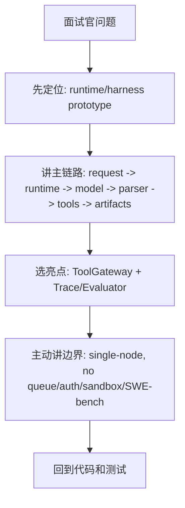

# 17 Interview Talk Track

## 本章解决什么问题

这一章给你准备可以直接开口说的面试话术。

目标不是把 Pure 说得很大，而是说得可信：能讲定位、能讲主链路、能承认边界、能回答质疑。

## 这块在 Pure 中怎么实现

所有话术都围绕当前代码事实：

- Runtime 主循环：[pure/core/runtime.py](../../pure/core/runtime.py)
- ToolGateway：[pure/tools/gateway.py](../../pure/tools/gateway.py)
- Repetition Guard：[pure/services/tool_repetition_guard.py](../../pure/services/tool_repetition_guard.py)
- TraceService：[pure/services/trace_service.py](../../pure/services/trace_service.py)
- Checkpoint：[pure/services/checkpoint_service.py](../../pure/services/checkpoint_service.py)
- Evaluator：[pure/evaluator](../../pure/evaluator)
- API/DB：[pure/server](../../pure/server), [pure/db](../../pure/db)
- Knowledge：[pure/knowledge](../../pure/knowledge)

## 核心代码入口

| 话术主题 | 代码依据 |
| --- | --- |
| 30 秒定位 | [README.md](../../README.md), [pure/core/runtime.py](../../pure/core/runtime.py) |
| 主链路 | [pure/core/runtime.py](../../pure/core/runtime.py), [pure/services/tool_execution_service.py](../../pure/services/tool_execution_service.py) |
| 工具治理 | [pure/tools/gateway.py](../../pure/tools/gateway.py), [pure/tools/policies.py](../../pure/tools/policies.py) |
| 可观测性 | [pure/services/trace_service.py](../../pure/services/trace_service.py), [pure/core/run_store.py](../../pure/core/run_store.py) |
| 恢复 | [pure/services/checkpoint_service.py](../../pure/services/checkpoint_service.py) |
| 评测 | [pure/evaluator/metrics.py](../../pure/evaluator/metrics.py), [../../eval_cases.json](../../eval_cases.json) |

## 主流程图或伪代码



面试回答伪代码：

```text
先说项目是什么
再说解决什么问题
然后讲一条主链路
接着讲一个亮点
最后主动收边界
```

## 面试官会怎么追问

### 30 秒版本

> Pure 是我从 Pico 演进出来的单机 Agent Runtime / Harness 原型。它不是 Claude Code 替代品，也不是生产级分布式平台。核心是把一次 Agent 运行拆成 Project/Task/Run，经过 Runtime 主循环、ModelClient、parser、ToolExecutionService、ToolGateway，再产生 trace/report/checkpoint，并用 evaluator 回归运行时行为。

### 1 分钟版本

> Pure 解决的是 Agent Runtime 层的问题：模型输出不可控、工具调用不可观测、中断后难恢复、重复探索难治理、运行行为难评测。代码上，`PureRuntime.ask()` 是主循环，每轮构建 prompt、调用模型、parse 输出、执行工具或返回 final。工具不会被模型直接执行，而是经过 `ToolExecutionService`、`ToolRepetitionGuard` 和 `ToolGateway`。每次 run 会产生 trace.jsonl、report.json 和 checkpoint，API 层用 Project/Task/Run 管生命周期，Evaluator 消费 trace/report 做行为评测。

### 2 分钟版本

> 这个项目最初参考 Pico 的轻量 runtime 思路，但我围绕后端工程化做了改造。现在它有 CLI 和 FastAPI 两条入口，服务层会创建 Project、Task、Run，装配 RuntimeConfig 和 ModelClient，然后进入 `PureRuntime.ask()`。Runtime 不依赖具体 provider，只调 `ModelClient.complete()`，返回文本先经过 `parse()` 转成 ToolCall、FinalAnswer 或 RetryNotice。ToolCall 进入 ToolExecutionService，先做短窗口重复调用检测，再进 ToolGateway 做工具存在性、参数、approval/read-only、workspace escape 和风险元数据记录。执行过程写 trace，结束写 report，关键状态点创建 checkpoint。Evaluator 用 eval_cases 驱动 FakeModelClient/mock outputs，读取 trace/report 来检查 expected tools、forbidden tools、trace events 和 runtime metrics。当前它是单机原型，没有 Redis/Celery/Auth/WebSocket/SWE-bench，也没有生产 sandbox。

### 5 分钟深挖版本

> 我会从 Runtime 和后端两条线讲。Runtime 线：`PureRuntime.ask()` 是控制循环，它一边推进任务，一边生产证据。每轮 prompt 都重新构建，因为 history、tool observation、memory、knowledge context、checkpoint 状态可能变化。模型输出不能直接执行，必须经过 parser。Parser 把 XML-like `<tool>` / `<final>` 转成控制对象，坏格式会变成 retry notice。工具链路是 `ToolExecutionService -> ToolRepetitionGuard -> ToolGateway -> Tool`，职责分清：Service 管流程，Guard 管重复调用，Gateway 管安全边界，Tool 管真实执行。状态线：RunStore 写 task_state、trace.jsonl、report.json；CheckpointService 存 memory snapshot、workspace hash、runtime identity；API 用 Project/Task/Run 和 DB metadata 暴露任务生命周期；Evaluator 消费 artifacts 评测行为。这个项目的价值不是模型更聪明，而是把 Agent 执行治理、可观测、可恢复、可评测做成一条可解释链路。

## 我应该怎么回答

**如果面试官只让我讲一个亮点，我讲什么？**

> 我会讲 ToolGateway + Trace/Evaluator 的闭环。模型不是直接执行工具，而是经过 parser、ToolExecutionService、Repetition Guard、ToolGateway。Gateway 做参数校验、approval/read-only、workspace escape、risk metadata；Runtime 同时写结构化 trace。Evaluator 再消费 trace/report 检查 expected tools、forbidden tools、security/repetition/checkpoint events。这个亮点能体现 Runtime 治理，不只是调模型。

**如果面试官质疑项目是 Vibe Coding，我怎么回答？**

> 我会承认项目开发中使用了 AI 辅助，但掌握项目不看写代码方式，而看能不能解释架构边界、调用链、测试证据和限制。我能从 `PureRuntime.ask()` 讲到 ModelClient、parse、ToolExecutionService、ToolGateway、RunStore、CheckpointService、Evaluator，并指出哪些是 fake/mock/dry-run，哪些不是生产级。这说明我不是只会跑生成结果，而是在复盘和验证 Runtime 设计。

**如果面试官问为什么没有 Redis/Celery，我怎么回答？**

> 当前定位是单机 Runtime/Harness 原型，先验证主循环、工具治理、trace、checkpoint 和 evaluator。API 的后台执行用 ThreadPoolExecutor，可以支持本地任务生命周期和测试。Redis/Celery 是生产化长任务、多实例、失败重试和 worker 扩展需要的下一步，会插在 TaskService start run 和 RunService 执行之间。

**如果面试官问为什么没有 SWE-bench，我怎么回答？**

> 我没有跑 SWE-bench，所以不会写成绩。当前 evaluator 验证的是 Runtime behavior，比如工具调用、禁止工具、trace events、checkpoint、knowledge、repetition guard。SWE-bench Lite 可以作为 roadmap，但只有真实接入并跑出报告后才能写指标。

**如果面试官问为什么不是 Claude Code，我怎么回答？**

> Claude Code 是面向开发者的 coding agent 产品，强调终端/工具链体验、读改跑测提交。Pure 是更底层的单机 runtime/harness 原型，关注模型输出后的受控执行、证据记录、恢复校验和评测。定位不同，所以我不会把 Pure 说成替代品。

**如果面试官问开源魔改含金量，我怎么回答？**

> 我会说项目最初参考 Pico，但我围绕工程化后端、运行时治理、API 服务化、评测和知识上下文做了系统改造。可以看代码里的 FastAPI/DB Project-Task-Run、ToolGateway、Repetition Guard、TraceService、Checkpoint resume API、KnowledgeService、Evaluator。这些是当前 Pure 的真实改造点。

## 不能夸大的说法

不能说：

- “我做了一个 Claude Code。”
- “这是生产级 Agent 平台。”
- “已经有 SWE-bench 成绩。”
- “支持分布式任务队列和多租户权限。”
- “fake evaluator 证明真实模型效果。”
- “这个项目完全原创，没有参考 Pico。”

更准确的说法：

- “这是单机 Runtime/Harness 原型，重点在执行治理和证据链。”
- “我能讲清楚哪些已实现、哪些是规划、哪些是 mock/dry-run。”

## 自测问题

1. 30 秒内如何说清 Pure？
2. 2 分钟内如何讲完整主链路？
3. 如果只能讲一个亮点，为什么选 ToolGateway + Trace/Evaluator？
4. 面试官说“AI 生成项目”时，你怎么把话题拉回代码理解？
5. 为什么没有 Redis/Celery 不是致命问题，但必须承认？
6. 为什么不能写 SWE-bench？
