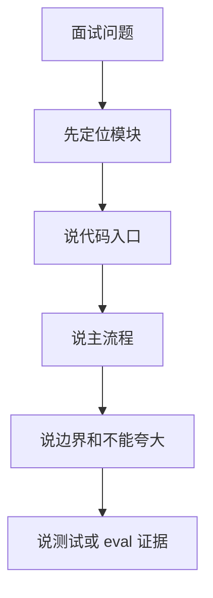

# 18 Interview Questions

## 本章解决什么问题

这一章提供一套按模块分组的面试题库。目标不是背标准答案，而是训练你把每个问题都落回 Pure 当前代码、测试和真实边界。

每个问题都包含：

- 简短回答
- 深挖回答
- 不能说的话
- 对应代码位置
- 面试官可能继续追问

## 这块在 Pure 中怎么实现

题库覆盖 Pure 的主链路：

```text
Project/Task/Run
-> RuntimeConfig
-> PureRuntime.ask()
-> ModelClient.complete()
-> parse()
-> ToolExecutionService
-> ToolRepetitionGuard
-> ToolGateway
-> Tool
-> Trace/Report/Checkpoint
-> Evaluator/API/DB
```

## 核心代码入口

| 模块 | 核心路径 |
| --- | --- |
| Runtime | [pure/core/runtime.py](../../pure/core/runtime.py) |
| ModelClient | [pure/core/models.py](../../pure/core/models.py) |
| Tool execution | [pure/services/tool_execution_service.py](../../pure/services/tool_execution_service.py) |
| ToolGateway | [pure/tools/gateway.py](../../pure/tools/gateway.py) |
| Repetition Guard | [pure/services/tool_repetition_guard.py](../../pure/services/tool_repetition_guard.py) |
| Trace/Run artifacts | [pure/services/trace_service.py](../../pure/services/trace_service.py), [pure/core/run_store.py](../../pure/core/run_store.py) |
| Checkpoint | [pure/services/checkpoint_service.py](../../pure/services/checkpoint_service.py) |
| Knowledge | [pure/knowledge](../../pure/knowledge) |
| Evaluator | [pure/evaluator](../../pure/evaluator), [../../eval_cases.json](../../eval_cases.json) |
| API/DB | [pure/server](../../pure/server), [pure/db](../../pure/db) |
| Tests | [../../tests](../../tests) |

## 主流程图或伪代码



## 面试官会怎么追问

面试官通常会沿三条线追问：

1. 你是否知道代码在哪里。
2. 你是否知道为什么这样设计。
3. 你是否知道当前项目没做到什么。

## 我应该怎么回答

回答模板：

```text
这个模块解决的是...
在 Pure 里代码入口是...
主流程是...
它的边界是...
测试或 eval 可以看...
```

## 不能夸大的说法

整套题库的底线：

- 不说生产级。
- 不说分布式。
- 不说 Claude Code 替代品。
- 不说 SWE-bench 成绩。
- 不把 fake/mock/dry-run 当真实能力。
- 不把 roadmap 当已实现。

## 自测问题

### 1. 项目定位

1. Pure 是什么？
简答：Pure 是单机 Agent Runtime / Harness 原型。
深挖：它有 CLI、FastAPI、Project/Task/Run、Runtime 主循环、工具治理、trace/report/checkpoint、Knowledge 和 Evaluator。
不能说：Pure 是 Claude Code 替代品或生产级分布式平台。
代码：`README.md`, `pure/core/runtime.py`, `pure/server/main.py`。
追问：Runtime 和 Agent Application 有什么区别？

2. Pure 不是什么？
简答：不是完整业务 Agent、不是 IDE、不是生产级多租户平台。
深挖：它缺少 Auth/RBAC、Redis/Celery、WebSocket/SSE、生产 sandbox、SWE-bench 成绩。
不能说：功能只是暂时没写但已经支持。
代码：`pyproject.toml`, `.env.example`, `pure/server`。
追问：为什么这些缺失仍然能作为后端原型？

3. 为什么说 Pure 更像 Harness？
简答：因为它治理的是模型输出后的执行环境。
深挖：核心价值在 parse、ToolExecutionService、ToolGateway、Trace、Checkpoint、Evaluator，不是某个固定业务决策。
不能说：Harness 等同于模型智能。
代码：`pure/core/runtime.py`, `pure/services/tool_execution_service.py`。
追问：Harness 和 LangChain 的区别是什么？

4. Pure 解决哪些核心问题？
简答：工具不可控、过程不可观测、中断难恢复、重复探索、缺少运行时评测。
深挖：对应 ToolGateway、TraceService、CheckpointService、Repetition Guard、Evaluator。
不能说：已经彻底解决所有 Agent 安全和 loop 问题。
代码：`pure/tools/gateway.py`, `pure/services/trace_service.py`, `pure/evaluator/metrics.py`。
追问：哪个问题你认为最关键？

5. 30 秒怎么介绍 Pure？
简答：Pure 是从 Pico 演进的单机 Agent Runtime/Harness 原型。
深挖：它用 Project/Task/Run 管生命周期，用 Runtime loop 编排模型和工具，用 artifacts/evaluator 复盘行为。
不能说：这是完整 coding agent 产品。
代码：`README.md`, `docs/deep-dive/17-interview-talk-track.md`。
追问：你自己主要改造了哪里？

### 2. Runtime Loop

6. Runtime 主循环入口在哪里？
简答：在 `PureRuntime.ask()`。
深挖：它负责创建 TaskState/RunStore、检索 Knowledge、循环调用模型、parse、执行工具、写 trace/checkpoint/report。
不能说：只是调用一次模型。
代码：`pure/core/runtime.py`。
追问：一次 ask 为什么会产生一个 run？

7. 每轮循环做什么？
简答：build prompt、call model、parse、final/tool/retry 分支。
深挖：tool 分支会进入 ToolExecutionService，final 分支会 finish_success 并写 report，retry 分支会把 notice 写回上下文。
不能说：模型输出直接执行。
代码：`pure/core/runtime.py`。
追问：retry limit 怎么收敛？

8. prompt 为什么每轮重建？
简答：因为 history、tool observation、memory、knowledge、checkpoint/context reduction 状态会变化。
深挖：ContextManager/PromptService 会按 section 重新组装上下文和 metadata。
不能说：prompt 是启动时固定的。
代码：`pure/core/context_manager.py`, `pure/services/prompt_service.py`。
追问：重建 prompt 的成本和收益是什么？

9. final answer 怎么判断？
简答：`parse()` 识别 `<final>...</final>`，非标签非空文本当前也会作为 final。
深挖：final 会写 history、promote durable memory、checkpoint、run_completed、report。
不能说：所有 provider 都强制结构化 final。
代码：`pure/core/runtime.py`。
追问：如果模型一直坏格式怎么办？

10. step limit 和 retry limit 怎么处理？
简答：tool steps 超限或 attempts 超限后停止并写 stop reason。
深挖：Runtime 用 `max_steps` 限制工具步数，用 `max_attempts` 限制坏格式/重试循环。
不能说：无限跑直到成功。
代码：`pure/core/runtime.py`, `pure/core/task_state.py`。
追问：为什么 attempts 不等于 tool steps？

### 3. ModelClient / Parser

11. ModelClient 的统一接口是什么？
简答：`complete(prompt, max_new_tokens=400, **kwargs) -> str`。
深挖：Runtime 只依赖这个接口，不绑定具体 provider。
不能说：Runtime 直接依赖 OpenAI SDK。
代码：`pure/core/models.py`。
追问：usage/cache 信息怎么处理？

12. FakeModelClient 为什么重要？
简答：它让 dry-run、测试和 evaluator 不依赖真实模型。
深挖：mock_outputs 可以稳定驱动 tool/final/retry 路径，验证 Runtime behavior。
不能说：Fake 代表真实模型能力。
代码：`pure/core/models.py`, `pure/evaluator/runner.py`。
追问：Fake 输出用完会怎样？

13. Pure 支持哪些 provider 路径？
简答：Fake、OpenAI-compatible、Anthropic-style、Ollama。
深挖：DeepSeek 在 CLI/API 中走 compatible client 路径，真实效果依赖 provider。
不能说：支持所有 provider 或原生所有高级能力。
代码：`pure/core/models.py`, `pure/cli/cli.py`, `pure/server/state.py`。
追问：为什么 provider-neutral 有价值？

14. parse() 做什么？
简答：把 raw text 转成 ToolCall、FinalAnswer 或 RetryNotice。
深挖：它是模型文本和 Runtime 控制流之间的桥，防止 raw text 直接执行。
不能说：parser 能保证模型永远合规。
代码：`pure/core/runtime.py`。
追问：malformed tool JSON 怎么办？

15. 为什么不用原生 function calling？
简答：为了 provider-neutral 和测试可控，当前用 XML-like 文本协议。
深挖：代价是格式约束弱，需要 retry；未来可在 ModelClient/parser 层替换。
不能说：XML 标签比 function calling 永远更好。
代码：`pure/core/runtime.py`, `pure/core/models.py`。
追问：未来迁移 function calling 要改哪层？

### 4. ToolExecutionService

16. ToolCall 是什么？
简答：parser 解析出的工具调用意图，包含 name 和 args。
深挖：它还不是工具执行结果，必须经过 Service/Gateway。
不能说：ToolCall 就是工具函数。
代码：`pure/core/runtime.py`。
追问：ToolCall 从哪里进入执行链路？

17. ToolExecutionService 的职责是什么？
简答：工具执行总调度。
深挖：它接收 ToolCall，调用 Repetition Guard，再调用 ToolGateway，包装 result/metadata。
不能说：它是安全沙箱或具体工具。
代码：`pure/services/tool_execution_service.py`。
追问：为什么不让 Runtime 直接调 Gateway？

18. ToolExecutionService 和 ToolGateway 有什么区别？
简答：Service 管流程，Gateway 管边界。
深挖：Service 负责 runtime-level orchestration；Gateway 负责工具注册、校验、approval、安全策略和执行。
不能说：二者是同一个东西。
代码：`pure/services/tool_execution_service.py`, `pure/tools/gateway.py`。
追问：Repetition Guard 放在哪一层？

19. 工具结果怎么回到下一轮上下文？
简答：Runtime 把 observation 写入 history/memory，再重新 build prompt。
深挖：ToolResult 文本和 metadata 也会进入 trace/report 证据链。
不能说：工具结果只打印到终端。
代码：`pure/core/runtime.py`, `pure/services/tool_execution_service.py`。
追问：工具失败也会写 history 吗？

20. 为什么模型不能直接调用工具？
简答：要经过 parser、guard、gateway、trace。
深挖：否则会绕过参数校验、approval、path escape、安全拒绝和证据记录。
不能说：相信模型自己会安全。
代码：`pure/core/runtime.py`, `pure/tools/gateway.py`。
追问：哪些工具风险最高？

### 5. ToolGateway

21. 工具怎么注册？
简答：通过 `TOOL_SPECS` 和 `ToolRegistry`。
深挖：spec 定义 name、description、schema、risky，registry 计算 risk level。
不能说：工具是随意动态执行的函数。
代码：`pure/tools/toolkit.py`, `pure/tools/registry.py`。
追问：新增工具要改哪里？

22. 参数怎么校验？
简答：`validate_tool()` 按工具类型校验 args。
深挖：包括 path、timeout、content、patch old_text 唯一性等。
不能说：只靠模型生成正确参数。
代码：`pure/tools/toolkit.py`。
追问：patch_file 为什么要 old_text 唯一？

23. path escape 怎么防？
简答：路径解析到 workspace root 后用 commonpath 检测。
深挖：`PureRuntime.path()` 拒绝逃逸工作区，shell args 也有 workspace policy。
不能说：这是完整 OS sandbox。
代码：`pure/core/runtime.py`, `pure/tools/policies.py`。
追问：run_shell 为什么更难防？

24. approval mode 有哪些？
简答：`auto`、`readonly`、`manual`。
深挖：readonly 拒绝高风险写/shell，manual 对高风险工具返回 waiting_approval。
不能说：manual 已有完整人审 UI。
代码：`pure/tools/policies.py`, `pure/tools/gateway.py`。
追问：legacy approval policy 怎么兼容？

25. Gateway metadata 记录什么？
简答：tool_status、risk、approval、affected_paths、workspace_changed、latency 等。
深挖：risky tool 会做 before/after workspace snapshot，用于 audit 和 report。
不能说：metadata 等于完整安全审计平台。
代码：`pure/tools/gateway.py`。
追问：workspace_changed 如何影响 Repetition Guard？

### 6. Tool Repetition Guard

26. Repetition Guard 解决什么问题？
简答：短窗口内同工具同参数重复调用。
深挖：它治理模型重复探索，例如连续 `list_files("pure")`。
不能说：解决所有 Agent loop。
代码：`pure/services/tool_repetition_guard.py`。
追问：为什么不是安全策略？

27. recent_tool_calls 保存什么？
简答：tool_name、normalized_args、step、timestamp、workspace_fingerprint。
深挖：workspace_fingerprint 变化后允许重复，因为语义环境可能变了。
不能说：只按原始 JSON 字符串比较。
代码：`pure/services/tool_repetition_guard.py`。
追问：normalized args 怎么做？

28. normalized args 忽略什么？
简答：忽略 timeout、limit、display_limit、max_lines 等非语义字段。
深挖：path 字段会规范化为 workspace 相对 slash path。
不能说：所有参数都同等影响重复判断。
代码：`pure/services/tool_repetition_guard.py`。
追问：为什么 timeout 不算语义变化？

29. warn 和 block 区别是什么？
简答：warn 记录事件后继续执行，block 直接拒绝。
深挖：warn 会写 `repeated_tool_call_detected`；block 会写 `tool_rejected_repeated_call`。
不能说：warn 会阻止工具。
代码：`pure/services/tool_execution_service.py`。
追问：默认模式是什么？

30. 为什么 mutating tool 后清空 guard？
简答：工作区变了，之前的重复判断可能不再有效。
深挖：write/patch/shell 可能改变文件，重复读操作不一定还是重复探索。
不能说：guard 永远保留所有调用历史。
代码：`pure/services/tool_execution_service.py`。
追问：shell nonzero 但改了文件怎么办？

### 7. Trace / Report

31. trace.jsonl 是什么？
简答：一次 run 的结构化事件流。
深挖：每行一个 JSON event，包含 run_id、step、event_type、payload、status 等。
不能说：只是普通日志。
代码：`pure/core/run_store.py`, `pure/services/trace_service.py`。
追问：为什么用 JSONL？

32. report.json 是什么？
简答：run 结束后的摘要。
深挖：包含 status、stop_reason、final_answer、tool_steps、attempts、knowledge_sources、repeated count 等。
不能说：report 等于完整 trace。
代码：`pure/core/runtime.py`。
追问：report 什么时候写？

33. TraceService 为什么要标准化事件？
简答：统一 Runtime、API、Evaluator 消费的事件类型。
深挖：它把 `prompt_built` 映射到 `context_built`，把 `run_finished` 映射到 completed/failed。
不能说：所有代码内部事件名都完全一致。
代码：`pure/services/trace_service.py`。
追问：legacy `event` 字段为什么还保留？

34. Trace 和日志有什么区别？
简答：Trace 是结构化运行证据，日志是开发排错文本。
深挖：Evaluator 会消费 trace 判断工具、安全、checkpoint、knowledge 行为。
不能说：trace 是 OpenTelemetry 分布式 trace。
代码：`pure/evaluator/metrics.py`, `pure/services/trace_service.py`。
追问：哪些 trace event 最重要？

35. Run artifacts 怎么组织？
简答：`.pure/runs/<run_id>/task_state.json|trace.jsonl|report.json`。
深挖：session/checkpoint payload 在 `.pure/sessions`，eval report 在 `.pure/evals`。
不能说：所有状态都在数据库里。
代码：`pure/core/run_store.py`, `pure/core/session_store.py`。
追问：为什么文件和 DB 要分开？

### 8. Checkpoint / Resume

36. create_checkpoint 和 resume 区别是什么？
简答：create 是存档，resume 是读档校验并启动新 run。
深挖：主循环创建 checkpoint 不代表正在恢复。
不能说：checkpoint 就是恢复动作。
代码：`pure/services/checkpoint_service.py`, `pure/services/checkpoint_app_service.py`。
追问：resume 是否恢复 Python 调用栈？

37. checkpoint 保存什么？
简答：任务状态、memory snapshot、workspace hash、runtime identity、last trace event 等。
深挖：这些字段用于恢复前判断旧状态是否可信。
不能说：只是保存一个 JSON。
代码：`pure/services/checkpoint_service.py`。
追问：runtime identity 包含哪些字段？

38. partial-stale 是什么？
简答：checkpoint 可读但部分 key file freshness 变旧。
深挖：说明旧上下文可能不完全可信，需要谨慎继续。
不能说：partial-stale 等于完全有效。
代码：`pure/services/checkpoint_service.py`。
追问：和 workspace-mismatch 区别是什么？

39. workspace-mismatch 怎么处理？
简答：workspace hash 不匹配时 resume 会拒绝或报告 mismatch。
深挖：API resume 会返回 409，避免用过期状态继续。
不能说：自动强行恢复。
代码：`pure/services/checkpoint_app_service.py`, `tests/test_tool_gateway_checkpoint_resume.py`。
追问：workspace hash 能证明语义一致吗？

40. 为什么 context reduction 也 checkpoint？
简答：上下文裁剪改变模型可见信息，需要留下审计点。
深挖：Runtime 检测 `budget_reductions` 后触发 `context_reduction` checkpoint。
不能说：只有 risky tool 才 checkpoint。
代码：`pure/core/runtime.py`, `pure/core/context_manager.py`。
追问：README 中 risky tool 前 checkpoint 说法准确吗？

### 9. Knowledge

41. KnowledgeService 做什么？
简答：项目文档索引、检索、渲染到 prompt。
深挖：它加载 README/docs，切 chunk，embedding，写 vector store，retrieve_for_context。
不能说：完整业务 RAG。
代码：`pure/knowledge/service.py`。
追问：默认索引哪些文件？

42. chunk 怎么切？
简答：按文档内容切 chunk，默认 size 900 overlap 120。
深挖：splitter 尽量按段落/窗口组织，避免超预算。
不能说：有复杂语义分块算法。
代码：`pure/knowledge/splitter.py`。
追问：chunk size 为什么影响 prompt？

43. fake embedding 是什么？
简答：本地 deterministic embedding，用于测试。
深挖：它不代表真实语义召回，只保证链路可跑可测。
不能说：默认就有强语义检索。
代码：`pure/knowledge/embeddings.py`。
追问：真实 embedding 怎么接？

44. FAISS 是默认吗？
简答：不是，是 optional dependency。
深挖：默认 `.env.example` 是 `PURE_VECTOR_STORE=inmemory`，FAISS 需安装并配置。
不能说：Pure 默认有向量数据库。
代码：`.env.example`, `pyproject.toml`, `pure/knowledge/vector_store.py`。
追问：InMemoryVectorStore 是否持久化？

45. Knowledge 怎么进入 prompt？
简答：`retrieve_for_context()` 返回 `Knowledge context:` 文本。
深挖：Runtime run 早期检索一次，sources 写 trace/report。
不能说：每轮都一定重新检索。
代码：`pure/core/runtime.py`, `pure/knowledge/service.py`。
追问：和 Charon RAG 的区别？

### 10. Evaluator

46. Evaluator 解决什么问题？
简答：评测一次 Agent run 的行为是否符合预期。
深挖：它看 trace/report，不只看 final answer。
不能说：替代 pytest 或证明真实模型能力。
代码：`pure/evaluator/runner.py`, `pure/evaluator/metrics.py`。
追问：为什么 behavior metrics 重要？

47. EvalCase 有哪些字段？
简答：id、task、expected_tools、forbidden_tools、success_keywords、max_steps、expected_trace_events。
深挖：还支持 mock_outputs 和 runtime_config。
不能说：case 只有输入和输出。
代码：`pure/evaluator/cases.py`, `eval_cases.json`。
追问：expected_trace_events 为什么可以是对象？

48. failure_reasons 怎么产生？
简答：metrics 根据缺失工具、禁用工具、关键词、trace events 等生成。
深挖：runner error 也会追加到 failure_reasons。
不能说：失败只有 pass/fail 一个布尔。
代码：`pure/evaluator/metrics.py`, `pure/evaluator/runner.py`。
追问：如何定位一个 eval case 失败？

49. repeated/security/tool rejection 指标是什么意思？
简答：分别统计重复调用、安全事件、工具拒绝。
深挖：这些来自 trace/report，是 Runtime governance 的证据。
不能说：这些等于模型质量指标。
代码：`pure/evaluator/metrics.py`。
追问：哪些指标适合写简历？

50. 当前有哪些 eval cases？
简答：7 个平台 eval cases，覆盖 dry-run、knowledge、tools、readonly、checkpoint、forbidden guard。
深挖：具体看 `eval_cases.json`，不要凭记忆编通过率。
不能说：有 SWE-bench。
代码：`eval_cases.json`。
追问：如何新增一个 eval case？

### 11. API / Backend

51. FastAPI 入口在哪里？
简答：`pure/server/main.py`。
深挖：它注册 sessions/projects/tasks/runs/tools/knowledge/evals routers。
不能说：只有 CLI 没有后端。
代码：`pure/server/main.py`。
追问：RuntimeService 在哪里创建？

52. Project/Task/Run 是什么关系？
简答：Project 有多个 Task，Task 有多个 Run。
深挖：Project 是工作区，Task 是任务，Run 是一次执行尝试。
不能说：Task 和 Run 是同一个概念。
代码：`pure/db/models.py`, `pure/services/task_service.py`。
追问：为什么 Task 和 Run 分开？

53. Create Task 和 Run Task 为什么分开？
简答：登记任务和执行任务是两个生命周期动作。
深挖：方便后续排队、重试、resume、状态查询和多次 run。
不能说：只是 API 多此一举。
代码：`pure/server/api/tasks.py`, `pure/services/task_service.py`。
追问：未来加队列时怎么改？

54. 当前异步执行怎么做？
简答：进程内 ThreadPoolExecutor。
深挖：不是 Redis/Celery；API 返回 queued，后台本地线程跑 Runtime。
不能说：分布式任务队列。
代码：`pure/server/state.py`, `pure/services/scheduler.py`。
追问：任务跑 10 分钟怎么办？

55. Status API 返回什么？
简答：task/run 状态、current run、step、last trace event、checkpoint count 等。
深挖：它汇总 DB 状态和 artifact trace 摘要。
不能说：WebSocket 实时流。
代码：`pure/services/task_service.py`, `pure/server/api/tasks.py`。
追问：trace/report API 怎么读？

### 12. DB / Storage

56. DB 存哪些模型？
简答：Project、Task、Run、ToolCall、Checkpoint。
深挖：DB 存 metadata 和摘要，不存完整 trace payload。
不能说：所有 runtime 状态都在 DB。
代码：`pure/db/models.py`。
追问：ToolCall 表有哪些审计字段？

57. artifacts 存哪些东西？
简答：session、task_state、trace、report、eval report、knowledge index。
深挖：完整 checkpoint payload 在 session artifact，DB 只索引摘要。
不能说：artifacts 只是缓存。
代码：`pure/core/run_store.py`, `pure/core/session_store.py`。
追问：为什么 checkpoint 表不是 source of truth？

58. 为什么不全部塞数据库？
简答：trace/report 是大而半结构化的证据文档。
深挖：JSONL 文件便于追加、人工查看和 evaluator 消费。
不能说：数据库不能存 JSON。
代码：`pure/core/run_store.py`, `pure/services/run_service.py`。
追问：生产化后怎么存？

59. 为什么不全部放文件？
简答：API 需要结构化查询 Project/Task/Run 状态。
深挖：DB 提供索引、状态查询和关系建模。
不能说：文件系统足够所有后端查询。
代码：`pure/db/repositories.py`, `pure/services/task_service.py`。
追问：状态一致性怎么保证？

60. SQLite/PostgreSQL 怎么支持？
简答：默认 SQLite，SQLAlchemy URL 可配置 Postgres。
深挖：Alembic 负责 schema migration，但这不等于生产高可用。
不能说：已经生产级 Postgres 多租户。
代码：`.env.example`, `pure/db/session.py`, `alembic/`。
追问：迁移脚本怎么验证？

### 13. Testing

61. Pure 有哪些测试类别？
简答：runtime、tools、gateway、checkpoint、API、DB、knowledge、evaluator、docs/docker 等。
深挖：测试覆盖 Runtime behavior 和后端服务层，但真实模型效果不由 pytest 保证。
不能说：测试证明生产可用。
代码：`tests/`。
追问：你最看重哪类测试？

62. dry-run 测试有什么价值？
简答：不用真实模型也能验证主链路和 artifacts。
深挖：FakeModelClient 让 parse/tool/final/checkpoint/evaluator 可重复。
不能说：dry-run 等于真实 provider。
代码：`pure/core/models.py`, `tests/test_task_api.py`。
追问：真实 provider 要怎么测？

63. Gateway 测试重点是什么？
简答：approval、readonly、path escape、tool audit、resume 相关行为。
深挖：这些测试证明工具边界在单机 Runtime 内生效。
不能说：测试证明 OS sandbox 安全。
代码：`tests/test_tool_gateway_checkpoint_resume.py`。
追问：run_shell 还有什么风险？

64. Evaluator 测试和 evaluator 本身区别？
简答：pytest 测 evaluator 代码，evaluator 评测 Agent run 行为。
深挖：`test_platform_evaluator.py` 验证 case loading、trace expectations、failure_reasons。
不能说：两者是同一个东西。
代码：`tests/test_platform_evaluator.py`, `pure/evaluator`。
追问：如何避免 evaluator 自己坏掉？

65. docs guardrail tests 有什么意义？
简答：防止文档/API/docker 描述和代码明显脱节。
深挖：比如检查 docs 提到 eval endpoints、compose 没有 Redis 等。
不能说：文档测试能证明所有文档都准确。
代码：`tests/test_docs_and_docker.py`。
追问：这次 deep-dive 文档还需要什么测试？

### 14. Limitations

66. 当前最大限制是什么？
简答：单机原型，缺少生产化任务队列、安全和隔离。
深挖：没有 Redis/Celery/Auth/RBAC/WebSocket/SSE/production sandbox。
不能说：只是配置没开。
代码：`pyproject.toml`, `pure/server`。
追问：先补哪个最重要？

67. 没有 SWE-bench 怎么解释？
简答：诚实说没有跑，不能写成绩。
深挖：当前 evaluator 是 runtime behavior evaluator，不是公开 coding benchmark。
不能说：dry-run benchmark 等同 SWE-bench。
代码：`pure/evaluator`, `benchmarks/coding_tasks.json`。
追问：如何接 SWE-bench Lite？

68. fake embedding 默认有什么风险？
简答：容易被误解成真实语义检索。
深挖：它只是 deterministic 测试 embedding，真实效果要接 provider。
不能说：默认 RAG 很强。
代码：`.env.example`, `pure/knowledge/embeddings.py`。
追问：如何评估真实检索质量？

69. real provider behavior unstable 怎么处理？
简答：用 Fake 稳定验证 Runtime，用真实 provider 单独评测格式和效果。
深挖：模型输出坏格式会 retry，但不能保证所有任务成功。
不能说：所有模型都稳定兼容。
代码：`pure/core/models.py`, `pure/core/runtime.py`。
追问：provider adapter 应如何加强？

70. no planner/multi-agent 怎么解释？
简答：Pure 当前重点是 Runtime execution governance。
深挖：delegate 是工具能力，不等于成熟 multi-agent planner。
不能说：已有完整多 Agent 协作系统。
代码：`pure/tools/toolkit.py`, `pure/core/runtime.py`。
追问：planner 应该放哪层？

### 15. Pure vs Pico / Claude Code

71. Pure 和 Pico 什么关系？
简答：Pure 从 Pico 思路演进，保留 compatibility aliases。
深挖：当前核心是 `PureRuntime`，`Pico = PureRuntime` 是兼容层。
不能说：完全原创或完全无关。
代码：`pure/core/runtime.py`, `pure/cli/cli.py`。
追问：怎么证明不是简单复制？

72. Pure 相比 Pico 改造了什么？
简答：API/DB、Project/Task/Run、ToolGateway、Repetition Guard、Knowledge、Evaluator、Checkpoint API。
深挖：这些模块在当前代码中有独立实现和测试。
不能说：Pure 完全超越 Pico。
代码：`pure/server`, `pure/db`, `pure/tools/gateway.py`, `pure/evaluator`。
追问：哪个改造最有含金量？

73. Pure 和 Claude Code 区别？
简答：Claude Code 是 coding agent 产品，Pure 是 runtime/harness 原型。
深挖：Pure 不做 IDE/terminal polish/committed code 产品体验。
不能说：Pure 是 Claude Code 替代品。
代码：`README.md`, `pure/core/runtime.py`。
追问：Pure 有什么可讲价值？

74. Pure 和 Cursor 区别？
简答：Cursor 是 AI code editor/coding agent，Pure 没有编辑器 UX。
深挖：Pure 关注后端 Runtime lifecycle 和 tool governance。
不能说：Pure 比 Cursor 更强。
代码：`pure/server`, `pure/tools/gateway.py`。
追问：Pure 是否能成为某种后端 harness？

75. Pure 和 OpenHands 区别？
简答：OpenHands 是更完整的软件开发 Agent 平台，Pure 是小型单机原型。
深挖：Pure 没有 SDK/CLI/GUI/Cloud/Enterprise 那样的完整产品矩阵。
不能说：Pure 已经是 OpenHands 级别平台。
代码：`README.md`, `docs/deep-dive/15-pure-vs-claude-code-openhands-cursor.md`。
追问：为什么还值得做 Pure？

### 16. Productionization

76. 如果要生产化，第一步改什么？
简答：任务队列和 worker 化。
深挖：把 TaskService start run 到 RunService run_task 之间替换为 Redis/Celery/job queue。
不能说：ThreadPoolExecutor 生产够用。
代码：`pure/services/task_service.py`, `pure/services/scheduler.py`。
追问：如何处理任务取消？

77. 如何做实时 trace streaming？
简答：引入 WebSocket/SSE，trace append 后推送事件。
深挖：当前 trace 是 JSONL 文件和轮询 API，未来可从 RunStore/TraceService 发事件。
不能说：当前已经实时推送。
代码：`pure/services/trace_service.py`, `pure/core/run_store.py`。
追问：断线重连怎么补事件？

78. 如何加强安全？
简答：Auth/RBAC、sandbox、命令隔离、人审 UI。
深挖：ToolGateway 是应用层边界，生产需要容器/权限/审计/secret 管理。
不能说：ToolGateway 等于生产 sandbox。
代码：`pure/tools/gateway.py`, `pure/tools/policies.py`。
追问：run_shell 应该如何隔离？

79. artifacts 如何生产化？
简答：对象存储 + DB metadata + schema versioning。
深挖：trace/report/checkpoint 放 S3-compatible store，DB 存路径、hash、retention、权限。
不能说：本地 `.pure` 适合多实例生产。
代码：`pure/core/run_store.py`, `pure/services/run_service.py`。
追问：如何保证 DB 和对象存储一致？

80. 如何接 SWE-bench Lite？
简答：新增 adapter，把 benchmark case 映射成 Project/Task/Run，并收集真实结果。
深挖：需要真实 provider、sandbox、超时、patch 验证、指标报告，不能复用 dry-run pass rate。
不能说：现有 evaluator 已经等于 SWE-bench。
代码：`pure/evaluator`, `benchmarks/coding_tasks.json`。
追问：最难的是任务执行还是结果验证？
