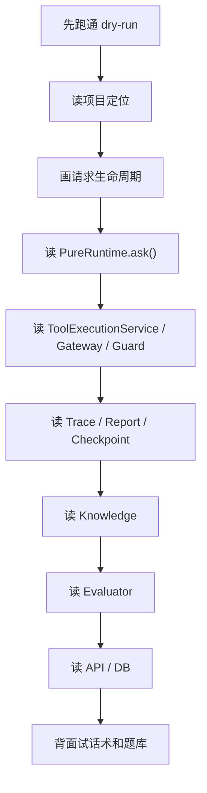

# Pure Deep Dive

## 本章解决什么问题

这是 `docs/deep-dive/` 的索引页。它告诉你这套文档怎么用、按什么顺序读、面试前怎么复习，以及哪些命令仍然需要你亲自跑通。

这套文档不是普通 README，而是“项目作者本人复习 + 面试准备 + 代码导读”。每章都按同一套结构写：

1. 本章解决什么问题。
2. 这块在 Pure 中怎么实现。
3. 核心代码入口。
4. 主流程图或伪代码。
5. 面试官会怎么追问。
6. 我应该怎么回答。
7. 不能夸大的说法。
8. 自测问题。

## 这块在 Pure 中怎么实现

文档基于当前 Pure 代码库整理，重点阅读范围包括：

- [README.md](../../README.md)
- [pyproject.toml](../../pyproject.toml)
- [pure/](../../pure)
- [tests/](../../tests)
- [docs/](../../docs)
- [eval_cases.json](../../eval_cases.json)
- [.env.example](../../.env.example)
- [scripts/](../../scripts)
- [alembic/](../../alembic)

文档刻意不把 Pure 说成 Claude Code 替代品，也不把 roadmap 写成已实现。你复习时要一直记住：Pure 当前是单机 Agent Runtime / Harness 原型。

## 核心代码入口

| 主链路 | 代码入口 |
| --- | --- |
| CLI | [pure/cli/cli.py](../../pure/cli/cli.py) |
| FastAPI | [pure/server/main.py](../../pure/server/main.py) |
| Project/Task/Run | [pure/services/task_service.py](../../pure/services/task_service.py), [pure/db/models.py](../../pure/db/models.py) |
| Runtime loop | [pure/core/runtime.py](../../pure/core/runtime.py) |
| ModelClient/parser | [pure/core/models.py](../../pure/core/models.py), [pure/core/runtime.py](../../pure/core/runtime.py) |
| Tool execution | [pure/services/tool_execution_service.py](../../pure/services/tool_execution_service.py) |
| ToolGateway | [pure/tools/gateway.py](../../pure/tools/gateway.py) |
| Trace/report | [pure/services/trace_service.py](../../pure/services/trace_service.py), [pure/core/run_store.py](../../pure/core/run_store.py) |
| Checkpoint/resume | [pure/services/checkpoint_service.py](../../pure/services/checkpoint_service.py), [pure/services/checkpoint_app_service.py](../../pure/services/checkpoint_app_service.py) |
| Knowledge | [pure/knowledge](../../pure/knowledge) |
| Evaluator | [pure/evaluator](../../pure/evaluator), [../../eval_cases.json](../../eval_cases.json) |

## 主流程图或伪代码



## 推荐阅读顺序

1. [00-how-to-study-pure.md](00-how-to-study-pure.md)
2. [01-project-positioning.md](01-project-positioning.md)
3. [02-global-architecture.md](02-global-architecture.md)
4. [03-request-lifecycle.md](03-request-lifecycle.md)
5. [04-runtime-loop.md](04-runtime-loop.md)
6. [05-model-client-and-parser.md](05-model-client-and-parser.md)
7. [06-tool-execution-system.md](06-tool-execution-system.md)
8. [07-tool-gateway-and-guardrails.md](07-tool-gateway-and-guardrails.md)
9. [08-trace-report-and-run-artifacts.md](08-trace-report-and-run-artifacts.md)
10. [09-checkpoint-and-resume.md](09-checkpoint-and-resume.md)
11. [10-knowledge-context-augmentation.md](10-knowledge-context-augmentation.md)
12. [11-evaluator-and-benchmark.md](11-evaluator-and-benchmark.md)
13. [12-api-and-service-layer.md](12-api-and-service-layer.md)
14. [13-data-model-and-storage.md](13-data-model-and-storage.md)
15. [14-pure-vs-pico.md](14-pure-vs-pico.md)
16. [15-pure-vs-claude-code-openhands-cursor.md](15-pure-vs-claude-code-openhands-cursor.md)
17. [16-limitations-and-roadmap.md](16-limitations-and-roadmap.md)
18. [17-interview-talk-track.md](17-interview-talk-track.md)
19. [18-interview-questions.md](18-interview-questions.md)

## 30 分钟速读路线

1. 读 [01-project-positioning.md](01-project-positioning.md)，只背 30 秒定位。
2. 看 [02-global-architecture.md](02-global-architecture.md) 的架构图。
3. 看 [03-request-lifecycle.md](03-request-lifecycle.md) 的 sequence diagram。
4. 看 [04-runtime-loop.md](04-runtime-loop.md) 的伪代码。
5. 看 [17-interview-talk-track.md](17-interview-talk-track.md) 的 2 分钟版本。
6. 看 [16-limitations-and-roadmap.md](16-limitations-and-roadmap.md) 的不能夸大清单。

## 2 小时复习路线

1. 第 1 个 30 分钟：跑 dry-run 和 API smoke，打开 trace/report。
2. 第 2 个 30 分钟：读 Runtime、ModelClient/parser、ToolExecutionService。
3. 第 3 个 30 分钟：读 ToolGateway、Trace/Report、Checkpoint。
4. 第 4 个 30 分钟：读 Evaluator、API/DB、面试话术。

## 2 周吃透路线

| 时间 | 目标 |
| --- | --- |
| 第 1-2 天 | 跑通 CLI dry-run 和 API dry-run，记录 artifacts |
| 第 3-4 天 | 画全局架构图和请求生命周期图 |
| 第 5-6 天 | 逐行读 `PureRuntime.ask()` 和 `parse()` |
| 第 7-8 天 | 读 ToolExecutionService、ToolGateway、Repetition Guard |
| 第 9-10 天 | 读 Trace/Report、Checkpoint/Resume |
| 第 11 天 | 读 Knowledge，明确 fake embedding 边界 |
| 第 12 天 | 读 Evaluator 和 eval_cases |
| 第 13 天 | 读 API/DB 和 tests |
| 第 14 天 | 背 17 章话术，刷 18 章题库 |

## 每章链接

| 章节 | 一句话用途 |
| --- | --- |
| [00-how-to-study-pure.md](00-how-to-study-pure.md) | 建立学习路线，避免 Vibe Coding 式“会跑不会讲”。 |
| [01-project-positioning.md](01-project-positioning.md) | 说清 Pure 是什么、不是什么。 |
| [02-global-architecture.md](02-global-architecture.md) | 从控制面、执行面、状态面、证据面看整体架构。 |
| [03-request-lifecycle.md](03-request-lifecycle.md) | 跟踪 CLI/API/dry-run/real provider 的完整请求链。 |
| [04-runtime-loop.md](04-runtime-loop.md) | 深挖 `PureRuntime.ask()` 主循环。 |
| [05-model-client-and-parser.md](05-model-client-and-parser.md) | 理解模型适配层和 parser 控制流。 |
| [06-tool-execution-system.md](06-tool-execution-system.md) | 讲清 ToolExecutionService 的流程职责。 |
| [07-tool-gateway-and-guardrails.md](07-tool-gateway-and-guardrails.md) | 讲清工具边界、审批策略和重复调用治理。 |
| [08-trace-report-and-run-artifacts.md](08-trace-report-and-run-artifacts.md) | 区分 trace、report、status 和 artifacts。 |
| [09-checkpoint-and-resume.md](09-checkpoint-and-resume.md) | 区分 create_checkpoint 和 resume。 |
| [10-knowledge-context-augmentation.md](10-knowledge-context-augmentation.md) | 明确 Pure Knowledge 是 context augmentation。 |
| [11-evaluator-and-benchmark.md](11-evaluator-and-benchmark.md) | 区分 evaluator、pytest 和 benchmark。 |
| [12-api-and-service-layer.md](12-api-and-service-layer.md) | 理解 FastAPI、Service Layer 和 Project/Task/Run。 |
| [13-data-model-and-storage.md](13-data-model-and-storage.md) | 理解 DB metadata 与 file artifacts 分工。 |
| [14-pure-vs-pico.md](14-pure-vs-pico.md) | 诚实解释从 Pico 演进的关系。 |
| [15-pure-vs-claude-code-openhands-cursor.md](15-pure-vs-claude-code-openhands-cursor.md) | 面对主流 coding agent 产品比较时不跑偏。 |
| [16-limitations-and-roadmap.md](16-limitations-and-roadmap.md) | 明确已实现、规划和不在范围内。 |
| [17-interview-talk-track.md](17-interview-talk-track.md) | 准备 30 秒到 5 分钟话术。 |
| [18-interview-questions.md](18-interview-questions.md) | 80 个分模块面试题。 |

## 面试前一天怎么复习

1. 背 [17-interview-talk-track.md](17-interview-talk-track.md) 的 30 秒、1 分钟、2 分钟版本。
2. 复述 [04-runtime-loop.md](04-runtime-loop.md) 主循环伪代码。
3. 复述 [06-tool-execution-system.md](06-tool-execution-system.md) 中 Service/Gateway/Guard/Tool 的区别。
4. 复述 [09-checkpoint-and-resume.md](09-checkpoint-and-resume.md) 中 create_checkpoint vs resume。
5. 快速刷 [18-interview-questions.md](18-interview-questions.md) 每组前两个问题。
6. 最后看 [16-limitations-and-roadmap.md](16-limitations-and-roadmap.md)，确保不吹过头。

## 当前仍然需要我亲自跑通的命令清单

这些命令建议你亲自跑一遍，并把输出贴到自己的 study-notes：

```powershell
python -m pytest
```

```powershell
python -m pure.cli --help
```

```powershell
python -m pure.cli --dry-run "Summarize this project"
```

```powershell
python -m uvicorn pure.server.main:app --host 127.0.0.1 --port 8765
```

```powershell
Invoke-RestMethod -Method Get -Uri "http://127.0.0.1:8765/health"
```

如果全量 pytest 太慢，至少跑：

```powershell
python -m pytest tests/test_runtime.py tests/test_tool_gateway_checkpoint_resume.py tests/test_platform_evaluator.py tests/test_task_api.py tests/test_docs_and_docker.py
```

## 面试官会怎么追问

**这套文档怎么用？**

回答：

> 先用 README 选路线，再按主链路读代码。每章最后的“不能夸大”和“自测问题”是面试前最重要的部分。

**为什么先读 Runtime 再读 API？**

回答：

> API 是入口和生命周期，真正的 Agent 行为在 Runtime 主循环。先理解 Runtime，再看 API 如何服务化它，会更稳。

## 我应该怎么回答

> 我会用这套文档把 Pure 拆成四层：控制面、执行面、状态面、证据面。每一层都能说代码入口、主流程、测试证据和限制。这样面试时不是背 README，而是能沿调用链解释。

## 不能夸大的说法

不能说：

- “看完文档就等于掌握项目。”
- “文档里的 roadmap 已经实现。”
- “不用跑代码也能准备面试。”

更准确的说法：

- “这套文档是复习地图，真正掌握还要亲自跑 dry-run、看 trace/report、读测试、手动改小点再回滚。”

## 自测问题

1. 30 分钟速读时应该看哪 6 个部分？
2. 2 小时复习时为什么要先跑 artifacts？
3. 面试前一天必须背哪几个话术？
4. 哪些命令需要你亲自跑？
5. 这套文档里哪些内容是 roadmap，不能说成已实现？
